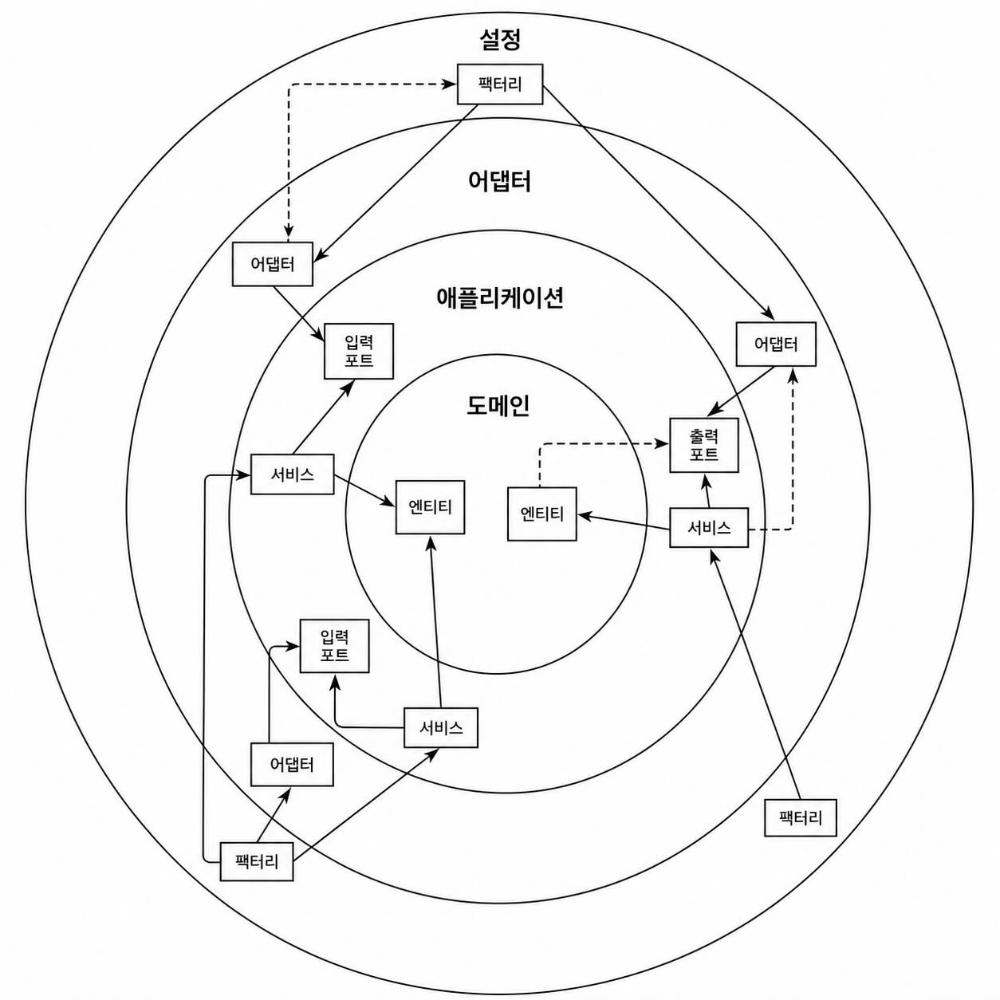
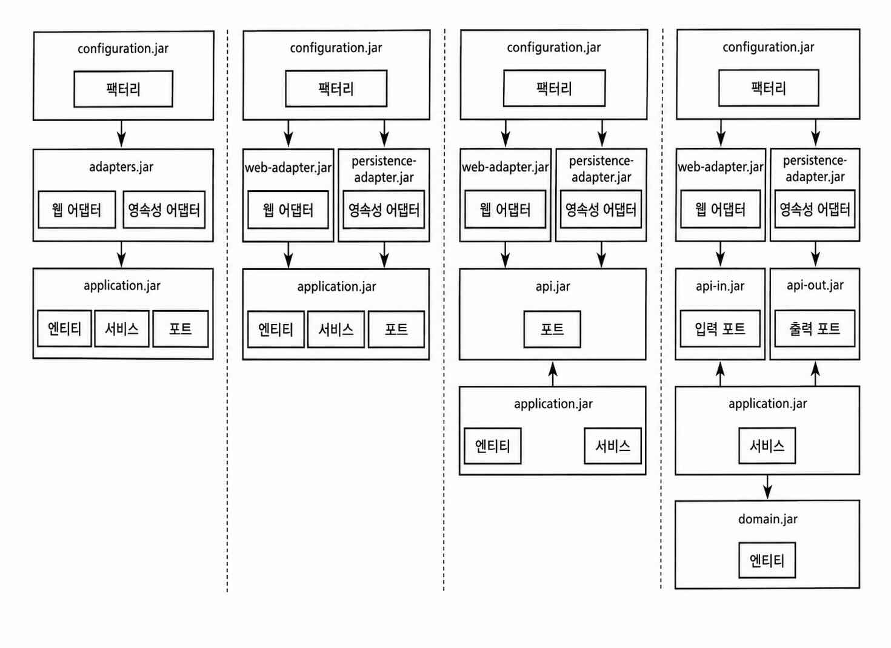

## 아키텍처 경계 강제하기

아키텍처 내의 경계를 강제하는 방법과 아키텍처 붕괴에 대처하는 법을 살펴본다.

### 경계와 의존성



그림에서 허용되지 않은 의존성은 점선 화살표로 표시된다.

- 가장 안쪽에 도메인 엔티티 존재
- 애플리케이션 계층은 애플리케이션 서비스 안에 유스케이스를 구현하기 위해 도메인 엔티티에 접근한다.
- 어댑터: 인커밍 포트를 통해 서비스에 접근한다.
- 서비스: 아웃고잉 포트를 통해 어댑터에 접근한다.
- 설정 계층은 어댑터와 서비스 객체를 생성할 팩토리를 포함하고, 의존성 주입 메커니즘을 제공한다.

아키텍처의 경계
- 각 계층 사이, 안쪽 인접 계층과 바깥쪽 인접 계층 사이에 경계가 있다.
- 계층 경계를 넘는 의존성은 항상 안쪽 방향으로 향해야 한다.
- 점선 화살표는 잘못된 의존성 방향을 가리킨다.

### 접근 제한자
접근 제한을 위해 자바의 접근 제한자를 사용할 수 있다.

package-private
- 자바 패키지를 통해 클래스들을 응집적인 '모듈'로 만들어준다.
- 모듈 내에 있는 클래스들은 서로 접근 가능하지만, 패키지 밖에서는 접근할 수 없다.
- 모듈 진입점으로 활용될 클래스들만 골라서 public으로 만들면 된다.
    - 의존성이 잘못된 방향을 가리켜서 의존성 규칙을 위반할 위험이 줄어든다.

```
buckpal
└── account
    ├── adapter
    │   ├── in
    │   │   └── web
    │   │       └── o AccountController
    │   └── out
    │       └── persistence
    │           ├── o AccountPersistenceAdapter
    │           └── o SpringDataAccountRepository
    │
    ├── domain
    │   ├── + Account
    │   └── + Activity
    │
    └── application
        ├── o SendMoneyService
        └── port
            ├── in
            │   └── + SendMoneyUseCase
            └── out
                ├── + LoadAccountPort
                └── + UpdateAccountStatePort
```
- persistence 패키지와 SendMoneyService는 외부에서 직접 접근할 필요가 없기 때문에 package-private (o 표시)으로 선언한다.
- 영속성 어댑터는 자신이 구현한 출력 포트를 통해서만 접근한다. (persistence 패키지의 클래스)

스프링은 리플렉션과 클래스패스 스캐닝을 이용해 package-private 클래스도 인스턴스화할 수 있다.
- 하지만 직접 객체를 생성하는 방식을 사용한다면 public 제한자가 필요할 수 있다.

나머지 클래스들은 public(+ 표시)이어야 한다.
- domain 패키지는 다른 계층에서 접근할 수 있어야 한다.
- application 계층은 web, persistence 어댑터에서 접근 가능해야 한다.

package-private 사용시 주의점
- package-private은 작은 패키지에서는 클래스 노출을 제한하는 데 효과적이다.
- 하지만 클래스가 많아지면 구조 정리를 위해 하위 패키지를 만들고 싶어진다.
    - 문제는 자바에서 하위 패키지는 같은 패키지가 아니라 별개의 패키지로 취급된다는 점이다.
- 따라서 하위 패키지의 클래스에 접근하려면 public으로 열어야 한다.
    - 이로 인해 외부 계층에서도 접근 가능한 클래스가 생기고, 아키텍처의 의존성 규칙이 깨질 수 있다.

### 컴파일 후 체크
- public 클래스는 어디서든 접근 가능하기 때문에 잘못된 의존성 방향도 컴파일러가 막지 못한다.
- 따라서 아키텍처 의존성 규칙 위반 여부를 검사할 별도의 수단이 필요하다.
    - 컴파일 후 체크를 통해 런타임에 의존성 규칙을 검증할 수 있다.

ArchUnit
- 의존성 방향이 기대한 대로 잘 설정돼 있는지 체크할 수 있는 API를 제공한다.

예시
- 도메인 계층이 바깥쪽 애플리케이션 계층에 의존하지 않는지 검사할 수 있다.

```java
class DependencyRuleTests {

    @Test
    void domainLayerDoesNotDependOnApplicationLayer() {
        noClasses()
            .that()
            .resideInAPackage("buckpal.domain..")
            .should()
            .dependOnClassesThat()
            .resideInAnyPackage("buckpal.application..")
            .check(new ClassFileImporter()
                .importPackages("buckpal.."));
    }
}
```

ArchUnit을 이용하면 아키텍처 규칙을 DSL 형태로 정의하고 패키지 간 의존성 방향을 자동으로 검증할 수 있다.

예시
- 패키지 의존성이 의존성 규칙을 따라 유효하게 설정됐는지 검증한다.
- HexagonalArchitecture DSL을 사용한 코드

```java
class DependencyRuleTests {

    @Test
    void validateRegistrationContextArchitecture() {
        HexagonalArchitecture.boundedContext("account")
            .withDomainLayer("domain")
            .withAdaptersLayer("adapter")
                .incoming("web")
                .outgoing("persistence")
                .and()
            .withApplicationLayer("application")
                .services("service")
                .incomingPorts("port.in")
                .outgoingPorts("port.out")
                .and()
            .withConfiguration("configuration")
            .check(new ClassFileImporter()
                .importPackages("buckpal.."));

    }
}
```

컴파일 후 체크 주의점
- 패키지명 변경이나 오타에 취약하다.
- 테스트가 실제 클래스를 찾지 못하면 검증 자체가 무의미해질 수 있다.
- 따라서 ArchUnit 테스트도 코드와 함께 유지보수해야 한다.

### 빌드 아티팩트
이전에는 모든 코드를 하나의 모놀리식 JAR로 빌드했다.

메이븐과 그레이들 같은 빌드 도구는 의존성 해결 기능을 제공한다.
- 필요한 의존성이 없으면 컴파일 전에 빌드가 실패한다.

이를 이용해 모듈별로 JAR를 분리하고 허용된 의존성만 선언할 수 있다.
- 허용되지 않은 계층의 클래스는 클래스패스에 존재하지 않기 때문에 컴파일 자체가 불가능하다.
- 따라서 잘못된 의존성을 컴파일 단계에서 강제적으로 막을 수 있다.



모듈 분리 방식
- 기본적으로 설정, 어댑터, 애플리케이션 계층을 각각 별도 모듈로 나눌 수 있다.
- 어댑터 모듈을 웹 어댑터와 영속성 어댑터로 더 세분화할 수 있다.
    - 어댑터끼리 불필요하게 의존하는 것을 방지한다.
- 애플리케이션 모듈에서 포트 인터페이스만 별도 API 모듈로 분리할 수 있다.
    - 어댑터가 서비스나 엔티티에 직접 접근하지 못하고 포트를 통해서만 접근하게 된다.
- API 모듈을 인커밍 포트와 아웃고잉 포트로 더 나눌 수도 있다.
    - 특정 어댑터가 인커밍 어댑터인지 아웃고잉 어댑터인지 명확해진다.
- 애플리케이션 모듈을 서비스 모듈과 도메인 모듈로 분리할 수도 있다.
    - 도메인 엔티티를 다른 애플리케이션에서도 재사용할 수 있다.

장점
- 모듈을 세분화할수록 의존성을 더 명확하게 제어할 수 있다.
- 빌드 도구가 순환 의존성을 막아준다.
    - 패키지 간 순환 의존성은 자바 컴파일러가 막지 않지만, 빌드 모듈 간 순환 의존성은 빌드 도구가 허용하지 않는다.
- 특정 모듈을 다른 모듈과 독립적으로 변경하고 테스트할 수 있다.
    - 예: 어댑터에 컴파일 에러가 있어도 애플리케이션 모듈 테스트를 실행할 수 있다.
- 의존성 추가가 빌드 스크립트에 명시되므로 우연히 잘못된 의존성이 생기기 어렵다.
    - 새로운 의존성을 추가하기 전에 정말 필요한지 고민하게 된다.

단점
- 모듈을 잘게 나눌수록 매핑이 늘어난다.
- 빌드 스크립트와 모듈 구조를 유지보수하는 비용이 증가한다.
- 따라서 아키텍처가 어느 정도 안정된 뒤에 빌드 모듈 분리를 적용하는 것이 좋다.

### 유지보수 가능한 소프트웨어를 만드는 데 어떻게 도움이 될까?
- 의존성이 뒤엉키면 아키텍처도 거대한 진흙 덩어리(big ball of mud)가 된다.
- 따라서 의존성이 올바른 방향을 향하는지 지속적으로 관리해야 한다.

의존성 관리 방법
- package-private 등을 이용해 접근 가능한 범위를 제한한다.
- 패키지 구조만으로 강제할 수 없다면 ArchUnit 같은 컴파일 후 체크 도구를 사용한다.
- 아키텍처가 충분히 안정되면 빌드 모듈(JAR)로 분리해 의존성을 더 강하게 제어한다.

이러한 방법들을 상황에 따라 함께 조합해서 사용할 수 있다.