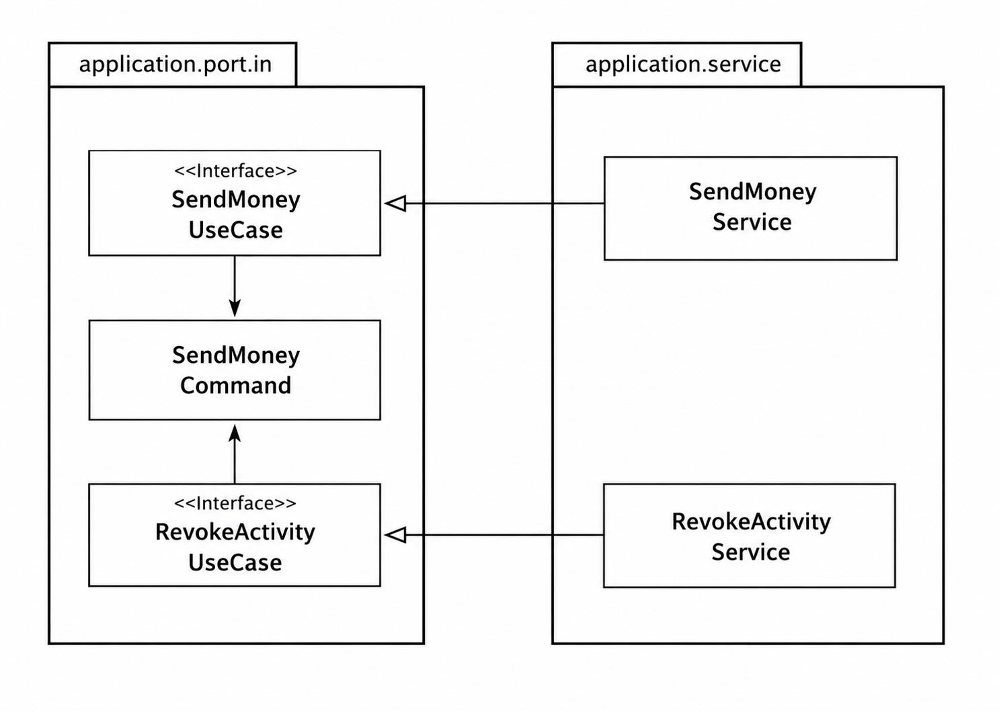
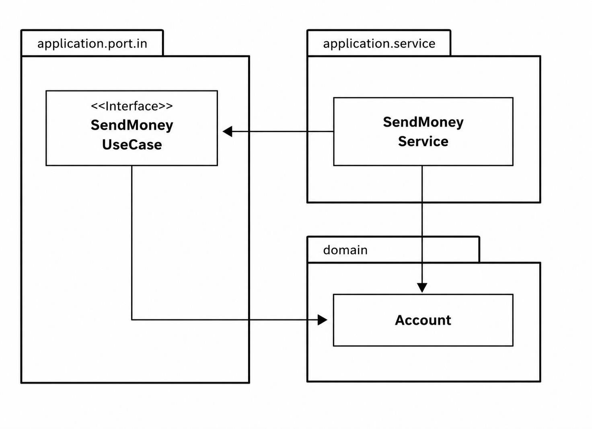
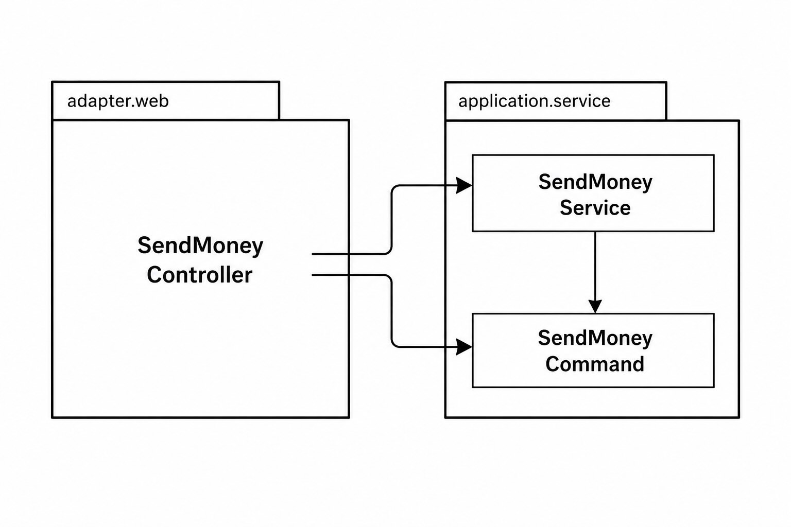
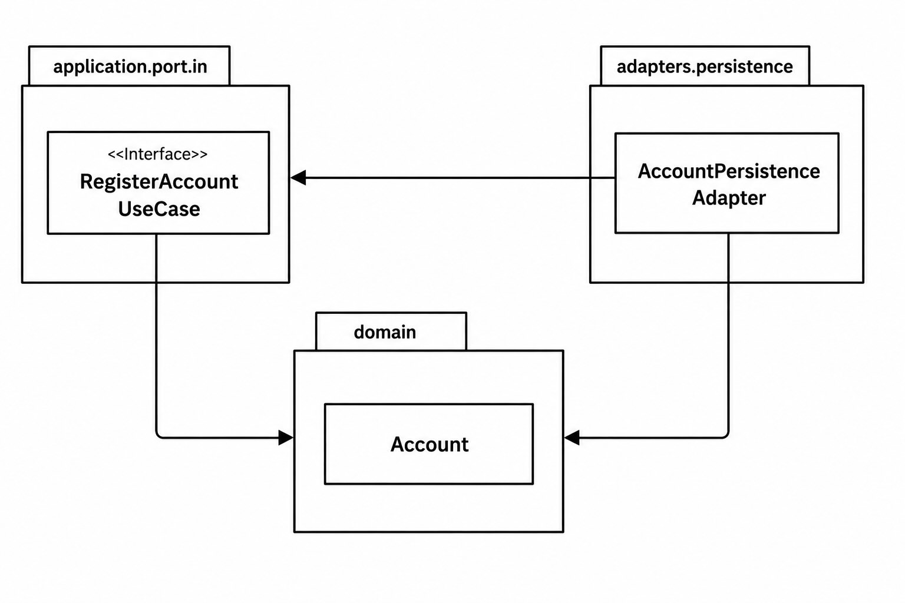

## 의식적으로 지름길 사용하기

갚을 수 없는 기술 부채를 만들지 않으려면 지름길을 인식해야 한다.
- 우발적인 지름길은 발견하고 수정할 수 있다.
- 정당한 지름길이라면 의식적으로 선택할 수 있다.

소프트웨어는 변경 비용이 상대적으로 낮기 때문에
- 먼저 지름길을 선택하고 나중에 수정하는 것이 경제적일 수 있다.

### 왜 지름길은 깨진 창문 같을까?
깨진 창문 이론을 코드에 적용하면
- 품질이 낮은 코드에서는 더 낮은 품질의 코드가 추가되기 쉽다.
- 규칙을 어긴 코드에서는 또 다른 규칙 위반이 쉽게 발생한다.
- 지름길이 많은 코드에서는 새로운 지름길도 쉽게 추가된다.

### 깨끗한 상태로 시작할 책임
가능하면 프로젝트를 깨끗한 상태로 시작해야 한다.
- 사람은 깨진 창문 심리에 무의식적으로 영향을 받는다.

마무리 되지 못한 프로젝트를 인계받는 입장에서는 프로젝트가 레거시이기 때문에 깨진 창문을 만들어내기가 쉽다.

지름길을 취하는것이 실용적일 경우가 있다.
- 중요하지 않거나, 프토타이핑이거나, 경제적인 이유 등이 그러하다.
- 지름길을 사용한 부분은 세심하게 기록해야 한다.
    - 의도적으로 추가된 것을 알기 때문에 깨진 창문 이론의 영향을 줄일 수 있다.

### 유스케이스 간 모델 공유하기
유스케이스마다 다른 입출력 모델을 가져야 한다.
- 입력 파라미터의 타입과 반환값의 타입이 달라야 한다.

두 개의 유스케이스가 같은 입력 모델을 공유한다.

SendMoneyUseCase와 RevokeActivityUseCase는 SendMoneyCommand를 공유한다.
- SendMoneyCommand가 변경되면 두 유스케이스 모두 영향을 받는다.
    - 즉, 두 유스케이스가 같은 '변경할 이유'를 공유하게 된다. (단일 책임 원칙)
- 출력 모델을 공유하는 경우도 마찬가지다.

입출력 모델 공유가 적절한 경우
- 유스케이스가 기능적으로 연관되어 있을 때
- 특정 세부사항 변경이 여러 유스케이스에 함께 반영되길 원할 때

두 유스케이스간에 영향없이 독립적으로 진화해야 하는 경우
- 입출력 모델 공유 방식은 지름길이 된다.
- 처음에 똑같은 입출력 클래스를 복사해야 하더라도 일단 분리해서 시작해야 한다.

비슷한 유스케이스가 독립적으로 진화해야 한다면 입출력 모델을 분리해야 한다.

### 도메인 엔티티를 입출력 모델로 사용하기
인커밍 포트가 도메인 엔티티를 입출력 모델로 사용하고 싶은 경우가 있다.

인커밍 포트는 도메인 엔티티에 의존성을 가지고 있다.
- Account 엔티티는 변경할 또 다른 이유가 생겼다.

유스케이스와 도메인 엔티티의 결합
- 인커밍 포트가 도메인 엔티티에 의존하면 유스케이스 변경이 도메인 엔티티에 영향을 줄 수 있다.
- 유스케이스에서만 필요한 정보 때문에 도메인 엔티티에 새로운 필드를 추가하고 싶어질 수 있다.

간단한 CRUD 유스케이스
- 엔티티를 그대로 입출력 모델로 사용해도 괜찮을 수 있다.

복잡한 유스케이스
- 복잡한 도메인 로직이 필요해지면 전용 입출력 모델을 만들어야 한다.
- 유스케이스 변경이 도메인 엔티티까지 전파되지 않도록 해야 한다.

주의점
- 많은 유스케이스는 단순 CRUD로 시작하지만 점점 복잡해진다.
- 따라서 적절한 시점에 엔티티 기반 입력 모델을 전용 입력 모델로 분리해야 한다.

### 인커밍 포트 건너뛰기

아웃고잉 포트는 의존성을 안쪽으로 향하게 만들기 위해 필수적이지만, 인커밍 포트는 필수 요소는 아니다.
- 인커밍 어댑터가 애플리케이션 서비스를 직접 호출하도록 만들 수도 있다.

인커밍 포트를 제거하면
- 추상화 계층이 줄어들어 단순해 보일 수 있다.

하지만 인커밍 포트는 애플리케이션의 진입점을 정의한다.
- 어떤 유스케이스가 존재하는지 한눈에 파악할 수 있다.
- 특정 기능을 위해 어떤 서비스 메서드를 호출해야 하는지 명확해진다.
- 새로운 개발자가 애플리케이션 구조를 이해하기 쉬워진다.

또한 인커밍 포트는 아키텍처 강제에도 도움이 된다.
- 인커밍 어댑터가 서비스가 아닌 인커밍 포트만 호출하도록 제한할 수 있다.
- 의도하지 않은 서비스 메서드 호출을 방지할 수 있다.

규모가 작고 흐름이 단순한 애플리케이션에서는 인커밍 포트 없이 직접 서비스를 호출해도 괜찮을 수 있다.
- 하지만 애플리케이션이 커질수록 제어 흐름과 진입점을 명확히 하기 위해 인커밍 포트를 유지하는 것이 도움이 된다.

### 애플리케이션 서비스 건너뛰기
애플리케이션 계층을 통째로 건너뛰는 경우

간단한 CRUD 유스케이스에서는 애플리케이션 서비스가 단순 전달 역할만 할 수 있다.
- 이 경우 영속성 어댑터가 인커밍 포트를 직접 구현하게 해서 서비스를 생략할 수 있다.

하지만 이 방식은 위험하다.
- 인커밍 어댑터와 아웃고잉 어댑터가 모델을 공유하게 된다.
- 애플리케이션 코어에 유스케이스가 사라진다.
- 요구사항이 복잡해지면 도메인 로직이 영속성 어댑터에 섞일 수 있다.
    - 도메인 로직이 흩어져서 도메인 로직을 찾거나 유지보수하기 어려워진다.

따라서 단순 CRUD에서는 서비스 생략이 가능하지만, 유스케이스가 생성/수정/삭제 이상의 일을 하게 되면 애플리케이션 서비스를 만들어야 한다.

### 유비조수 가능한 소프트웨어를 만드는 데 어떻게 도움이 될까?

- 단순 CRUD 유스케이스에서는 전체 아키텍처를 적용하는 것이 과하게 느껴질 수 있다.
    - 따라서 애플리케이션 서비스 생략 같은 지름길의 유혹이 생긴다.
    - 하지만 유스케이스가 복잡해지는 시점에 더 유지보수하기 좋은 구조로 전환할 기준을 팀이 합의해야 한다.
- 반대로 계속 단순 CRUD로 유지되는 유스케이스도 있다.
    - 이런 경우에는 지름길을 유지하는 것이 더 경제적일 수 있다.
- 어떤 지름길을 선택했는지와 그 이유를 기록해두어야 한다.
    - 나중에 구조를 다시 평가하거나 유지보수할 때 도움이 된다.