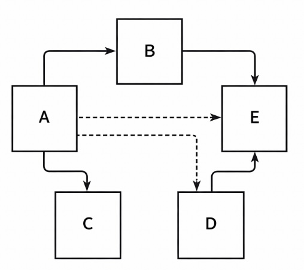
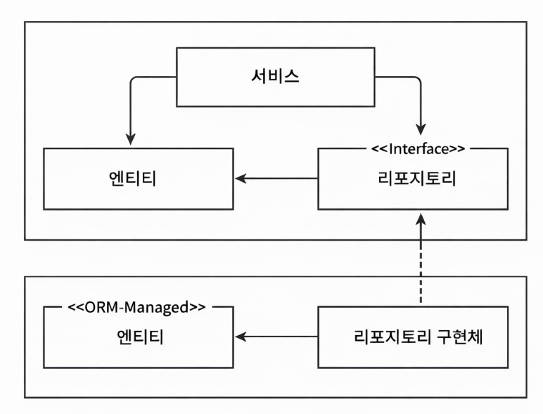
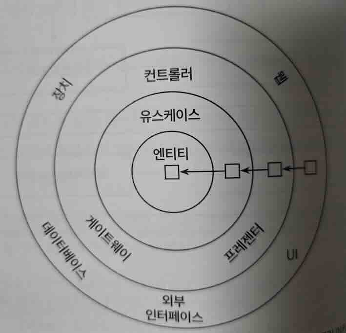

## 의존성 역전하기

### 단일 책임 원칙
단일 책임 원칙의 일반적인 해석
```
하나의 컴포넌트는 오로지 한 가지 일만 해야 하고, 그것을 올바르게 수행해야 한다.
```
단일 책임 원칙의 실제 정의는 다음과 같다.
```
컴포넌트를 변경하는 이유는 오직 하나뿐이어야 한다.
```
책임을 '오로지 한 가지 일만 하는 것'보다는 '변경할 이유'로 해석해야 한다.
- 컴포넌트를 변경할 이유가 오로지 한 가지라면 컴포넌트는 딱 한가지 일만 하게 된다.
- 더 중요한 것은 변경할 이유가 오직 한 가지라는 것이다.

컴포넌트를 변경할 이유가 한 가지라면 어떤 다른 이유로 소프트웨어를 변경하더라도 이 컴포넌트에 대해 전혀 신경 쓸 필요가 없다.
- 소프트웨어가 변경되더라도 우리가 기대한 대로 동작할 것이기 때문



컴포넌트 A는 다른 여러 컴포넌트에 의존한다. 컴포넌트 E는 의존하는 것이 전혀 없다.

컴포넌트 E를 변경할 유일한 이유는 E의 기능을 바꿔야 할 때 뿐이다. 컴포넌트 A의 경우에는 모든 컴포넌트에 의존하고 있기 때문에 다른 어떤 컴포넌트가 바뀌든지 같이 바뀌어야 한다.

단일 책임 원칙을 위반하면 변경 이유가 쌓여 변경이 어려워지고 비용이 증가하며, 다른 컴포넌트에 영향을 준다.
- 한 컴포넌트를 변경하면 다른 컴포넌트가 실패하는 원인이 될 수 있다.

### 부수효과에 관한 이야기
부수효과가 잦은 코드베이스에서는 변경에 대한 두려움 때문에 더 나은 설계보다 안전한 선택이 우선된다. 그 결과 비효율적인 방식이 반복되고, 유지보수 비용이 증가한다.

### 의존성 역전 원칙
계층형 구조에서는 하위 계층 변경이 상위 계층까지 영향을 주며, 특히 영속성 변경이 도메인 변경으로 이어질 수 있다.
- 상위 계층들이 하위 계층들에 비해 변경할 이유가 더 많다.

의존성 역전 원칙을 사용하면 이 의존성을 제거할 수 있다.
```
코드상의 어떤 의존성이든 그 방향을 바꿀 수(역전시킬 수) 있다.
```

의존성 역전은 양쪽 코드를 제어할 수 있을 때만 가능하다. 
- 서드파티 라이브러리에 의존성이 있다면 제어할 수 없기 때문에 의존성을 역전시킬 수 없다.

의존성 역전을 통해 영속성이 도메인에 의존하도록 만들어 도메인의 변경의 이유를 최소화할 수 있다.

```
        ┌──────────────┐
        │   서비스      │                   [도메인 계층]
        └──────┬───────┘
               │
     ┌─────────┴─────────────┐
     ↓                       ↓
┌──────────────┐        ┌──────────────┐
│   엔티티      │<────── │  리포지토리     │   [영속성 계층]
└──────────────┘        └──────────────┘
```
위 그림에서 도메인 계층에 영속성 계층의 엔티티와 리포지토리와 상호작용하는 서비스가 있다.

엔티티는 도메인 객체를 표현하고 도메인 로직은 엔티티의 상태를 변경하는 데 집중하기 때문에, 엔티티를 도메인 계층으로 올린다.

엔티티를 도메인 계층으로 올리면 리포지토리와 순환 의존성이 발생한다. 즉, 두 계층간에 순환 의존성이 발생한다. 이를 해결하기 위해 도메인 계층에 인터페이스를 두고 실제 리포지토리는 영속성 계층에서 구현한다.

결과는 다음과 같다. (위는 도메인 계층, 아래는 영속성 계층)


영속성 계층은 도메인 계층에 의존하게 변경되었다.

### 클린 아키텍처
도메인 코드가 바깥으로 향하는 어떤 의존성도 없어야 한다. 대신 의존성 역전 원칙의 도움으로 모든 의존성은 도메인 코드를 향하고 있다.



가장 중요한 규칙은 계층 간의 모든 의존성이 안쪽으로 향해야 한다는 것이다.

도메인 엔티티와 단일 책임으로 분리된 유스케이스가 코어를 이루고, 바깥 계층은 영속성, UI, 외부 시스템 연동 등을 통해 이를 지원한다.

도메인 코드는 어떤 영속성 프레임워크나 UI 프레임워크가 사용되는지 알 수 없다.
- 특정 프레임워크에 대한 코드를 가질 수 없고 비즈니스 규칙에 집중할 수 있다.

클린 아키텍처의 대가
- 도메인 계층은 영속성, UI 같은 외부 계층과 분리되므로 계층별 모델을 따로 유지해야 한다.
- 예를 들어 도메인 계층은 영속성 계층을 모르기 때문에, 도메인 엔티티와 영속성 엔티티를 각각 만들고 서로 변환해야 한다.

모델 분리에는 비용이 들지만, JPA이 관리하는 엔티티의 인자가 없는 기본 생성자 요구와 같은 프레임워크 의존성을 도메인에서 제거할 수 있다는 점에서 바람직하다. 