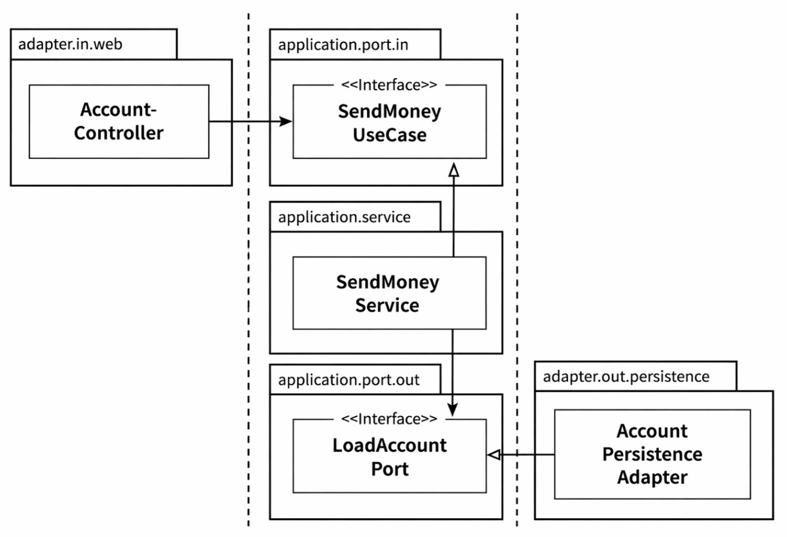

## 코드 구성하기

### 계층으로 구성하기
코드를 구조화 하는 첫 번째 접근법은 계층을 이용하는 것이다.

```
buckpal
├── domain
│   ├── Account
│   ├── Activity
│   ├── AccountRepository
│   └── AccountService
├── persistence
│   └── AccountRepositoryImpl
└── web
    └── AccountController
```
의존성 역전 원칙을 적용해 의존성이 domain 패키지에 있는 도메인 코드만을 향하게 해뒀다.
- AccountRepository 인터페이스를 AccountRepositoryImpl가 구현해서 의존성을 역전시킨다.

위 패키지는 최적의 구조가 아니다.
- 애플리케이션의 기능 조각(functional slice)이나 특성(feature)을 구분 짓는 패키지 경계가 없다.
    - 사용자 관리 기능을 추가할 경우, UserController, UserService, UserRepository, UserRepositoryImpl 등을 각각의 계층(web, domain, persistence)에 나누어 추가해야 한다.
    - 그 결과, 서로 관련 없는 기능들이 같은 패키지에 섞이면서 예상하지 못한 부수효과를 유발할 가능성이 높다.
- 애플리케이션이 어떤 유스케이스들을 제공하는지 파악할 수 없다.
    - AccountService, AccountController만으로는 어떤 유스케이스를 구현하는지 명확히 드러나지 않는다.
    - 특정 기능을 이해하려면 어떤 서비스가 이를 담당하는지, 어떤 메서드가 책임을 수행하는지 직접 추적해야 한다.

패키지 구조만으로는 어떤 기능이 어디서 호출되고 어떤 역할을 하는지 한눈에 파악하기 어려우며, 포트와 어댑터의 관계도 코드 속에 숨겨진다.

### 기능으로 구성하기
```
buckpal
└── account
    ├── Account
    ├── AccountController
    ├── AccountRepository
    ├── AccountRepositoryImpl
    └── SendMoneyService
```
- 각 기능들을 묶은 새로운 그룹은 account와 같은레벨의 새로운 패키지로 들어간다.
- 패키지 경계를 package-private 접근 수준과 겷합하면 각 기능 사이의 불필요한 의존성을 방지할 수 있다.

AccountService의 책임을 좁히기 위해 SendMoneyService로 클래스명을 바꿨다.
- '송금하기' 유스케이스를 클래스명으로 찾을 수 있다.

기능으로 구성하기의 단점
- 가시성이 떨어진다. 어댑터를 나타내는 패키지명이 없고, 인커밍, 아웃고잉 포트를 확인할 수 없다.
- SendMoneyService가 AccountRepository 인터페이스만 의존하도록 했더라도, 실제 구현체에 대한 의존을 구조적으로 막기 어렵다.

### 아키텍처적으로 표현력 있는 패키지 구조
육각형 아키텍처에서 핵심적인 요소
- 엔티티, 유스케이스, 인커밍/아웃고잉 포트, 인커밍/아웃고잉 어댑터

```
buckpal
└── account
    ├── adapter
    │   ├── in
    │   │   └── web
    │   │       └── AccountController
    │   └── out
    │       └── persistence
    │           ├── AccountPersistenceAdapter
    │           └── SpringDataAccountRepository
    │
    ├── domain
    │   ├── Account
    │   └── Activity
    │
    └── application
        ├── SendMoneyService
        └── port
            ├── in
            │   └── SendMoneyUseCase
            └── out
                ├── LoadAccountPort
                └── UpdateAccountStatePort
```
구조의 각 요소들은 패키지 하나씩에 직접 매핑된다.

- account 패키지
    - Account와 관련된 유스케이스를 구현한 모듈임을 나타낸다.
- domain 패키지
    - 도메인 모델이 속해 있다.
- application 패키지
    - 도메인 모델을 둘러싼 서비스 계층을 포함한다.
    - SendMoneyService는 인커밍 포트 인터페이스 SendMoneyUseCase를 구현하고, 아웃고잉 포트 인터페이스이자 영속성 어댑터에 의해 구현된 LoadAccountPort, UpdateAccountStatePort를 사용한다.
- adapter 패키지
    - 애플리케이션 계층의 인커밍 포트를 호출하는 인커밍 어댑터를 포함한다.
    - 애플리케이션 계층의 아웃고잉 포트에 대한 구현을 제공하는 아웃고잉 어댑터를 포함한다.

해당 패키지 구조의 특징
- 패키지 구조가 복잡해 보이지만, 실제로는 아키텍처를 이해하고 소통하는 데 도움이 된다
- 표현력 있는 패키지 구조는 아키텍처와 코드 간의 간극을 줄여, 코드가 설계에서 벗어나지 않도록 한다.
- 패키지 구조는 개발자가 아키텍처를 의식하며 코드를 작성하도록 유도한다.

패키지가 많으면 접근을 위해 모든 것을 public으로 만들어야 하는 것 아닐까? 아니다.
- 어댑터에 있는 클래스들은 포트를 통해서만 접근되므로, package-private로 제한해도 된다.
    - 애플리케이션 계층에서 어댑터 클래스로 향하는 우발적인 의존성은 있을 수 없다.
- 포트 인터페이스와 일부 도메인 요소는 public으로 열어야 한다.
    - 포트는 어댑터에서 접근 가능해야 하므로 public이어야 한다.
    - 도메인 클래스들은 서비스, 잠재적으로 어댑터에서 접근 가능하도록 public이어야 한다.
    - 서비스는 인커밍 포트 인터페이스 뒤에 숨겨질 수 있기 때문에 public일 필요가 없다.

어댑터 코드를 자체 패키지로 이동시키면 필요한 경우 하나의 어댑터를 다른 구현으로 쉽게 교체할 수 있다.
- 키-밸류 데이터베이스를 SQL 데이터베이스로 교체하려면, 기존 아웃고잉 포트는 그대로 두고 해당 포트의 구현체를 새로운 어댑터 패키지에 구현한 뒤 기존 어댑터 패키지를 제거하면 된다.

이 패키지 구조는 DDD개념에 직접적으로 대응시킬 수 있다.
- account 패키지는 하나의 바운디드 컨텍스트다.
- 포트를 통해 외부와 통신이 가능하다.

패키지 구조를 프로젝트 내내 유지하기 위해 지켜야 할 규칙이 있다.
- 잘못 설계하면 아키텍처와 코드 괴리 발생
- 표현력 있는 패키지 구조는 적어도 코드와 아키텍처 간의 갭을 줄일 수 있게 해준다.

### 의존성 주입의 역할
클린 아키텍처의 가장 본질적인 요건은 애플리케이션 계층이 인커밍/아웃고잉 어댑터에 의존성을 갖지 않는 것이다.

웹 어댑터와 같은 인커밍 어댑터는 의존성 방향이 올바르다.
- 제어 흐름과 의존성 방향이 일치한다.
- 애플리케이션 계층에 위치한 서비스를 호출할 뿐이다.
- 애플리케이션 계층으로의 진입점을 구분 짓기 위해 실제 서비스를 포트 인터페이스들 사이에 숨겨둘 수 있다.

아웃고잉 어댑터는 의존성 역전 원칙이 필요하다.
- 의존성 방향이 반대이기 때문이다.
- 포트와 어댑터 구조에서는 애플리케이션에 인터페이스(포트)를 두고, 어댑터가 이를 구현한다.
    - 애플리케이션이 포트를 호출한다.
    - 어댑터가 포트를 구현한다.

포트 구현 객체는 애플리케이션 내부에서 생성하면 안된다.
- 어댑터에 대한 의존성이 생기기 때문이다.
- 의존성 주입으로 외부에서 객체를 생성하고 연결한다.



위 그림 설명
- 의존성 주입으로 컨트롤러에 서비스 구현체를 주입한다.
    - 컨트롤러는 인터페이스에 의존하고, 실제 구현체는(SendMoneyService)는 DI가 주입
- 의존성 주입으로 어댑터 구현체를 주입한다.
    - 서비스는 포트 인터페이스에 의존하고, 실제 구현체(AccountPersistenceAdapter)는 DI가 주입

### 유지보수 가능한 소프트웨어를 만드는 데 어떻게 도움이 될까?
육각형 아키텍처의 패키지 구조는 코드와 아키텍처를 일치시켜, 이해와 유지보수를 쉽게 만든다.