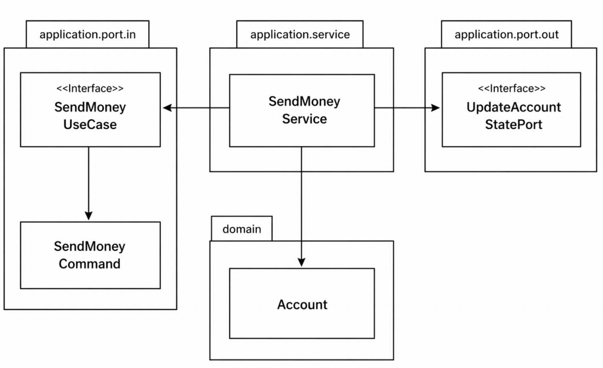

## 유스케이스 구현하기

육각형 아키텍처는 도메인 중심의 아키텍처에 적합하다.
- 도메인 엔티티를 만든 후 엔티티를 중심으로 유스케이스를 구현한다.

### 도메인 모델 구현하기
계좌 송금 유스케이스
- 계좌 송금은 Account 엔티티를 통해 출금과 입금을 수행하는 방식으로 구현한다.

```java
package buckpal.domain;

public class Account {

    private AccountId id;
    private Money baselineBalance;
    private ActivityWindow activityWindow;

    public Money calculateBalance() {
        return Money.add(
            this.baselineBalance,
            this.activityWindow.calculateBalance(this.id)
        );
    }

    public boolean withdraw(Money money, AccountId targetAccountId) {
        if (!mayWithdraw(money)) {
            return false;
        }

        Activity withdrawal = new Activity(
            this.id,
            this.id,
            targetAccountId,
            LocalDateTime.now(),
            money);
        
        this.activityWindow.addActivity(withdrawal);
        return true;
    }

    private boolean mayWithdraw(Money money) {
        return Money.add(
            this.calculateBalance(),
            money.negate())
        .isPositive();
    }

    public boolean deposit(Money money, AccountId sourceAccountId) {
        Activity deposit = new Activity(
            this.id,
            sourceAccountId,
            this.id,
            LocalDateTime.now(),
            money);
        this.activityWindow.addActivity(deposit);
        return true;
    }
}
```
- Account 엔티티: 실제 계좌의 스냅숏
- Activity 엔티티: 계좌에 대한 입금, 출금 정보
    - ActivityWindow에 일정 범위안의 활동이 보관된다.
    - 모든 활동이 메모리에 올라가지 않음
- baselineBalance 속성: ActivityWindow의 첫 번째 활동 전의 잔고
    - baselineBalance + ActivityWindow의 활동들 합 -> 현재 총 잔고
- 입금과 출금은 withdraw()와 deposit()으로 이루어진다.

이제 Account 엔티티를 중심으로 유스케이스를 구현할 수 있다.

### 유스케이스 둘러보기
일반적인 유스케이스의 단계
1. 입력을 받는다
2. 비즈니스 규칙을 검증한다
3. 모델 상태를 조작한다
4. 출력을 반환한다

유스케이스는 입력 유효성을 검증하는 대신 비즈니스 규칙을 검증할 책임이 있으며, 도메인 엔티티와 이 책임을 공유한다.

비즈니스 규칙을 충족하면 유스케이스는 입력을 기반으로 도메인 상태를 변경하고, 포트를 통해 이를 저장하거나 외부 어댑터를 호출한다.

마지막 단계로 아웃고잉 어댑터의 결과를 유스케이스의 출력 객체로 변환해 호출한 어댑터에 반환한다.

아래 예제는 넓은 서비스 문제를 피하기 위해 각 유스케이스별로 분리된 각각의 서비스로 만든것이다.

```java
package buckpal.application.service;

@RequiredArgsConstructor
@Transactional
public class SendMoneyService implements SendMoneyUseCase {

    private final LoadAccountPort loadAccountPort;
    private final AccountLock accountLock;
    private final UpdateAccountStatePort updateAccountStatePort;

    @Override
    public boolean sendMoney(SendMoneyCommand command) {
        // TODO: 비즈니스 규칙 검증
        // TODO: 모델 상태 검증
        // TODO: 출력 값 반환
    }
}
```



컴포넌트들의 관계는 위와 같다.

### 입력 유효성 검증
입력 유효성 검증은 애플리케이션 계층의 책임에 해당한다.

입력 유효성 검증을 어댑터에 맡기면 중복 구현과 누락 위험이 생기므로, 애플리케이션 계층에서 일관되게 수행해야 한다. 이를 위해 입력 모델(커맨드 객체)에서 검증해 유효하지 않은 값이 도메인에 전달되는 것을 방지한다.

```java
package buckpal.application.port.in

@Getter
public class SendMoneyCommand {

    private final AccountId sourceAccountId;
    private final AccountId targetAccountId;
    private final Money money;

    public SendMoneyCommand(
            AccountId sourceAccountId,
            AccountId targetAccountId,
            Money money) {
        this.sourceAccountId = sourceAccountId;
        this.targetAccountId = targetAccountId;
        this.money = money;
        requireNonNull(sourceAccountId);
        requireNonNull(targetAccountId);
        requireNonNull(money);
        requireGreaterThan(money, 0);
    }
}
```
위의 조건 중 하나라도 위배되면 객체를 생성할 때 예외를 던져서 객체 생성을 막으면 된다.

필드들은 불변이다 객체가 생성되고 나면 상태는 유효하고 이후에 잘못된 상태로 변경될 수 없다.

SendMoneyCommand는 인커밍 포트에 위치하며, 입력 검증은 애플리케이션 계층에서 Command 객체로 분리해 유스케이스 코드를 오염시키지 않는다. 따라서 유스케이스는 입력 검증 없이 비즈니스 로직에만 집중한다.

자바 Bean Validation API를 이용하면 위와같은 검증작업을 직접 구현하지 않아도 된다.

```java
package buckpal.application.port.in;

@Getter
public class SendMoneyCommand extends SelfValidating<SendMoneyCommand> {

    @NotNull
    private final Account.AccountId sourceAccountId;
    @NotNull
    private final Account.AccountId targetAccountId;
    @NotNull
    private final Money money;

    public SendMoneyCommand(
            Account.AccountId sourceAccountId,
            Account.AccountId targetAccountId,
            Money money)
        this.sourceAccountId = sourceAccountId;
        this.targetAccountId = targetAccountId;
        this.money = money;
        requireGreaterThan(money, 0);
        this.validateSelf();
    )
}
```
SendMoneyCommand는 생성자에서 validateSelf()를 통해 Bean Validation을 수행하고, 추가적인 규칙은 직접 검증 로직으로 처리하며, 유효하지 않은 경우 예외를 던져 객체 생성을 막는다.

```java
package shared;

public abstract class SelfValidating<T> {

    private Validator validator;

    public SelfValidating() {
        ValidatorFactory factory = Validation.buildDefaultValidatorFactory();
        validator = factory.getValidator();
    }

    protected void validateSelf() {
        Set<ConstraintViolation<T>> violations = validator.validate((T) this);
        if (!violations.isEmpty()) {
            throw new ConstraintViolationException(violations);
        }
    }
}
```
오류 방지 계층
- SelfValidating은 입력 모델이 Bean Validation을 통해 스스로 검증을 수행하게 하여, 유효하지 않은 입력을 차단하고 유스케이스를 보호한다.
