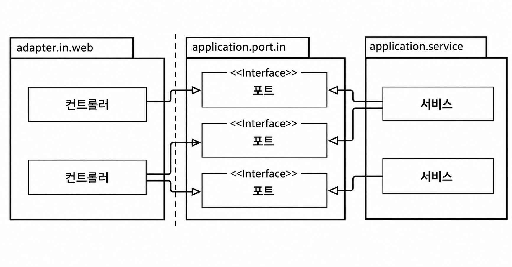
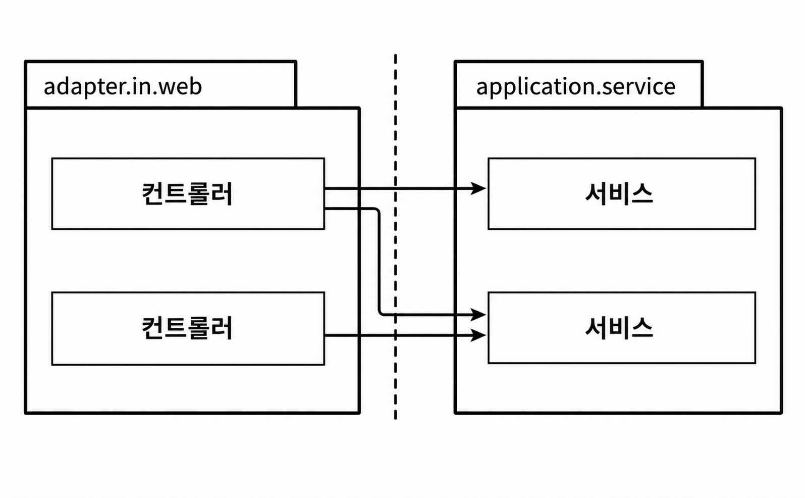

## 웹 어댑터 구현하기

목표로 하는 아키텍처에서 외부 세계와의 모든 커뮤니케이션은 어댑터를 통해 이뤄진다.
- 이번 장에서는 웹 인터페이스를 제공하는 어댑터의 구현 방법을 살펴본다.

### 의존성 역전



웹 어댑터는 '주도하는' 혹은 '인커밍' 어댑터이다.
- 제어의 흐름이 웹 어댑터에 있는 컨트롤러에서 애플리케이션 계층에 있는 서비스로 흐른다.

애플리케이션 계층은 웹 어댑터가 통신할 수 있는 포트를 제공한다.
- 서비스는 포트를 구현하고, 웹 어댑터는 이 포트를 호출할 수 있다.



- 의존성 역전 원칙이 적용되었다.
- 웹 어댑터가 유스케이스를 직접호출할 수 있다.

어댑터와 유스케이스 사이에 또 다른 간접 계층을 넣는 이유
- 애플리케이션 코어가 외부 세계와 통신할 수 있는 곳에 대한 명세가 포트이다.
- 유지보수 시 구조를 이해하기 쉬워진다.

웹소켓 어댑터는 요청을 받아 애플리케이션을 호출하면서, 동시에 애플리케이션의 데이터를 외부로 전달하는 인커밍/아웃고잉 어댑터 역할을 모두 수행한다.

### 웹 어댑터의 책임

웹 어댑터가 일반적으로 하는 일
1. HTTP 요청을 자바 객체로 매핑
2. 권한 검사
3. 입력 유효성 검증
4. 입력을 유스케이스의 입력 모델로 매핑
5. 유스케이스 호출
6. 유스케이스의 출력을 HTTP로 매핑
7. HTTP 응답을 반환

유효성 검증에서 웹 어댑터, 유스케이스 차이
- 유스케이스 입력 모델은 유스케이스 맥락에서 유효한 입력만 허용해야 한다.
- 이 부분에서는 웹 어댑터의 입력 모델에 대한 검증을 이야기하고 있다.
    - 유스케이스와 다른 또 다른 검증을 수행해야 한다.
- 웹 어댑터의 입력 모델을 유스케이스의 입력 모델로 변환할 수 있다는 것을 검증해야 한다.

웹 어댑터의 책임이 많지만 이 책임들은 애플리케이션 계층이 신경 쓰면 안되는 것들이다.
- HTTP와 관련된 것은 애플리케이션 계층으로 침투해서는 안된다.
    - 침투시 HTTP를 사용하지 않는 또 다른 인커밍 어댑터의 요청에 대해 동일한 도메인 로직을 수행할 수 있는 선택지를 잃게 된다.

도메인과 애플리케이션 계층부터 구현하면 웹 계층과의 경계가 자연스럽게 유지되며, 계층 간 경계를 흐리는 지름길을 피할 수 있다.

### 컨트롤러 나누기
- 웹 어댑터는 한 개 이상의 클래스로 구성해도 된다.
    - 클래스들이 같은 소속이라는 것을 표현하기 위해 같은 패키지 수준에 놓아야 한다.
- 컨트롤러는 너무 적은 것보다는 너무 많은 게 낫다.
    - 각 컨트롤러가 가능한 한 좁고 다른 컨트롤러와 가능한 한 적게 공유하는 웹 어댑터 조각을 구현해야 한다.

Account 엔티티의 연산들의 예
- AccountController를 하나 만들어서 계좌와 관련된 모든 요청을 받는 것

```java
package buckpal.adapter.web;

@RestController
@RequiredArgsConstructor
class AccountController {

    private final GetAccountBalanceQuery getAccountBalanceQuery;
    private final ListAccountsQuery listAccountsQuery;
    private final LoadAccountQuery loadAccountQuery;

    private final SendMoneyUseCase sendMoneyUseCase;
    private final CreateAccountUseCase createAccountUseCase;

    @GetMapping("/accounts")
    List<AccountResource> listAccounts() {
        ...
    }

    @GetMapping("/accounts/{accountId}")
    AccountResource getAccount(@PathVariable("accountId") Long accountId) {
        ...
    }

    @GetMapping("/accounts/{accountId}/balance")
    long getAccountBalance(@PathVariable("accountId") Long accountId) {
        ...
    }

    @PostMapping("/accounts")
    AccountResource createAccount(@RequestBody AccountResource account) {
        ...
    }

    @PostMapping("/accounts/send/{sourceAccountId}/{targetAccountId}/{amount}")
    void sendMoney(
        @PathVariable("sourceAccountId") Long sourceAccountId,
        @PathVariable("targetAccountId") Long targetAccountId,
        @PathVariable("amount") Long amount) {
        ...
    }
}
```

위 방식의 단점
- 컨트롤러에 코드가 조금만 늘어나도 코드 파악의 난이도가 높아진다.
- 테스트 코드를 찾기 힘들다.
    - 테스트 코드는 더 추상적이라 프로덕션 코드에 비해 파악하기 어려울 때가 많다.
    - 클래스가 작을수록 테스트 코드를 찾기 더 쉽다.
- AccountResource 모델 클래스를 공유한다.
    - 필요하지 않은 필드까지 포함되어 모델이 복잡해진다.

각 연산에 대해 별도의 패키지 안에 별도의 컨트롤러를 사용하는 방식
- 메서드와 클래스명은 유스케이스를 최대한 반영해서 지어야 한다.

```java
@RestController
@RequiredArgsConstructor
public class SendMoneyController {

    private final SendMoneyUseCase sendMoneyUseCase;

    @PostMapping("/accounts/send/{sourceAccountId}/{targetAccountId}/{amount}")
    void sendMoney(
        @PathVariable("sourceAccountId") Long sourceAccountId,
        @PathVariable("targetAccountId") Long targetAccountId,
        @PathVariable("amount") Long amount) {
        
        SendMoneyCommand command = new SendMoneyCommand(
            new AccountId(sourceAccountId),
            new AccountId(targetAccountId),
            Money.of(amount));
        
        sendMoneyUseCase.sendMoney(command);
    }
}
```
- 각 컨트롤러가 CreateAccountResource, UpdateAccountResource 같은 컨트롤러 자체의 모델이나 위의 코드처럼 원시값을 가질 수 있다.
    - 전용 모델 클래스는 package-private으로 선언할 수 있기 때문에 실수로 다른 곳에서 재사용될 일이 없다.
    - 컨트롤러 전용 모델을 별도 패키지에 두면 다른 컨트롤러에서 쉽게 재사용하기 어렵다. 따라서 모델을 공유하기 전에 정말 필요한지 다시 고민하게 되고, 결국 각 컨트롤러에 맞는 모델을 따로 만들 가능성이 높아진다.

위와 같이 나누는 스타일의 또 다른 장점
- 서로 다른 연산에 대한 동시 작업이 쉬워진다.
    - 두 명의 개발자가 서로 다른 연산에 대해 코드를 짜고 있다면 병합 충돌이 일어나지 않는다.

### 유지보수 가능한 소프트웨어를 만드는 데 어떻게 도움이 될까?
- 웹 어댑터 구현
    - HTTP 요청을 애플리케이션의 유스케이스에 대한 메서드 호출로 변환하고 결과를 다시 HTTP로 변환
    - 어떠한 도메인 로직도 수행하지 않아야 함
- 애플리케이션 계층
    - HTTP에 대한 상세 정보를 노출시키지 않도록 HTTP와 관련된 작업을 해서는 안된다.
        - 필요할 경우 웹 어댑터를 다른 어댑터로 쉽게 교체할 수 있다.

웹 컨트롤러를 나눌 때는 모델을 공유하지 않은 여러 작은 클래스들을 만드는 것을 두려워 하면 안된다.
- 작은 클래스는 파악하기 쉽다.
- 작은 클래스는 테스트하기 쉽다.
- 동시 작업을 지원한다.
- 세분화된 컨트롤러는 처음에 공수가 더 들지만 유지보수는 쉬워질 것이다.