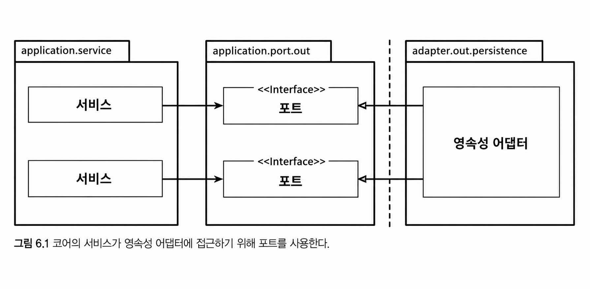
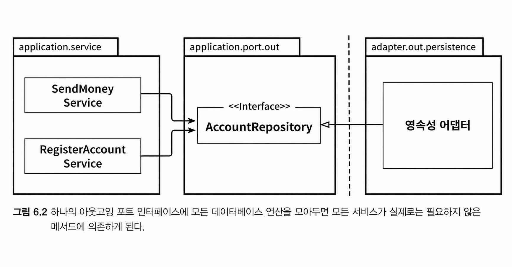
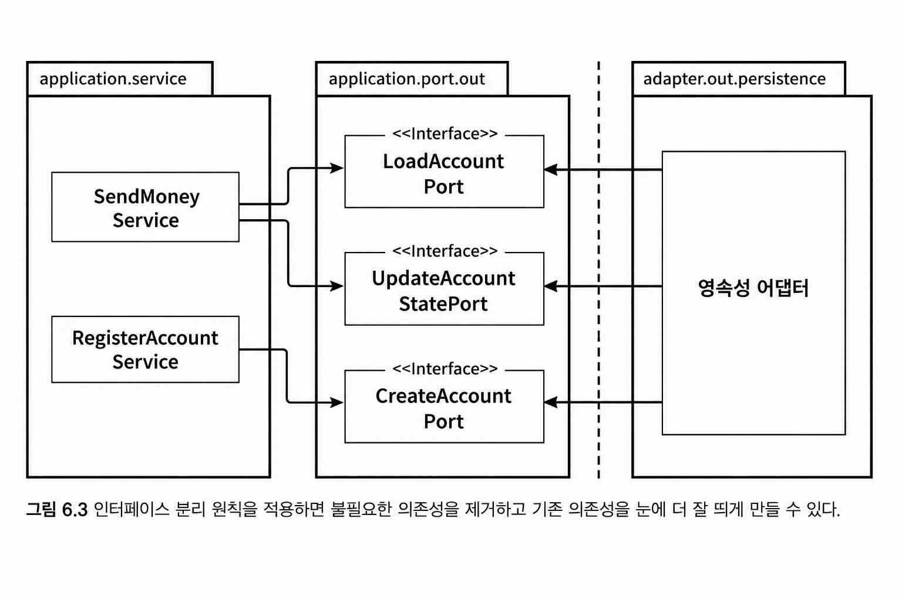
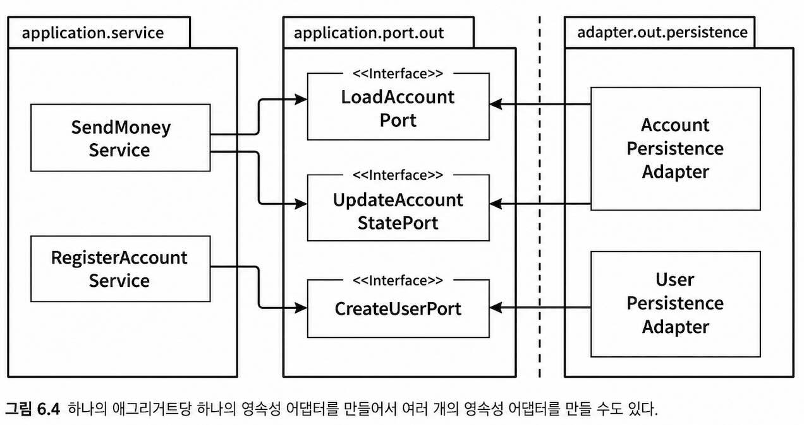
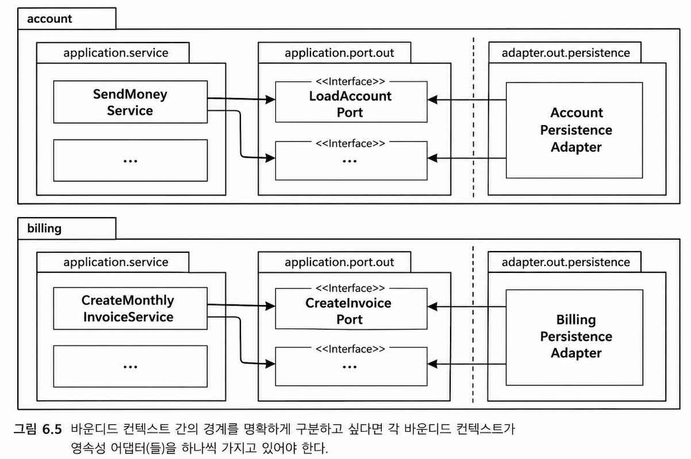

## 영속성 어댑터 구현하기

계층형 아키텍처에서는 모든 것이 영속성 계층에 의존하게 된다.
- 이러한 의존성을 역전시키기 위해 영속성 계층을 애플리케이션 계층의 플러그인으로 만드는 방법을 살펴본다.

### 의존성 역전

애플리케이션 계층에서 영속성 기능을 사용하기 위해 포트 인터페이스를 호출한다.
- 포트는 영속성 작업을 수행하고 데이터베이스와 통신할 책임을 가진 영속성 어댑터 클래스에 의해 구현된다.

영속성 어댑터
- '주도되는' 혹은 '아웃고잉' 어댑터이다.
- 애플리케이션에 의해 호출되고, 애플리케이션을 호출하지는 않는다.

포트
- 애플리케이션 서비스와 영속성 코드 사이의 간접적 계층
- 애플리케이션이 영속성 계층에 대한 코드 의존성이 생기지 않게 한다.
- 포트로 인해 코어에 영향을 미치지 않으면서 영속성 코드를 수정할 수 있다.

### 영속성 어댑터의 책임

일반적으로 영속성 어댑터가 하는 일
1. 입력을 받는다
2. 입력을 데이터베이스 포맷으로 매핑한다
3. 입력을 데이터베이스로 보낸다
4. 데이터베이스 출력을 애플리케이션 포맷으로 매핑한다
5. 출력을 반환한다.

영속성 어댑터는 포트 인터페이스를 통해 입력을 받는다.
- 입력 모델은 포트 인터페이스가 지정한 도메인 엔티티나 특정 데이터베이스 연산 전용 객체일 수 있다.

영속성 어댑터는 JPA 엔티티, SQL 구문, 직렬화된 파일 등 데이터베이스와 통신 가능한 포맷으로 입력 모델을 매핑한다.

영속성 어댑터의 입력 모델은 영속성 어댑터 내부가 아닌 애플리케이션 코어에 존재한다.
- 영속성 어댑터의 내부를 변경하는 것이 코어에 영향을 미치지 않는다.

데이터베이스 응답은 포트에 정의된 출력 모델로 매핑해서 반환된다.
- 출력 모델은 영속성 어댑터가 아니라 애플리케이션 코어에 위치한다.

### 포트 인터페이스 나누기

서비스 구현 시 고민할 점은 데이터베이스 연산 포트를 어떻게 분리할지다.

일반적인 방법
- 특정 엔티티가 필요로 하는 모든 데이터베이스 연산을 하나의 Repository 인터페이스로 묶는다.

- 각 서비스는 실제로 하나의 메서드만 사용하더라도 하나의 '넓은' 포트 인터페이스 전체에 의존하게 된다.
    - 맥락상 필요하지 않은 메서드까지 의존하게 되어 코드 이해와 테스트가 어려워진다.
    - 예를 들어 RegisterAccountService의 테스트를 작성할 때도 AccountRepository의 어떤 메서드가 호출되는지 모두 확인해야 한다.
    - 인터페이스 전체가 모킹되었다고 착각해 테스트 오류가 발생할 수 있다.

인터페이스 분리 원칙(Interface Segregation Principle, ISP)는 이 문제의 답을 제시한다.
- 클라이언트가 오로지 자신이 필요로 하는 메서드만 알면 된다.
- 넓은 인터페이스를 특화된 인터페이스로 분리한다.

ISP를 적용한 그림

- 각 서비스는 필요한 포트에만 의존한다.
- 각 포트의 이름이 포트의 역할을 명확히 표현하고 있다.
- 대부분의 포트가 하나의 메서드만 있기 때문에 테스트에서 어떤 메서드를 모킹할지 고민할 필요가 없다.

모든 상황에 '포트 하나당 하나의 메서드'를 적용하지는 못할것이다.
- 응집성이 높고 함께 사용될 때가 많기 때문에 하나의 인터페이스에 묶고 싶은 데이터베이스 연산들이 존재한다.

### 영속성 어댑터 나누기

영속성 어댑터는 하나 이상의 클래스로 만들 수 있다.
- 영속성 연산이 필요한 도메인 클래스(애그리거트) 하나당 영속성 어댑터를 구현하는 방식을 선택할 수 있다.

영속성 어댑터들은 각 영속성 기능을 이용하는 도메인 경계를 따라 자동으로 나눠진다.

영속성 어댑터를 훨씬 더 많은 클래스로 나눌 수 있다.
- JPA, OR 매퍼를 이용한 영속성 포트 구현
- 성능 개선을 위해 평번한 SQL을 이용하는 다른 종류의 포트 구현

도메인은 포트에 의존하며, 영속성 구현체 변경에는 영향을 받지 않는다.

애그리거트별 영속성 어댑터 분리는 바운디드 컨텍스트 분리의 좋은 토대가 된다.

- 각 바운디드 컨텍스트는 영속성 어댑터를 하나씩(하나 이상일 수도 있다.) 가지고 있다.
- 바운디드 컨텍스트는 "경계"를 암시한다.
    - 각각의 서비스는 다른 맥락의 어댑터에 접근하지 않는다. (account -> billing을 접근하지 않음)