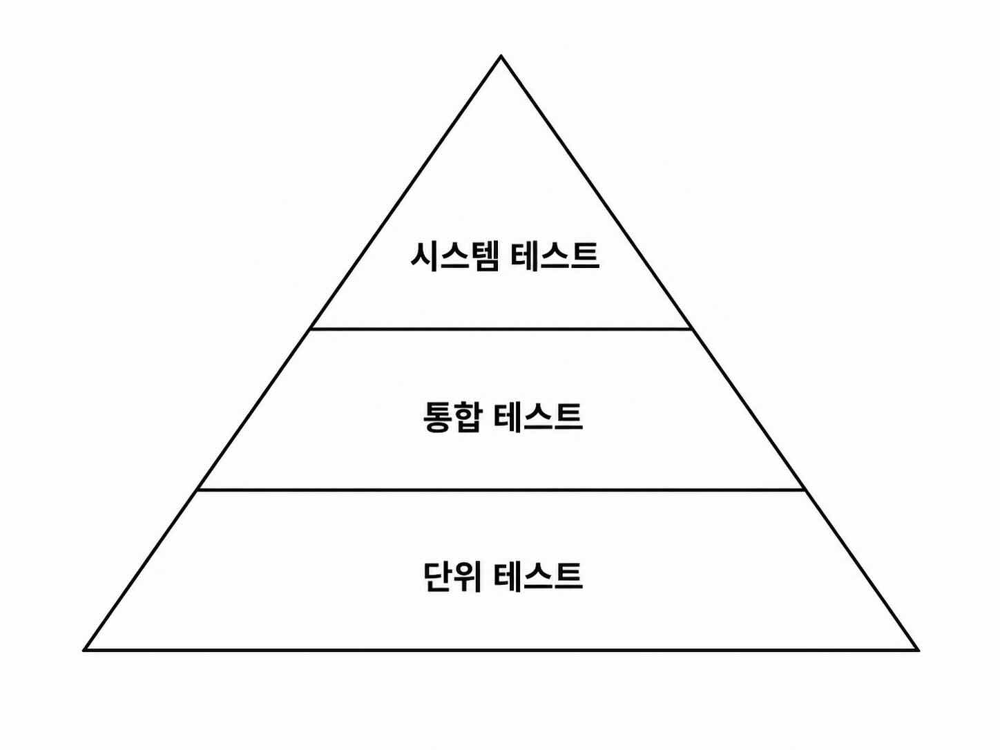

## 아키텍처 요소 테스트하기

### 테스트 피라미드



- 단위 테스트는 빠르고 안정적이며 유지보수 비용이 낮기 때문에 높은 커버리지를 유지해야 한다.
- 통합/시스템 테스트는 비용이 크고 깨지기 쉬우므로 필요한 범위만 작성해야 한다.

테스트 종류
- 단위 테스트
    - 일반적으로 하나의 클래스를 인스턴스화하고 해당 클래스의 인터페이스를 통해 기능들을 테스트한다.
        - 테스트 중 클래스가 의존하는 다른 객체는 mock으로 대체한다.
- 통합 테스트
    - 여러 객체를 실제로 연결해 함께 동작하는지 검증한다.
    - 계층 간 경계를 함께 테스트할 수 있다.
    - 모든 객체를 실제로 사용할 필요는 없으며 일부는 mock으로 대체할 수 있다.
- 시스템 테스트
    - 애플리케이션을 구성하는 모든 객체 네트워크를 가동시켜 특정 유스케이스가 전 계층에서 잘 동작하는지 검증한다.

### 단위 테스트로 도메인 엔티티 테스트하기
Account의 상태는 과거 특정 시점의 계좌 잔고(baselineBalance)와 그 이후의 입출금 내역(activity)으로 구성되어 있다.

withdraw() 메서드가 기대한 대로 동작하는지 검증
```java
class AccountTest {

    @Test
    void withdrawalSucceeds() {
        AccountId accountId = new AccountId(1L);
        Account account = defaultAccount()
            .withAccountId(accountId)
            .withBaselineBalance(Money.of(555L))
            .withActivityWindow(new ActivityWindow(
                defaultActivity()
                    .withTargetAccount(accountId)
                    .withMoney(Money.of(999L)).build(),
                defaultActivity()
                    .withTargetAccount(accountId)
                    .withMoney(Money.of(1L)).build()))
            .build();

        boolean success = account.withdraw(Money.of(555L), new AccountId(99L));

        assertThat(success).isTrue();
        assertThat(account.getActivityWindow().getActivities()).hasSize(3);
        assertThat(account.calculateBalance()).isEqualTo(Money.of(1000L));
    }
}
```
- 이 테스트는 만들고 이해하는 것도 쉬운 편이고, 아주 빠르게 실행된다. 테스트가 간단하다.
- 이런 식의 단위 테스트가 도메인 엔티티에 녹아 있는 비즈니스 규칙을 검증하기에 가장 적절한 방법이다.
- 도메인 엔티티의 행동은 다른 클래스에 거의 의존하지 않기 때문에 다른 종류의 테스트는 필요하지 않다.

### 단위 테스트로 유스케이스 테스트하기
출금 계좌의 잔고가 다른 트랜잭션에 의해 변경되지 않도록 락을 걸고, 출금 계좌에서 돈이 출금되고 나면 똑같이 입금 계좌에 락을 걸고 돈을 입금시킨다. 그러고 나서 두 계좌에서 모두 락을 해제한다.

```java
class SendMoneyServiceTest {
    // 필드 선언 생략

    @Test
    void transactionSucceeds() {

        Account sourceAccount = givenSourceAccount();
        Account targetAccount = givenTargetAccount();

        givenWithdrawalWillSucceed(sourceAccount);
        givenDepositWillSucceed(targetAccount);

        Money money = Money.of(500L);

        SendMoneyCommand command = new SendMoneyCommand(
            sourceAccount.getId(),
            targetAccount.getId(),
            money);
        
        boolean success = sendMoneyService.sendMoney(command);

        assertThat(success).isTrue();

        AccountId sourceAccountId = sourceAccount.getId();
        AccountId targetAccountId = targetAccount.getId();

        then(accountLock).should().lockAccount(eq(sourceAccountId));
        then(sourceAccount).should().withdraw(eq(money), eq(targetAccountId));
        then(accountLock).should().releaseAccount(eq(sourceAccountId));

        then(accountLock).should().lockAccount(eq(targetAccountId));
        then(targetAccount).should().deposit(eq(money), eq(sourceAccountId));
        then(accountLock).should().releaseAccount(eq(targetAccountId));

        thenAccountsHaveBeenUpdated(sourceAccountId, targetAccountId);
    }

    // 헬퍼 메서드 생략
}
```
- given/when/then 방식 사용
    - given: Account 생성 및 값 설정
    - when: sendMoney() 메서드 호출
    - then: 트랜잭션 성공 확인 및 출금, 입금 Account, 그리고 계좌에 락을 걸고 해제하는 책임을 가진 AccountLock에 대해 특정 메서드가 호출됐는지 검증한다.
- Mockito의 given()으로 mock 객체를 만들고 then()으로 메서드 호출 여부를 검증한다.
- 상태 대신 상호작용 검증
    - stateless 서비스는 상태를 검증하기 어렵기 때문에 의존 객체와의 상호작용 여부를 검증한다.
    - 상호작용 검증은 코드 구조 변경(리팩터링)에 취약하다.
- 상호작용 검증 범위
    - 모든 상호작용을 검증하기보다 핵심 동작만 검증하는 것이 좋다.
    - 모든 동작을 검증하면 구현 변경마다 테스트도 함께 수정해야 한다.

이 테스트는 단위 테스트지만 의존성의 상호작용을 테스트하고 있기 때문에 통합 테스트에 가깝다.
- 실제 의존성을 사용하지 않으므로 완전한 통합 테스트보다 만들고 유지보수하기 쉽다.

### 통합 테스트로 웹 어댑터 테스트하기
웹 어댑터는 HTTP 입력 -> 유효성 검증 -> 유스케이스 포맷으로 매핑 -> 유스케이스 전달 -> 유스케이스 결과를 HTTP 응답으로 변환하는 방식으로 동작한다.

```java
@WebMvcTest(controllers = SendMoneyController.class)
class SendMoneyControllerTest {

    @Autowired
    private MockMvc mockMvc;

    @MockBean
    private SendMoneyUseCase sendMoneyUseCase;

    @Test
    void testSendMoney() throws Exception {

        mockMvc.perform(
            post("/accounts/send/{sourceAccountId}/{targetAccountId}/{amount}",
                41L, 42L, 500)
                .header("Content-Type", "application/json"))
            .andExpect(status().isOk());

        then(sendMoneyUseCase).should()
            .sendMoney(eq(new SendMoneyCommand(
                new AccountId(41L),
                new AccountId(42L),
                Money.of(500L))));
    }
}
```
MockMvc 테스트
- MockMvc를 이용해 HTTP 요청과 응답을 테스트한다.
- HTTP 상태 코드와 유스케이스 호출 여부를 검증한다.

매핑을 검증한다.
- 실제 HTTP 프로토콜 자체를 테스트하는 것은 아니다.
- 대신 JSON -> Command 객체 매핑 과정과 입력 검증은 테스트한다.

왜 통합 테스트인가?
- 컨트롤러 하나만 테스트하는 것처럼 보이지만, 실제로는 스프링의 객체 네트워크가 함께 동작한다.
- @WebMvcTest가 요청 매핑, JSON 변환, HTTP 입력 검증 등을 포함한 환경을 구성한다.

웹 컨트롤러 테스트 전략
- 웹 컨트롤러는 스프링에 강하게 의존하므로 프레임워크와 통합된 상태로 테스트하는 것이 합리적이다.
- 단위 테스트만 사용하면 매핑, 검증, HTTP 관련 동작을 충분히 검증할 수 없다.
