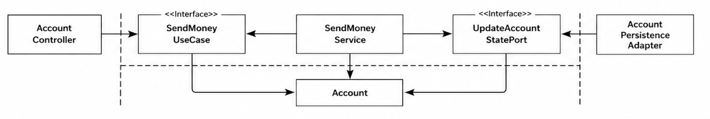
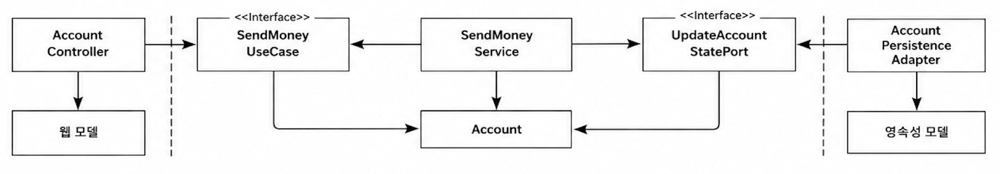
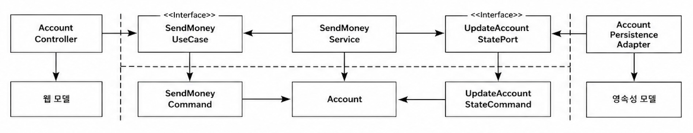
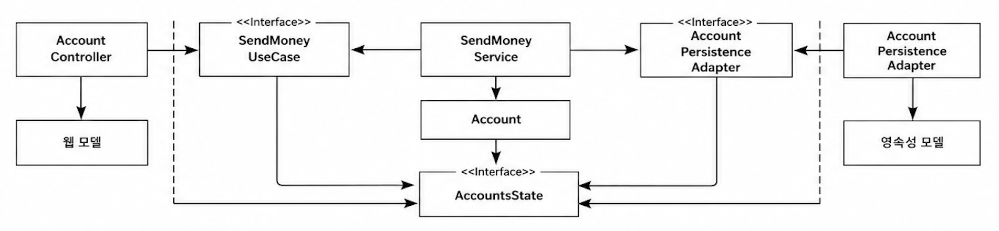

## 경계 간 매핑하기

매퍼 구현을 피하기 위해 두 계층에서 같은 모델에 대한 논쟁
- 매핑에 찬성
    - 두 계층간에 같은 모델을 사용하면 두 계층이 강하게 결합된다.
- 매핑에 반대
    - 매핑을 위한 보일러플레이트 코드가 많이 생기게 된다.
    - 많은 유스케이스 계층들이 CRUD만 수행하고 계층에 걸쳐 같은 모델을 사용하기 때문에 계층 사이의 매핑이 과하다.

여러 매핑 전략들과 장단점에 대해 설명

### '매핑하지 않기' 전략

- SendMoneyUseCase가 Account 객체를 인자로 가진다.
    - 영속성 계층도 Account 객체를 인자로 가진다.
    - 모든 계층이 같은 인자를 가짐
- 웹 계층에서 모델을 JSON 으로 직렬화 하기 위해, 영속성 계층에서 데이터베이스 매핑을 위해 특정 애너테이션이 필요할 수 있다.
    - Account 도메인 모델이 위와 같은 특수한 요구사항을 다뤄야 한다.
        - 웹, 애플리케이션, 영속성 계층과 관련된 이유로 인해 변경될 수 있기 때문에 단일 책임 원칙을 위반한다.

각 계층이 Account 클래스에 특정 커스텀 필드를 요구할 수 있다.
- 한 계층에서만 필요한 필드를 포함하는 파편화된 도메인 모델로 이어질 수 있다.

매핑하지 않기 전략이 들어맞는 경우
- 간단한 CRUD 유스케이스
    - JSON, ORM 관련 애너테이션 한 두개를 변경해도 큰 영향이 없음
- 모든 계층이 정확히 같은 구조의, 같은 정보를 필요로 한다면 좋은 선택이다.

그러나 애플리케이션 계층과 도메인 계층에서 웹과 영속성 계층에 관한 문제를 다루게 되면 다른 전략을 취해야 한다.

매핑 전략은 이후에도 변경할 수 있다.
- 처음에는 단순 CRUD 유스케이스로 시작하더라도
- 이후 유효성 검증과 비즈니스 규칙을 가지는 복잡한 유스케이스로 발전할 수 있다.

### '양방향' 매핑 전략

각 계층이 전용 모델을 가진 매핑 전략이다.
- 웹 계층은 웹 모델을 인커밍 포트에서 필요한 도메인 모델로 매핑하고, 인커밍 포트에 의해 반환된 도메인 객체를 다시 웹 모델로 매핑한다.
- 영속성 계층도 이와 유사하게 매핑된다.

두 계층 모두 양방향으로 매핑하기 때문에 '양방향' 매핑이라고 부른다.

'양방향' 매핑의 장점
- 각 계층이 전용 모델을 가지고 있어서 전용 모델을 변경해도 다른 계층에 영향이 없다.
- 각 계층의 전용 모델이 자신이 필요로 하는 최적의 구조를 가질 수 있다.
- 도메인 모델은 웹이나 영속성 관심으로 오염되지 않는 깨끗한 모델이 된다.
    - JSON, ORM 애너테이션이 없게 되고, 단일 책임 원칙을 만족한다.
- 매핑 책임이 명확하다.
    - 바깥쪽 계층/어댑터는 안쪽 계층의 모델로 매핑하고, 다시 반대 방향으로 매핑한다.

'양방향' 매핑의 단점
- 많은 보일러플레이트 코드가 생긴다.
    - 매핑 프레임워크를 사용하더라도 매핑에 시간이 든다.
    - 매핑 프레임워크의 내부 동작이 제네릭 코드와 리플렉션으로 작동한다면 디버깅도 까다롭다.
- 도메인 모델이 계층 경계를 넘어서 통신하는 데 사용된다.
    - 인커밍 포트와 아웃고잉 포트는 도메인 객체를 입력 파라미터와 반환값으로 사용한다.
    - 바깥쪽 계층의 요구에 따른 변경에 취약해진다.
        - 도메인 모델은 도메인 모델의 필요에 의해서만 변경되는게 이상적이다.

양방향 매핑 전략도 은총알(silver bullet)은 아니다.
- 어떤 매핑 전략도 철칙처럼 여겨져서는 안된다. 각 유스케이스마다 적절한 전략을 택할 수 있어야 한다.

### '완전' 매핑 전략

각 연산마다 별도의 입출력 모델을 사용한다.
- 계층 경계를 넘어 통신할 때 도메인 모델을 사용하는 대신 Command 객체 처럼 각 작업에 특화된 모델을 사용한다.

웹 계층은 입력을 유스케이스별 커맨드 객체로 매핑할 책임을 가진다.
- 커맨드 객체는 애플리케이션 계층의 인터페이스를 명확하게 만들어준다.
- 각 유스케이스는 전용 필드와 유효성 검증을 가진 커맨드를 사용한다.
- 불필요한 필드나 유효성 검증이 섞이지 않는다.

애플리케이션 계층은 커맨드 객체를 유스케이스에 따라 도메인 모델을 변경하기 위해 필요한 무엇인가로 매핑할 책임을 가진다.

유스케이스마다 별도 매핑 코드가 필요해 코드량은 증가한다.
- 하지만 여러 유스케이스 요구사항을 하나의 모델로 처리하는 것보다 구현과 유지보수가 쉽다.

주의점
- 완전 매핑 전략을 모든 계층에 전역적으로 적용할 필요는 없다.
- 웹 계층과 애플리케이션 계층 사이의 상태 변경 유스케이스에서 특히 효과적이다.
- 애플리케이션 계층과 영속성 계층 사이에서는 매핑 오버헤드 때문에 사용하지 않는 것이 좋다.
- 출력 모델은 경우에 따라 도메인 객체를 그대로 사용할 수도 있다.
- 매핑 전략은 상황에 따라 섞어서 사용할 수 있다.

### '단방향' 매핑 전략

모든 계층의 모델들이 같은 인터페이스를 구현한다.
- 인터페이스는 관련있는 특성에 대한 getter 메서드를 제공한다.
- 도메인 모델의 상태를 캡슐화한다. (행동을 외부에 노출하지 않음)

흐름
- 웹 계층은 상태 인터페이스를 구현한 객체를 애플리케이션 계층에 전달한다.
- 애플리케이션 계층은 이를 실제 도메인 객체로 변환해 도메인 로직을 수행한다.
    - 이는 DDD의 Factory 개념과 잘 어울린다.

특징
- 각 계층은 전달받은 객체를 자신이 사용할 모델로 한 방향만 매핑한다.
- 상태 인터페이스에는 행동이 노출되지 않기 때문에 외부 계층이 도메인 상태를 실수로 변경할 수 없다.

장점
- 읽기 전용 작업에서 매핑을 줄일 수 있다.
- 계층 간 모델 구조가 비슷할 때 효과적이다.

단점
- 매핑 책임이 여러 계층에 분산된다.
- 다른 매핑 전략보다 개념적으로 복잡하다.

### 어ㄴ제 어떤 매핑 전략을 사용할 것인가?

매핑 전략은 상황에 따라 달라진다.
- 하나의 전략을 모든 계층에 전역 규칙처럼 적용할 필요는 없다.
- 소프트웨어는 계속 변화하기 때문에 현재 최선의 전략도 나중에는 달라질 수 있다.
- 단순한 전략으로 시작하고 필요할 때 더 복잡한 전략으로 변경해도 된다.

팀은 상황별 매핑 전략 가이드라인을 가져야 한다.

예시 가이드라인
- 변경 유스케이스
    - 웹 <-> 애플리케이션 계층
        - 완전 매핑 전략 우선
        - 유스케이스별 입력/유효성 검증을 명확하게 분리 가능
    - 애플리케이션 <-> 영속성 계층
        - 매핑하지 않기 전략 우선
        - 영속성 문제가 애플리케이션 계층으로 새어나오면 양방향 매핑 전략 사용
- 조회(쿼리) 유스케이스
    - 매핑 오버헤드를 줄이기 위해 기본적으로 매핑하지 않기 전략 사용
    - 웹/영속성 문제가 애플리케이션 계층에 침투하면 양방향 매핑 전략 사용

### ## 유지보수 가능한 소프트웨어를 만드는 데 어떻게 도움이 될까?

인커밍/아웃고잉 포트는 계층 간 통신 방식을 정의한다.
- 여기에는 어떤 매핑 전략을 사용할지도 포함된다.

유스케이스별로 좁은 포트를 사용하면
- 각 상황에 맞는 매핑 전략을 독립적으로 선택할 수 있다.
- 다른 유스케이스에 영향을 주지 않고 구조를 개선할 수 있다.

상황별 매핑 전략은 복잡하고 팀 커뮤니케이션도 더 필요하지만, 적절한 가이드라인이 있다면 더 유지보수하기 쉬운 코드로 이어진다.