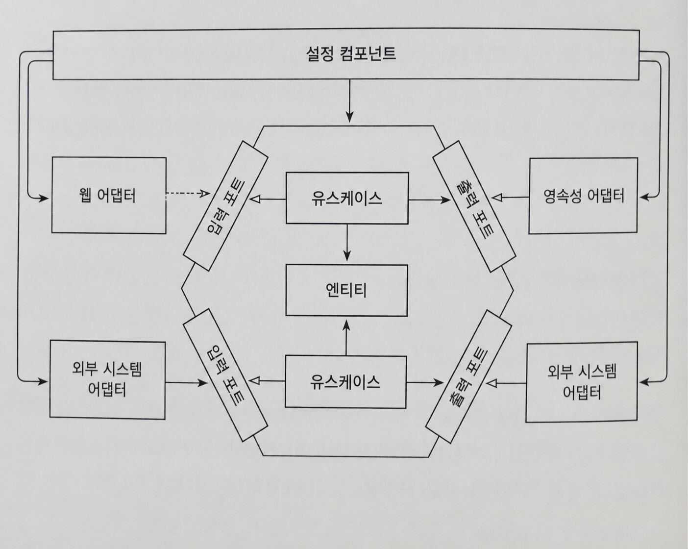

## 애플리케이션 조립하기

### 왜 조립까지 신경 써야 할까?
- 의존성이 도메인 코드 방향(안쪽)으로 향하도록 하기 위해 유스케이스와 어댑터를 직접 생성하지 않는다.
- 이를 통해 도메인 코드를 바깥 계층의 변경으로부터 보호할 수 있다.

유스케이스와 영속성 어댑터
- 유스케이스가 영속성 어댑터를 직접 생성하면 의존성 방향이 잘못된다.
- 그래서 유스케이스는 아웃고잉 포트 인터페이스만 의존하고, 실제 구현은 런타임에 주입받는다.

위와 같은 방식의 장점
- 코드를 훨씬 더 테스트하기 쉽다.
- 한 클래스가 필요로 하는 객체들을 생성자로 전달할 수 있다면 객체 대신 목(mock)을 전달할 수 있고, 격리된 단위 테스트를 생성하기 쉬워진다.

설정 컴포넌트 (configuration component)
- 아키텍처에 대해 중립적이고 인스턴스 생성을 위해 모든 클래스에 대한 의존성을 가진다.
- 의존성 규칙을 어기지 않으며 객체 인스턴스를 생성한다.



설정 컴포넌트는 애플리케이션을 조립하는 역할을 한다.
- 객체 인스턴스를 생성하고 필요한 의존성을 주입한다.
- 설정 파일이나 파라미터를 읽어 필요한 구현체와 동작 방식을 결정한다.

특징
- 많은 책임을 가지지만 애플리케이션을 조립하는 바깥 계층 역할이므로 허용된다.

### 평범한 코드로 조립하기
의존성 주입 프레임워크의 도움이 없는 경우 코드로 컴포넌트를 만들 수 있다.

```java
package copyeditor.configuration;

class Application {

    public static void main(String[] args) {

        AccountRepository accountRepository = new AccountRepository();
        ActivityRepository activityRepository = new ActivityRepository();

        AccountPersistenceAdapter accountPersistenceAdapter = 
            new AccountPersistenceAdapter(accountRepository, activityRepository);
        
        SendMoneyUseCase sendMoneyUseCase = 
            new SendMoneyUseService(
                accountPersistenceAdapter,      // LoadAccountPort;
                accountPersistenceAdapter);     // UpdateAccountStatePort;
        
        SendMoneyController sendMoneyController = 
            new SendMoneyController(sendMoneyUseCase);
        
        startProcessingWebRequests(sendMoneyController);
    }
}
```
- main 메서드에서 필요한 모든 클래스의 인스턴스를 생성한 후 연결한다.
- startProcessingWebRequests() 메서드로 웹 컨트롤러를 HTTP로 노출한다.

이 방식의 단점
- 엔터프라이즈 애플리케이션을 실행하기 위해 훨씬 많은 생성 및 의존성 주입 코드가 필요하다.
- 패키지 외부에서 인스턴스를 생성하기 위해 클래스들이 모두 public이어야 한다.
    - 유스케이스가 영속성 어댑터에 직접 접근하는 것을 막지 못한다.

package-private 의존성을 유지하며 이러한 작업을 대신하는 방법
- 스프링 같은 의존성 주입 프레임워크 사용
- 스프링 프레임워크는 웹과 데이터베이스 환경을 지원하기 때문에 startProcessingWebRequests() 같은 메서드를 구현할 필요가 없다.

### 스프링의 클래스패스 스캐닝으로 조립하기
애플리케이션 컨텍스트(application context)
- 스프링 프레임워크를 이용해서 애플리케이션을 조립한 결과물
- 애플리케이션을 구성하는 모든 객체를 포함한다.

클래스패스 스캐닝으로 @Component 애너테이션이 붙은 클래스를 찾고, 클래스의 객체를 생성한다.
```java
@RequiredArgsConstructor
@Component
class AccountPersistenceAdapter implements LoadAccountPort, UpdateAccountStatePort {
    
    private final AccountRepository accountRepository;
    private final ActivityRepository activityRepository;
    private final AccountMapper accountMapper;

    @Override
    public Account loadAccount(AccountId accountId,
            LocalDateTime baselineDate) {
        // ...
    }

    @Override
    public void updateActivities(Account account) {
        // ...
    }
}
```
- 클래스패스 스캐닝 방식을 이용하면 편리하게 애플리케이션을 조립할 수 있다.
- 적절한 곳에 @Component 애너테이션을 붙이고 생성자만 잘 만들어 두면 된다.

```java
@Target({ElementType.TYPE})
@Retention(RetentionPolicy.RUNTIME)
@Documented
@Component
public @interface PersistenceAdapter {

    @AliasFor(annotation = Component.class)
    String value() default "";
}
```
- 메타 애너테이션으로 @Component를 포함하고 있어 클래스패스 스캐닝으로 인스턴스를 생성할 수 있다.
- @PersistenceAdapter를 이용해 코드를 읽는 사람이 아키텍처를 더 쉽게 파악할 수 있게 한다.

이 방식의 단점
- 클래스에 프레임워크에 특화된 애너테이션을 붙여야 한다.
    - 코드를 특정한 프레임워크와 결합시킨다.
- 클래스패스 스캐닝은 자동으로 객체를 등록하기 때문에 제어가 어렵다.
    - 의도하지 않은 클래스가 애플리케이션 컨텍스트에 등록될 수 있다.
- 자동 등록 과정에서 원인을 찾기 어려운 숨겨진 부수효과가 발생할 수 있다.

### 스프링의 자바 컨피그로 조립하기
애플리케이션 컨텍스트에 추가할 빈을 생성하는 설정 클래스를 만든다.

모든 영속성 어댑터들의 인스턴스 생성을 담당하는 설정 클래스 만들기
```java
@Configuration
@EnableJpaRepositories
class PersistenceAdapterConfiguration {

    @Bean
    AccountPersistenceAdapter accountPersistenceAdapter(
            AccountRepository accountRepository,
            ActivityRepository activityRepository,
            AccountMapper accountMapper) {
        
        return new AccountPersistenceAdapter(
            accountRepository,
            activityRepository,
            accountMapper);
    }

    @Bean
    AccountMapper accountMapper() {
        return new AccountMapper();
    }
}
```
@Configuration과 @Bean을 이용해 필요한 객체를 명시적으로 등록할 수 있다.

장점
- 어떤 Bean이 등록되는지 제어하기 쉽다.
- 특정 모듈만 선택적으로 구성할 수 있어 테스트 유연성이 높아진다.
- @Component 사용을 줄여 애플리케이션 계층을 프레임워크 의존 없이 유지할 수 있다.
- 모듈별 설정 클래스를 통해 모듈화와 분리가 쉬워진다.

특징
- 필요한 리포지토리 구현체는 @EnableJpaRepositories를 통해 자동 생성할 수 있다.
- 기능별 설정 모듈을 분리하면 불필요한 기능까지 함께 활성화하지 않아도 된다.

단점
- 다른 패키지의 Bean을 생성하려면 public 가시성이 필요할 수 있다.
- 패키지 구조와 모듈 경계를 함께 고려해야 한다.

### 유지보수 가능한 소프트웨어를 만드는 데 어떻게 도움이 될까?
스프링의 클래스패스 스캐닝은 매우 편리하다.
- 패키지만 지정하면 자동으로 Bean을 등록하고 애플리케이션을 조립한다.
- 빠르게 개발할 수 있다.

하지만 규모가 커질수록 문제점이 생긴다.
- 어떤 Bean이 애플리케이션 컨텍스트에 등록되는지 파악하기 어려워진다.
- 테스트에서 일부 모듈만 독립적으로 띄우기 어려워진다.

전용 설정 컴포넌트를 만들면
- 애플리케이션 조립 책임을 한 곳으로 모을 수 있다.
- 각 모듈을 독립적으로 구성하고 테스트하기 쉬워진다.
- 프레임워크 의존성을 줄이고 응집도 높은 모듈을 만들 수 있다.

단점
- 설정 컴포넌트를 직접 유지보수해야 한다.
- 자동 스캔보다 설정 코드가 늘어난다.
