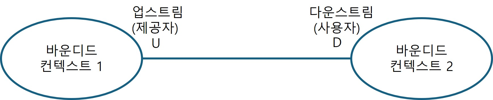
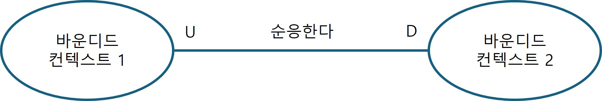

## 바운디드 컨텍스트 연동
바운디드 컨텍스트의 모델은 서로 독립적으로 발전하고 구현될 수 있다. 그러나 바운디드 컨텍스트 자체는 독립적이지 않다.
- 시스템의 요소가 전체의 목적을 이루기 위해 상호작용 하듯이, 바운디드 컨텍스트의 구현도 상호작용해야 한다.
    - 바운디드 컨텍스트는 독립적으로 발전할 수 있지만 상호작용 해야 한다.
- 바운디드 컨텍스트 사이에는 항상 접점이 있는데 이것을 <b>컨트랙트(contract)</b>라고 부른다.

각 컨트랙트는 하나 이상의 당사자에 영향을 끼치므로 서로 조윯해서 컨트랙트를 정의해야 한다.

### 협력형 패턴 그룹
협력형(cooperation) 그룹의 패턴은 소통이 잘 되는 팀에서 구현된 바운디드 컨텍스트와 관련되어 있다.
- 예시
    - 단일 팀에 의해 구현된 바운디드 컨텍스트
    - 한 팀의 성공이 다른 팀에 달려 있고, 반대도 마찬가지인 의존적 목표가 있는 팀

#### 파트너십 패턴

파트너십 패턴(partnership) 모델
- 바운디드 컨텍스트 간의 연동은 애드혹(ad-hoc) 방식으로 조정한다.
- 한 팀은 다른 팀에게 API의 변경을 알리고 다른 팀은 충돌 없이 이를 받아들인다.
- 연동의 조정은 양방향에서 하고, 양 팀은 차이점을 함께 해결하고 적절한 솔루션을 선정하며, 문제 발생시 양 팀 모두 협력한다.
- 동기화와 커뮤니케이션의 어려움 때문에 지리적으로 떨어져 있는 팀에게는 적합하지 않을 수 있다.

#### 공유 커널 패턴
바운디드 컨텍스트가 모델의 경계임에도 불구하고, 여전히 하위 도메인의 동일 모델 혹은 그 일부가 다른 바운디드 컨텍스트에서 구현되는 경우 사용

공유 모델은 이를 사용하는 모든 바운디드 컨텍스트에 걸쳐서 일관성을 유지해야 한다.

- 각 바운디드 컨텍스트는 권한 모델을 수정할 수 있고 이 변경은 이 모델을 사용하는 다른 모든 바운디드 컨텍스트에 영향을 준다.

##### 공유 범위
- 공유 모델의 변경은 다른 모든 바운디드 컨텍스트에 즉시 영향을 준다.
- 변경의 연쇄 영향을 최소화 하려면 양쪽의 겹치는 모델을 제한해서 바운디드 컨텍스트에서 공통으로 구현돼야 하는 모델의 일부분만 노출하도록 해야 한다.
- 공유 커널(shared kernel)은 바운디드 컨텍스트 간에 제공될 의도가 있는 연동 관련 컨트랙트와 자료구조만으로 구성하는 것이 이상적이다.

#### 구현
공유 커널은 소스코드의 모든 변경이 이를 사용하는 모든 바운디드 컨텍스트에 즉시 반영되도록 구현된다.
- 공유 커널에 대한 변경이 생길 때마다 영향을 받는 모든 바운디드 컨텍스트와 연동 테스트를 수행해야 한다.
- 공유 커널은 여러 바운디드 컨텍스트에 속하기 때문에 변경은 지속적으로 통합돼야 한다.
    - 커널의 변경사항을 관련된 모든 바운디드 컨텍스트로 전파하지 않으면 모델의 일관성이 깨진다.
    - 바운디드 컨텍스트가 변경 전의 공유 커널 구현을 참조하면 데이터가 깨지거나 운영 중 문제가 발생할 수 있다. (이전 회사에서 경혐ㅠㅠ 컨텐츠 서버 <-> 채널인 서버)

#### 공유 커널을 사용해야 하는 경우
중복 비용이 조율 비용보다 클 경우에만 적용해야 한다.
- 지리적인 제약이나 조직의 정치적 문제로 협업이 어려운 경우에 적용
    - 하지만 적절한 조율 없이 밀접히 연결된 기능을 공유하면 통합 문제, 모델 동기화 문제, 설계 의사 결정에 대한 논쟁 등의 문제가 발생
    - 통합의 문제를 일찍 발견하는 법
        - 공유 커널의 범위를 최소화해 연쇄적인 변경의 범위를 줄이고 매번 변경할 때마다 통합 테스트를 돌리는 것
- 일시적이긴 하지만, 레거시 시스템을 점진적으로 현대화할 경우 사용

공유 커널은 동일 팀에서 소유하고 구현한 바운디드 컨텍스트를 연동하는 경우에 잘 맞는다.

### 사용자-제공자 패턴 그룹
사용자-제공자(customer-supplier) 패턴 그룹

- 협력 그릅과 다르게 양 팀은 서로 독립적으로 성공할 수 있다.
- 대부분의 경우 업스트림 또는 다운스트림 팀이 연동 컨트랙트를 주도하는 권력의 불균형이 존재
    - 순응주의자, 충돌 방지 계층, 오픈 호스트 서비스 패턴 존재

#### 순응주의자 패턴
힘의 균형이 서비스를 제공하는 업스트림 팀에 있는 경우
- 제공자의 모델에 따라 정의된 연동 컨트랙트를 제공할 뿐이므로 사용자의 선택지는 이를 받아들이거나 떠나거나 둘 중 하나이다.

- <b>순응주의자(conformist) 패턴</b>
    - 다운스트림 팀이 업스트림 팀의 모델을 받아들이는 바운디드 컨텍스트의 관계
    - 업스트림팀이 노출한 컨트랙트가 산업 표준이거나 잘 구축된 모델 또는 다운스트림 팀의 요건에 충분하다면 다운스트림 팀이 자율성의 일부를 포기하는 결정은 정당화될 수 있다.

#### 충돌 방지 계층 패턴

충돌 방지 계층 (ACL: anticorruption layer) 

다운스트림 바운디드 컨텍스트가 업스트림 바운디드 컨텍스트에 순응하지 않는 경우 충돌 방지 계층을 통해 업스트림 바운디드 컨텍스트의 모델을 스스로의 필요에 맞게 가공할 수 있다.

충동 발지 계층 패턴을 사용하는 경우
- 다운스트림 바운디드 컨텍스트가 핵심 하위 도메인을 포함할 경우
- 업스트림 모델이 사용자의 요건에 비효율적이거나 불편한 경우
- 제공자가 컨트랙트를 자주 변경하는 경우

다운스트림 사용자가 제공자의 모델을 변환하면 자신의 바운디드 컨텍스트와 상관없는 외부의 개념으로부터 다운스트림 사용자를 안전하게 보호할 수 있다.
