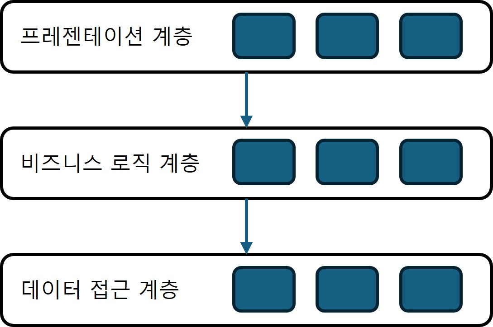
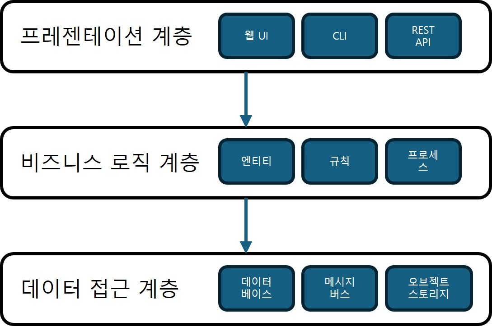
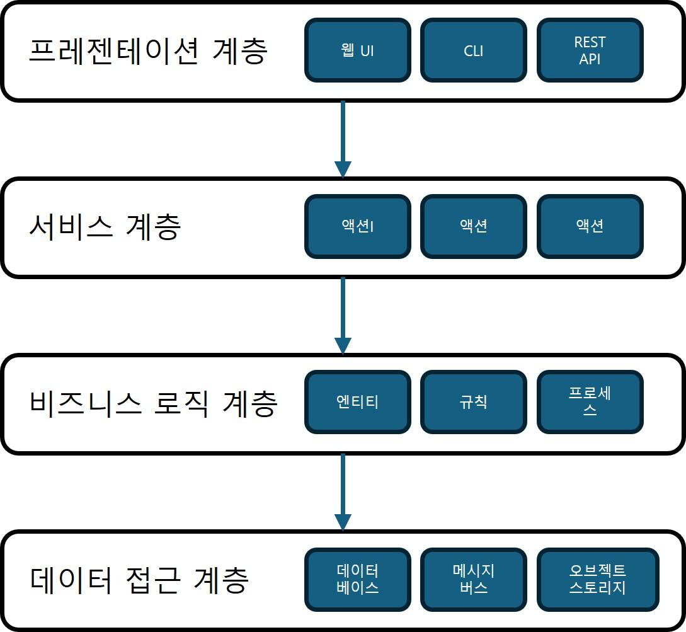

## 아키텍처 패턴

### 비즈니스 로직과 아키텍처 패턴
- 다양한 관심사로 인해 비즈니스 로직은 코드베이스 곳곳에 흩어지기 쉽다.
- 아키텍처 패턴은 이러한 관심사를 구분하고, 구성 원칙과 명확한 경계를 제공한다.
- 올바른 아키텍처 선택은 비즈니스 로직 구현을 단순화하고, 장기적인 유지보수를 용이하게 한다.

### 계층형 아키텍처
- 기술적 관심사(프레젠테이션, 비즈니스 로직, 데이터 접근)를 구분해 코드베이스를 수평 계층으로 나눈 구조이다.

#### 프레젠테이션 계층
- 사용자와 상호작용을 하기 위한 프로그램의 사용자 인터페이스를 구현
- 프로그램의 동작을 촉발하는 모든 동기식 또는 비동기식 수단과 같은 범주를 포함
    - 그래픽 사용자 인터페이스(GUI) 
    - 커맨드 라인 인터페이스(CLI)
    - 다른 시스템과 연동하는 프로그램 API
    - 메시지 브로커에서 이벤트에 대한 구독
    - 나가는 이벤트를 발행하는 메시지 토픽
- 시스템이 외부 환경으로부터 요청을 받고 결과를 소통하는 수단
- 프로그램의 퍼블릭 인터페이스다.
- 예) 웹 UI, CLI, REST API 등

#### 비즈니스 로직 계층
- 비즈니스 로직을 구현하고 묶는 것을 담당
- 액티브 레코드 또는 도메인 모델과 같은 비즈니스 로직 패턴을 구현하는 계층
- 예) 엔티티, 규칙, 프로세스 등

#### 데이터 접근 계층
- 영속성 매커니즘에 접근할 수 있게 해준다.
- 목적에 따라 다양한 데이터베이스를 사용
    - 도큐먼트 저장소(실시간 데이터 처리)
    - 검색 인덱스(동적 질의)
    - 인메모리 데이터베이스(최적화된 성능)
- 다양한 정보 저장 매체 사용
    - 클라우드 기반 오브젝트 저장소(S3, 구글 클라우드 스토리지)
    - 메시지 버스(내부 커뮤니케이션)
- 다양한 외부 정보 제공자와 연동
    - 외부 시스템의 API
- 예) 데이터베이스, 메시지 버스, 오브젝트 스토리지

#### 계층 간 커뮤니케이션
- 각 계층은 바로 아래 계층에만 의존한다.
    - 구현 관심사의 결합성을 낮추고 계층 간에 공유할 지식을 줄인다.

#### 변종(variation)

##### 서비스 계층
- 서비스 계층은 프로그램의 프레젠테이션 계층과 비즈니스 로직 계층 사이의 중간 역할을 한다.

- 프레젠테이션 계층과 하부의 비즈니스 로직의 결합을 제거하기 위해 조율 로직을 서비스 계층으로 이동할 수 있다.
    - 서비스 계층이 없다면 프레젠테이션 계층에 비즈니스 로직이 결합된다.
- 서비스 계층은 **논리적** 경계이다. 물리적 서비스가 아니다.
- 서비스 계층은 비즈니스 로직 계층으로의 관문 역할을 한다.
- 프레젠테이션 계층은 서비스 계층에서 요구하는 입력을 제공하고 결과를 호출자에게 반환하는 것까지만 책임진다.
    - 프레젠테이션에서는 관련된 구현 상세를 포함하지 않음

서비스 계층의 장점
- 동일한 서비스 계층을 여러 퍼블릭 인터페이스에서 재사용 가능
- 모든 관련 메서드를 한곳에 모으면 모듈화가 개선된다.
- 프레젠테이션 계층과 비즈니스 로직 계층의 결합도를 낮춘다.
- 비즈니스 기능을 테스트하기 쉬워진다.

항상 서비스 계층이 필요한 것은 아니다.
- 트랜잭션 스크립트처럼 이미 퍼블릭 인터페이스를 제공하는 구조라면 불필요
- 액티브 레코드처럼 외부에서 로직 조율이 필요한 경우에는 서비스 계층이 필요하다.

##### 용어
- 프레젠테이션 계층 = 사용자 인터페이스 계층
- 서비스 계층 = 애플리케이션 계층
- 비즈니스 로직 계층 = 도메인 계층 = 모델 계층
- 데이터 접근 계층 = 인프라스트럭쳐 계층

#### 계층형 아키텍처를 사용하는 경우
- 비즈니스 로직은 데이터 접근 계층에 의존하므로, 트랜잭션 스크립트나 액티브 레코드처럼 구조가 단순한 시스템에는 계층형 아키텍처가 적합하다.
- 도메인 모델에서는 비즈니스 엔티티(애그리게이트와 밸류 오브젝트)가 인프라스트럭처에 의존하지 않아야 하므로, 의존성이 상위에서 하위로 흐르는 계층형 아키텍처를 적용하기 어렵다.