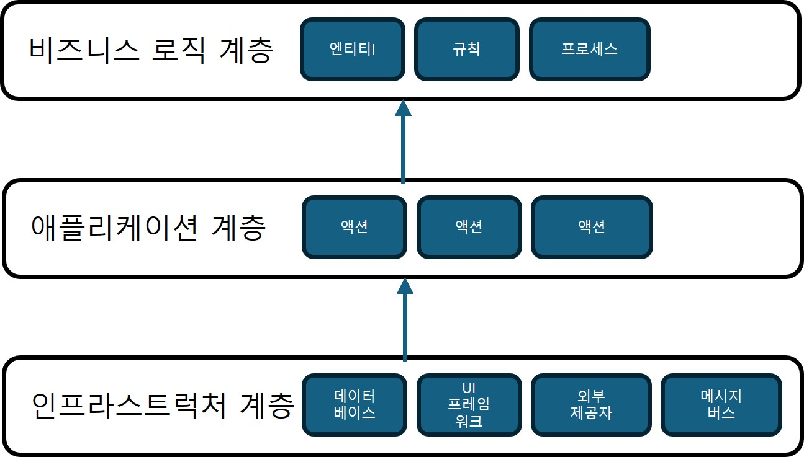

## 아키텍처 패턴

### 포트와 어댑터

#### 용어
인프라스트럭쳐 계층
- 프레젠테이션 계층과 데이터 접근 계층은 외부 구성요소(DB, 외부 서비스, UI 프레임워크 등)와의 연동을 담당한다.
- 이들은 시스템의 비즈니스 로직을 직접 반영하지 않으므로, 인프라스트럭처 계층으로 통합할 수 있다.

#### 의존성 역전 원칙
의존성 역전 원칙(DIP: dependency inversion principle)
- 비즈니스 로직을 구현하는 상위 모듈은 하위 수준의 모듈에 의존해서는 안된다.
- 전통적인 계층형 아키텍처에서 비즈니스 로직 계층은 인프라스트럭처 계층에 의존한다.

- 의존관계를 반대로 하면 비즈니스 로직 계층은 프레젠테이션 계층과 데이터 접근 계층에 끼어있는 대신, 중심적인 역할을 맡는다.
- 비즈니스 로직은 더 이상 인프라스트럭처 구성요소에 의존하지 않는다.

- 애플리케이션 계층은 시스템의 퍼블릭 인터페이스를 위한 관문으로, 모든 오퍼레이션을 정의하고 실행 시 비즈니스 로직을 조율하는 역할을 맡는다.
- 계층형 아키텍처의 서비스 계층과 유사한 위치에 있다.

포트와 어댑터
- 도메인 모델, 이벤트 소싱 도메인 모델 패턴의 구현 요건에 따라 비즈니스 로직은 어떠한 하위 계층에도 의존하지 않는다.

#### 인프라 구성요소와의 연동
- 포트와 어댑터 아키텍처의 핵심 목적은 인프라스트럭처 구성요소로부터 비즈니스 로직을 분리하는 것이다.
- 비즈니스 로직 계층은 인프라스트럭처가 구현해야 할 <b>포트(인터페이스)</b>를 정의하고,
인프라스트럭처 계층은 이를 <b>어댑터(구현체)</b>로 실현한다.
- 이렇게 하면 다양한 기술을 사용하더라도 핵심 로직은 변경되지 않고, 외부 의존성만 어댑터를 통해 교체할 수 있다.

#### 변형
용어는 다음과 같이 다를 수 있다.
- 애플리케이션 계층 = 서비스 계층 = 유스케이스 계층
- 비즈니스 로직 계층 = 도메인 계층 = 핵심 계층

#### 포트와 어댑터를 사용하는 경우
- 모든 기술적 관심사로부터 비즈니스 로직을 분리하는 것이 목적
- 도메인 모델 패턴을 사용하여 구현한 비즈니스 로직에 매우 적합하다.