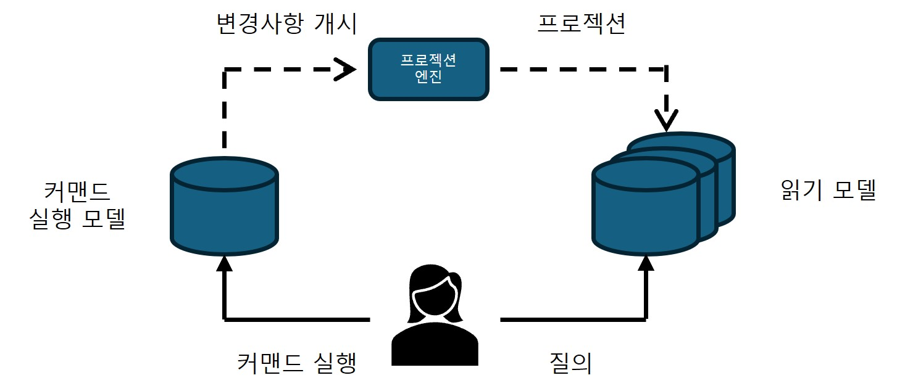
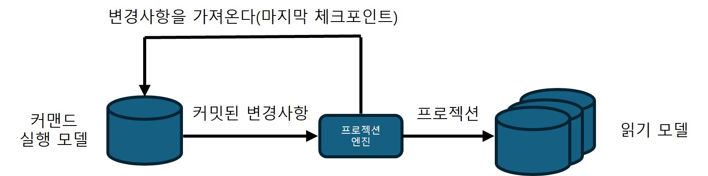
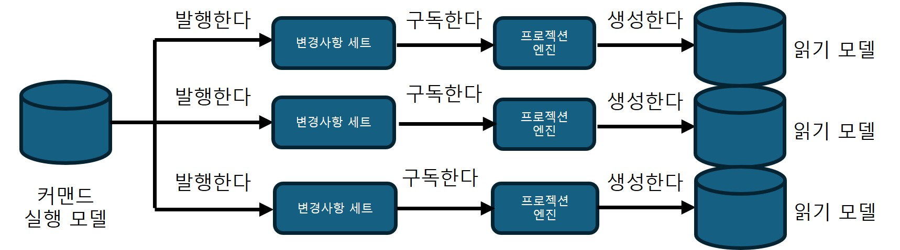

## 아키텍처 패턴

### CQRS
- CQRS(command-query responsibility segregation)
- 여러 영속 모델에 시스템의 데이터를 표현할 수 있다.

#### 폴리글랏 모델링
- 단일 비즈니스 도메인 모델로 시스템의 모든 요구사항을 해결하기는 불가능하지 않지만 어려울 수 있다.
- 폴리글랏 영속성 모델(polyglot persistence model)
    - 다양한 데이터 관련 요구사항을 구현하기 위해 여러 데이터베이스를 사용하는 것
- CQRS
    - 이벤트 소싱 모델 질의 한계를 극복하려고 정의되었다.
    - 이벤트 소싱이 개별 애그리게이트 단위로만 질의할 수 있는 한계를 가지기 때문에, CQRS는 프로젝션된 모델을 물리적 데이터베이스에 머터리얼라이즈하여 유연한 질의를 가능하게 한다.

##### 구현
CQRS는 시스템 모델의 책임을 분리시킨다. (커맨드 실행 모델, 읽기 모델)

- 커맨드 실행 모델
    - 커맨드 실행 모델(Command Execution Model)은 시스템의 상태 변경(쓰기 연산)을 전담하는 모델로, 비즈니스 로직을 구현하고 규칙을 검증하며 불변성을 유지한다.
    - 강한 일관성을 가진 데이터를 표현하며, 갱신 시 낙관적 동시성 제어를 지원한다.
- 읽기 모델(프로젝션)
    - 사용자 표시나 외부 제공을 위해 데이터를 조회 전용으로 구성한 모델이다.
    - 프로젝션 형태로 캐시,DB,파일 등 다양한 저장소에 유지될 수 있으며, 필요하면 언제든 이벤트를 재생해 처음부터 다시 생성할 수 있다.
    - 잘 설계된 CQRS 시스템은 새로운 프로젝션 추가 확장이 용이하며, 읽기 모델은 읽기 전용으로 직접 수정할 수 없다.

#### 읽기 모델의 프로젝션
- 읽기 모델이 작동하려면 시스템은 커맨드 실행 모델에서 변경을 모든 읽기 모델로 프로젝션해야 한다.

- 읽기 모델의 프로젝션은 RDB의 머티리얼라이즈 뷰의 개념과 유사하다.
    - 원천 테이블이 갱신되면 변경사항은 미리 작성된 뷰에 반영되어야 한다.

프로젝션 생성의 두 가지 방식

##### 동기식 프로젝션(synchronous projection)
- 격차 해소 구독 모델(catch-up subscription model)을 통해 OLTP 데이터의 변경사항을 가져온다.
- 실행 과정
    - 프로젝션 엔진이 OLTP 데이터베이스로부터 마지막에 처리했던 체크포인트 이후에 추가되거나 갱신된 레코드를 조회한다.
    - 프로젝션 엔진이 조회된 데이터를 이용해서 시스템의 읽기 모델을 재생성 또는 갱신한다.
    - 프로젝션 엔진은 마지막으로 처리 레코드의 체크포인트를 저장한다. 이 값은 다음 처리 때 추가되거나 갱신된 레코드를 조회하는 데 사용된다.

- 격차 해소 구독이 작동하려면 커맨드 실행 모델이 추가되거나 갱신되는 모든 데이터베이스 레코드를 체크포인트로 관리해야한다.
- 저장 메커니즘도 체크포인트 기반으로 레코드를 조회하는 것을 지원해야 한다.
- 체크포인트는 데이터베이스의 기능을 사용해 구현할 수 있다.
    - rowversion 칼럼을 사용하거나, 수정되는 레코드에 카운터를 증가시켜 추가하는 방법을 사용할 수 있다.
- 마지막에 반환된 레코드의 체크포인트보다 낮은 값을 다음 실행에서 가지면 안된다.
    - 일관성 없는 모델이 만들어진다.
- 동기식 프로젝션은 체크포인트를 0으로 초기화해, 처음부터 모든 데이터를 다시 읽어 프로젝션을 재생성할 수 있다.

##### 비동기식 프로젝션
- 커맨드 실행 모델은 모든 커밋된 변경사항을 메시지 버스에 발행한다.
- 시스템의 프로젝션 엔진은 발행된 메시지를 구독하고 읽기 모델을 생성하는 데 사용한다.

#### 도전과제
비동기식 프로젝션
- 확장성과 성능의 장점이 있지만 분산 컴퓨팅에서 문제가 발생하기 쉽다.
- 메시지의 순서가 잘못되거나 중복 처리되면 읽기 모델에 일관성 없는 데이터가 프로젝션된다.
- 새로운 프로젝션을 추가하거나 이미 존재하는 것을 재생성하는 것이 어렵다.

가능하면 동기식 프로젝션 방식을 구현하고, 그 위에 선택적으로 비동기식 프로젝션 방식을 추가하는것을 권장

#### 모델 분리
- CQRS에서는 커맨드(쓰기)와 질의(읽기)의 책임이 분리된다.  
- 커맨드는 실행 결과를 호출자에게 반환해야 하며, 성공,실패 이유를 알려 사용자 경험을 개선한다.  
- 단, 반환 데이터는 강한 일관성을 가진 커맨드 실행 모델에서만 제공된다.
    - 데이터가 궁극적으로 일관성을 갖는 프로젝션의 경우에는 데이터에 대한 즉각적인 갱신은 기대할 수 없다.

#### CQRS를 사용해야 하는 경우
- CQRS는 여러 데이터 모델과 여러 데이터베이스에 저장된 동일한 데이터와 작동할 필요가 있는 애플리케이션에 유용하다.  
- 운영 관점에서 가장 효과적인 모델을 사용하고 비즈니스 도메인 모델을 지속적으로 개선하는 도메인 주도 설계의 핵심 가치를 지원한다. 인프라 관점에서는 다양한 데이터베이스 활용을 지원한다.  
- 또한 이벤트 소싱 모델의 한계를 보완해 상태 조회가 가능한 프로젝션을 제공한다.
    - 이벤트 소싱 모델에서는 애그리게이트의 상태에 기반한 레코드 조회가 불가능하다.

### 범위
- 계층형, 포트,어댑터, CQRS 같은 아키텍처 패턴은 시스템 전체에 일괄 적용해선 안 된다.  
- 하위 도메인별 특성과 목적에 맞는 아키텍처를 선택해야 하며, 바운디드 컨텍스트 내부에서도 서로 다른 패턴을 사용할 수 있다.  
- 도메인을 수직으로 분리해 모듈 경계를 명확히 하면, 모놀리식 구조가 커다란 진흙 덩어리가 되는 것을 방지할 수 있다.

### 결론
- 계층형 아키텍처
    - 기술적 관심사에 따라 코드베이스를 분해
    - 비즈니스 로직과 데이터 접근 구현을 결합시키므로 액티브 레코드 기반 시스템에 적합
- 포트와 어댑터
    - 관계를 역전 시킨다.
    - 비즈니스 로직을 중심에 두고 모든 인프라스트럭처와의 의존성을 분리한다.
    - 도메인 모델 패턴을 구현하는 비즈니스 로직에 적합
- CQRS 패턴
    - 여러 모델에서 동일한 데이터를 표현
    - 이벤트 소싱 도메인 모델에 기반한 시스템에 적합하지만 다양한 영속 모델을 사용할 필요가 있는 어떤 시스템에도 사용할 수 있다.