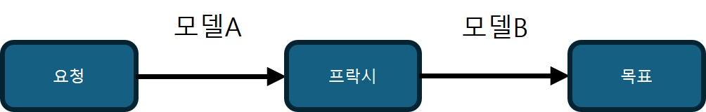
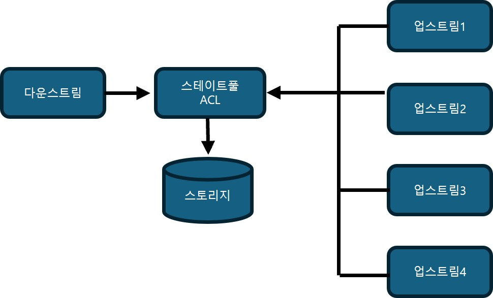

## 커뮤니케이션 패턴
- 바운디드 컨텍스트간 커뮤니케이션 용이하게 하기
- 애그리게이트 설계의 제한 상황을 해결
- 여러 시스템 컴포넌트에 걸쳐 비즈니스 프로세스를 조율

### 모델 변환
- 바운디드 컨텍스트는 유비쿼터스 언어 모델의 경계이다.
- 바운디드 컨텍스트 사이에 커뮤니케이션하기 위한 다양한 설계 패턴들이 있다.
    - [4장에 정리](../part1/4-1.md)
    - 협력의 경우
        - 파트너십, 공유 커널
    - 사용자-제공자
        - 다운스트림 바운디드 컨텍스트의 충돌 방지 계층(ACL)
        - 업스트림 바운디드 컨텍스트의 오픈 호스트 서비스(OHS)

모델의 변환로직은 상태에 따라 두 가지 로직이 존재
- **스테이트리스 변환(stateless translation)**
    - 수신(OHS) 또는 발신(ACL) 요청이 발행할 때 즉석에서 발생한다.
- **스테이트풀 변환(stateful translation)**
    - 상태 보존을 위해 데이터베이스를 사용하여 좀 더 복잡한 변환 로직을 다룰 수 있다.

#### 스테이트리스 모델 변환
모델 변환을 소유하는 바운디드 컨텍스트(OHS 또는 ACL)는 프락시 디자인 패턴을 구현하여 수신과 발신 요청을 삽입하고 소스 모델을 바운디드 컨텍스트의 목표 모델에 매핑한다.

스테이트리스 모델 변환에는 동기, 비동기 통신 방식이 존재한다.

##### 동기
바운디드 컨텍스트의 코드베이스에 변환 로직을 포함한다.
- 오픈 호스트 서비스(OHS)에서 공용 언어로의 변환은 유입되는 요청을 처리할 때 발생
- 충돌 방지 계층(ACL)에서는 업스트림 바운디드 컨텍스트를 호출 할 때 발생

경우에 따라 변환 로직을 API 게이트웨이 패턴과 같은 외부 컴포넌트로 넘기는 것이 더 비용 효과적이고 편할 수 있다.
- 오픈소스 (Kong 또는 KrakenD)
- 클라우드의 관리형 서비스 (AWS API Gateway, Google Apigee, Azure API Management)

##### 비동기
비동기 통신이 사용하는 모델을 변환하기 위해 <b>메시지 프락시(message proxy)</b>를 구현할 수 있다.
- 메시지 프락시는 소스 바운디드 컨텍스트에서 오는 메시지를 구독하는 중개 컴포넌트
- 프락시는 필요한 모델 변환을 적용하고 결과 메시지를 대상 구독자에게 전달

- 중개 컴포넌트는 필요없는 메시지 필터링도 가능하다.

OHS 구현시 비동기식 모델 변환은 반드시 필요
- 실수로 바운디드 컨텍스트의 모델을 그대로 노출할 수 있다.
- 비동기 변환을 사용하면 도메인 이벤트를 가로채서 공표된 언어로 변환할 수 있다. (캡슐화)

#### 스테이트풀 모델 변환
더 중요한 모델 변환의 경우 필요
- 원천 데이터를 집계 하거나 여러 개의 요청에서 들어오는 데이터를 단일 모델로 통합해야 하는 경우

##### 들어오는 데이터 집계하기
- 여러 유스 케이스가 존재
    - 바운디드 컨텍스트가 들어오는 요청을 집계하고 성능 최적화를 위해 일괄 처리
        - 동기와 비동기 요청 모두에 대해 집계가 필요할 수 있다.
    - 여러개의 세분화된 메시지를 단일 메시지로 결합

유입되는 데이터를 집계하는 모델 변환은 API 게이트웨이를 사용할 수 없다.
- 들어오는 데이터를 추적하고 그에 따라 처리하려면 변환 로직에 자체 영구 저장소가 필요하다.

- 일부 유스케이스에서는 상용 제품을 사용
    - 스트림 처리 플랫폼(Kafka, AWS Kinesis)
    - 일괄 처리 솔루션(Apache NiFi, AWS Glue, Spark 등)

##### 여러 요청 통합
- BFF(backend-for-frontend pattern)
    - 사용자 인터페이스가 여러 서비스에서 발생하는 데이터를 결합하는 패턴
- 충돌 방지 계층 패턴을 사용하여 통합 모델을 단순화하기
    - 여러 다른 컨텍스트의 데이터를 처리하고 이를 위해 복잡한 비즈니스 로직을 구현해야 하는 바운디드 컨텍스트에서 사용한다.

