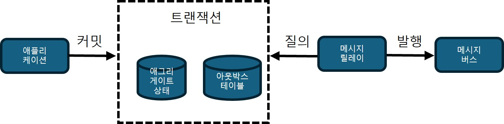
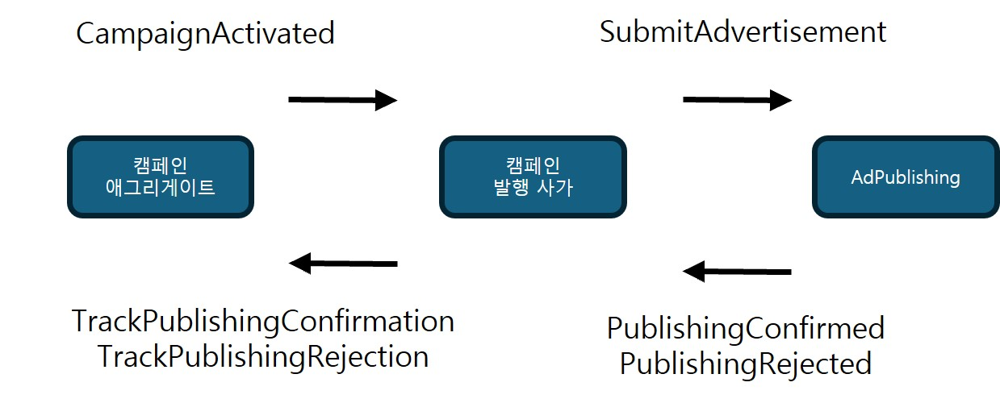
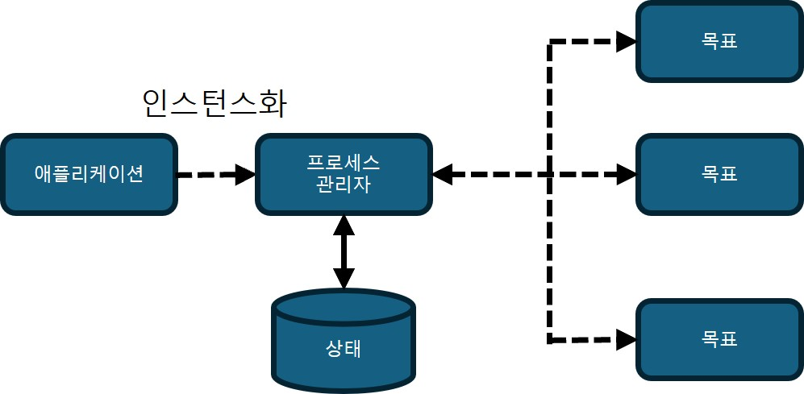
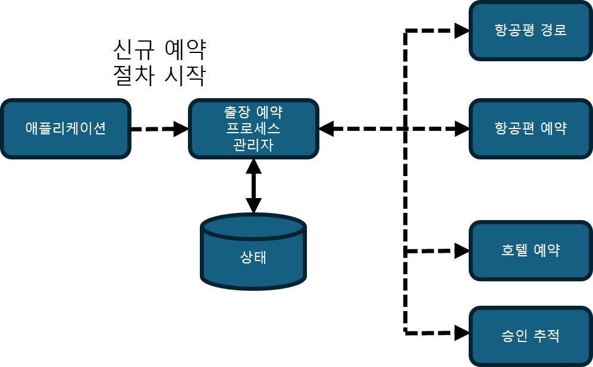

## 커뮤니케이션 패턴

### 애그리게이트 연동
- 애그리게이트가 시스템의 나머지 부분과 통신하는 방법 : 도메인 이벤트 발행
- 외부 컴포넌트는 도메인 이벤트를 구독하고 해당 로직을 실행한다.

이벤트 발행 프로세스에서 일어나는 몇 가지 실수
- 애그리게이트에서 바로 도메인 이벤트를 발행
    - 애그리게이트의 새 상태가 데이터베이스에 커밋되기 전에 이벤트가 발행될 수 있다.
    - 데이터베이스 트랜잭션이 롤백 되었는데 이벤트가 발행되어 구독자에게 전달될 수 있다.
- 애플리케이션 계층에서 도메인 이벤트를 발행
    - 데이터베이스 트랜잭션이 커밋되었지만 도메인 이벤트가 발행되지 않을 수 있다.

#### 아웃박스
아웃박스를 이용한 도메인 이벤트 발행 순서
- 업데이트된 애그리게이트의 상태와 새 도메인 이벤트는 모두 동일한 원자성 트랜잭션으로 커밋된다.
- 메시지 릴레이는 데이터베이스에서 새로 커밋된 도메인 이벤트를 가져온다.
- 릴레이는 도메인 이벤트를 메시지 버스에 발행한다.
- 성공적으로 발행되면 릴레이는 이벤트를 데이터베이스에 발행한 것으로 표시하거나 완전히 삭제한다.

- RDB를 사용할 때 두 개의 테이블에 원자적으로 커밋하고 메시지를 저장하기 위한 전용 테이블을 사용하는 데이터베이스의 기능을 활용하는 것이 좋다.
- NoSQL 데이터베이스를 사용할 때는 메시지 버스로 전달될 도메인 이벤트를 애그리게이트 레코드에 포함해야 한다.  
    - 다중 문서 트랜잭션을 지원하지 않기 때문이다.

##### 발행되지 않은 이벤트 가져오기
발행 릴레이는 풀(Pull) 기반 또는 푸시(Push) 기반 방식으로 새 도메인 이벤트를 가져올 수 있다.
- 풀: 발행자 폴링
    - 발행되지 않은 이벤트에 대해 데이터베이스에 계속 질의할 수 있음
    - 데이터베이스 부하를 최소화하려면 적절한 인덱스가 있어야 한다.
- 푸시: 트랜잭션 로그 추적
    - 데이터베이스의 기능을 활용하여 새 이벤트가 추가될 때마다 발행 릴레이를 호출할 수 있다.

아웃박스 패턴은 적어도 한 번은 메시지 배달을 보장한다.
- 발행 후 릴레이가 실패하면, 다음 실행 시 같은 메시지가 다시 발행될 수 있다.

#### 사가
- 각 트랜잭션은 하나의 애그리게이트 인스턴스만 다루어야 한다.  
    - 이렇게 해야 애그리게이트의 경계가 명확해지고 응집된 비즈니스 기능을 캡슐화할 수 있다.  
- 단, 여러 애그리게이트에 걸친 비즈니스 프로세스를 구현해야 할 때도 있다.
    - 여러 바운디드 컨텍스트에 걸친 비즈니스 프로세스가 필요한 경우, 서로 다른 컨텍스트의 애그리게이트가 협력해야 한다. 이때 각 컨텍스트를 하나로 합치기보다, **사가(Saga)** 를 이용해 흐름을 조율하고 이벤트를 통해 상호작용하도록 구성한다.
- 사가(Saga)는 여러 트랜잭션에 걸친 비즈니스 프로세스를 조율하는 메커니즘이다.   
- 각 컴포넌트에서 발생한 이벤트를 수신해 후속 커맨드를 발행하며, 어떤 단계가 실패하면 전체 일관성을 유지하기 위해 보상 트랜잭션을 수행한다.

- 사가는 각 바운디드 컨텍스트로부터 이벤트를 기다림 (사가 방향 화살표)
- 사가는 각 애그리게이트에서 커맨드를 실행해야 한다. (애그리게이트 방향 화살표)
- 이 예시는 메시징 인프라를 통해 이벤트를 전달하고 커맨드를 실행하는 단순한 형태의 사가다.  
이 경우 상태 관리는 필요하지 않다.

상태관리가 필요한 사가
- 실행된 작업을 추적하거나 실패 시 보상 조치가 필요한 사가
- 이런 사가는 이벤트 소싱 애그리게이트로 구현해 수신 이벤트와 발행 커맨드의 이력을 저장하며,  
커맨드 실행은 아웃박스 패턴처럼 비동기적으로 처리된다.
    - 예를 들어, 사가는 처리된 이벤트와 발행할 커맨드를 모두 내부 이력으로 저장해 두고, 이후 별도의 릴레이가 이를 비동기적으로 실행한다.

##### 일관성
- 사가는 여러 컴포넌트의 트랜잭션을 조율하지만, 관련 상태는 궁극적 일관성(Eventual Consistency)을 가진다.  
- 강한 일관성은 애그리게이트 경계 내부에서만 보장되며, 외부 연동은 모두 궁극적 일관성에 의존한다.  
- 잘못된 애그리게이트 경계를 보완하기 위해 사가를 남용해서는 안 된다.

#### 프로세스 관리자
사가 패턴은 단순하고 선형적인 흐름을 관리한다. 사가는 이벤트를 해당 커맨드와 일치시킨다.
- 사가 예제에서 CampaignActivated와 SubmitAdvertisement 커맨드 (위의 그림)

프로세스 관리자 패턴
- 비즈니스 로직 기반 프로세스를 구현하기 위한 것
- 시퀀스의 상태를 유지하고 다음 처리 단계를 결정하는 중앙 처리 장치

- 프로세스와 사가의 차이점
    - 특정 이벤트가 관찰될 때 사가는 암시적으로 인스턴스화
    - 프로세스 관리자는 단일 소스 이벤트에 바인딩 될 수 없다. 여러 단계로 구성된 비즈니스 프로세스다. 프로세스 관리자는 명시적으로 인스턴스화해야 한다.
    - 사가는 "이벤트로 자동 시작"되고, 프로세스 관리자는 "명시적으로 시작되는 절차형 오케스트레이터"다.

프로세스 관리자 예시 (출장 예약)
1. 가장 비용 효과적인 비행 경로 선택하고 직원에게 승인을 요청하는 알고리즘으로 시작한다.
2. 직원이 다른 경로를 선호하는 경우 직속 관리자가 승인해야 한다.
3. 항공편을 예약한 후 사전 승인된 호텔 중 하나를 적절한 날짜에 예약해야 한다.
4. 이용 가능한 호텔이 없으면 항공권을 취소해야 한다.

- 프로세스 관리자는 워크플로를 제어하는 이벤트를 구독하고 실제 커맨드를 실행하기 위해 아웃박스 릴레이에서 처리될 이벤트를 인스턴스화 한다.

### 결론
- 아웃박스 패턴은 애그리게이트의 도메인 이벤트를 발행하는 안정적인 방법
    - 다른 프로세스 실패에 직면해도 도메인 이벤트를 항상 발행한다.
- 사가 패턴
    - 간단한 교차 컴포넌트 비즈니스 프로세스를 구현하는 데 사용할 수 있다.
- 프로세스 관리자 패턴
    - 좀 더 복잡한 비즈니스 프로세스를 구현할 수 있다.

사가 패턴과 프로세스 관리자 패턴 모두 도메인 이벤트에 대한 비동기식 반응과 커맨드 발행에 의존한다.