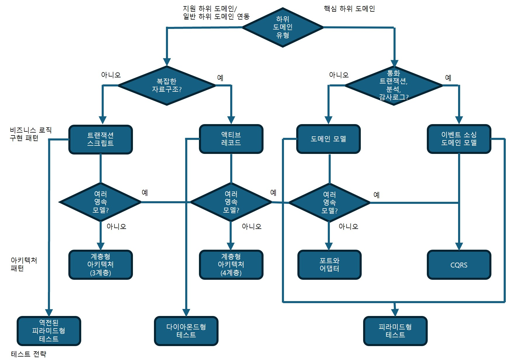

## 휴리스틱 설계

### 휴리스틱
모든 정보를 완벽히 분석하려 하지 않고 불필요한 노이즈는 무시하고 핵심 단서에 집중해 문제를 빠르게 해결하는 방법이다.

### 바운디드 컨텍스트
- 바운디드 컨텍스트는 기능을 억지로 작게 쪼개지 말고, 도메인 모델이 자연스럽게 담고 있는 기능 범위 그대로 설정하는 것이 더 효과적이다.
- 여러 바운디드 컨텍스트에 걸친 변경은 비용이 크고 팀 간 조율이 많이 필요하다.
- 변경이 한 컨텍스트 안에서 해결되지 않는다면 경계가 잘못 설계된 신호이며, 바운디드 컨텍스트 경계 리팩터링은 매우 비싸기 때문에 기술 부채가 되기 쉽다.
- 바운디드 컨텍스트 경계가 자주 무너지는 이유는 도메인이 아직 명확하지 않거나 요구사항이 자주 바뀌기 때문이며, 이는 핵심 하위 도메인의 특징이다.
- 초기에는 경계를 넓게 잡고(큰 컨텍스트) 도메인 지식이 쌓인 후 점진적으로 쪼개는 것이 리스크와 비용을 줄이는 가장 효과적인 방식이다.
- 특히 핵심 하위 도메인은 변동성이 크므로, 함께 많이 상호작용하는 다른 하위 도메인까지 하나의 컨텍스트로 묶어 두면 예상치 못한 변경에도 더 안전하다.

### 비즈니스 로직 구현 패턴
- 간단한 비즈니스 로직을 포함하는 하위 도메인
    - 트랜잭션 스크립트, 액티브 레코드 패턴 사용
    - 트랜잭션 스크립트 패턴은 단순한 자료구조에 사용
    - 액티브 레코드 패턴은 복잡한 자료 구조를 하부 데이터베이스에 매핑하는 것을 한데 묶는 데 도움을 준다.
- 복잡한 비즈니스 로직을 가진 핵심 하위 도메인
    - 도메인 모델
    - 이벤트 소싱 도메인 모델
        - 통화 트랜잭션, 감사 로그 제공, 시스템의 동작을 분석할 필요가 있는 핵심 하위 도메인

복잡한 비즈니스 로직은 복잡한 규칙·불변성·알고리즘이 있고, 간단한 로직은 입력 검증 수준에 머문다.
또한 유비쿼터스 언어가 CRUD 중심이면 단순한 로직, 복잡한 규칙을 설명한다면 복잡한 로직의 신호다.

로직의 복잡성에 따라 적용되는 패턴이 달라지면, 처음 분류했던 하위 도메인 타입(핵심/지원/일반)을 다시 검증해야 한다는 신호다. 

경쟁력은 꼭 기술적 복잡성에서만 나오지 않는다.

### 아키텍처 패턴
- 아키텍처 패턴에는 계층형 아키텍처, 포트와 어댑터, CQRS가 있다.

아키텍처 패턴 선정 방법
- 이벤트 소싱 도메인 모델
    - CQRS가 필요하다. 그렇지 않으면 시스템 데이터 질의 옵션이 극심하게 제한되어 자신의 ID만으로 단일 인스턴스를 가져와야 한다.
- 도메인 모델
    - 포트와 어댑터 아키텍처
    - 계층형 아키텍처에서는 영속성에 대한 고려 없이 애그리게이트와 밸류 오브젝트를 만들기가 어렵다.
- 액티브 레코드 패턴
    - 애플리케이션(서비스) 계층을 추가한 계층형 아키텍처와 잘 어울린다.
    - 계층형 아키텍처는 액티브 레코드를 제어하는 로직을 위한 것이다.
- 트랜잭션 스크립트 패턴
    - 세 개의 계층만으로 이어진 최소한의 계층형 아키텍처를 적용하여 구현할 수 있다.

### 테스트 전략
엔드-투-엔드, 통합, 단위 테스트 유형을 전략에 따라 나눌 수 있다.
- 피라미드형 (단위 테스트 강조)
- 다이아몬드형 (통합 테스트 강조)
- 역피라미드형 (엔드-투-엔드 테스트 강조)

#### 피라미드형 테스트
- 단위 테스트를 강조한다. 통합 테스트와 엔드-투-엔드 테스트는 별로 없다.
- 애그리게이트와 밸류 오브젝트 도메인 모델 패턴을 모두 잘 지원한다.
    - 두 도메인 모델 패턴은 사실상 비즈니스 로직을 테스트하는 완벽한 단위이다.

#### 다이아몬드형 테스트
- 통합 테스트에 집중
- 액티브 레코드 패턴에 효과적이다.
    - 시스템의 비즈니스 로직은 서비스 계층과 비즈니스 로직 계층에 흩어지므로 두 계층의 연동에 중점을 둔다면 다이아몬드형 테스트가 효과적

#### 역전된 피라미드형 테스트
- 엔드-투-엔드 테스트에 집중
- 트랜잭션 스크립트 패턴을 구현한 코드베이스에 가장 잘 어울린다.
    - 처음부터 끝까지 애플리케이션의 워크플로를 검증
    - 비즈니스 로직이 간단하고 계층의 수가 적으므로 엔드-투-엔드 테스트에 효과적

### 전술적 설계 의사결정 트리

- 모든 규칙에 예외가 있듯이, 휴리스틱에도 예외가 있어 위의 의사 결정 트리는 100% 정확하게 들어맞지는 않는다.
- 특정 상황에 따라 효과적인 접근 방법이 달라진다.
    - 위의 트리는 가이드 규칙으로만 사용
- 당면한 문제에 더 잘 맞는 다른 휴리스틱을 찾는다면 가이드 원칙을 개선하거나, 자신만의 의사 결정 트리를 만들도록 한다.

### 결론
- 바운디드 컨텍스트 경계 선택, 비즈니스 로직 모델링, 아키텍처 패턴을 결정하는 방법등을 학습
- 비즈니스 도메인에 따라 테스트의 우선순위가 다르다.
- 설계 의사결정을 내리는 것도 중요하지만, 더 중요한 것은 시간이 지나면서 과거의 의사 결정이 여전히 유효한지를 검증하는 것