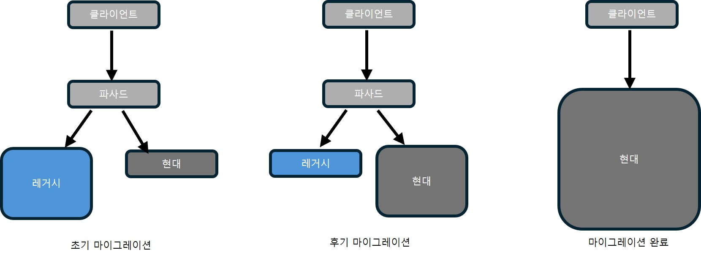
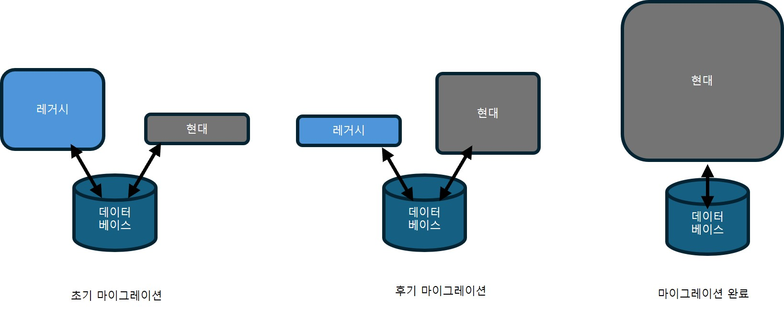

## 실무에서의 도메인 주도 설계

소프트웨어 엔지니어는 경력의 대부분을 브라운필드, 레거시, 커다란 진흙 덩어리 코드베이스에서 보낸다. 브라운필드 프로젝트와 이상적이지 않은 환경에서 실제로 도메인 주도 설계 도구와 패턴을 적용하기 위한 전략을 정리

### 전략적 분석
DDD를 도입하는 가장 좋은 출발점
- 조직의 비즈니스 전략과 시스템 아키텍처의 현 상황을 이해하는 데 시간을 투자하는 것

#### 비즈니스 도메인 이해하기
- 먼저 회사의 비즈니스 도메인을 파악한다.
    - 조직의 비즈니스 도메인은 무엇인가?
    - 고객은 누구인가?
    - 조직이 고객에게 제공하는 서비스 또는 가치는 무엇인가?
    - 경쟁 회사 또는 그들의 제품은 무엇인가?
- 조직이 하위 도메인을 달성하기 위해 사용하는 비즈니스 구성요소를 찾는다.
- 특정한 유형의 하위 도메인의 신호를 찾는다.

하위 도메인을 찾는 방법
- 핵심 하위 도메인
    - 경쟁업체와 차별화되는 점을 찾아야한다.
    - 기술적인 것 뿐만 아니라 비기술적 경쟁 우위를 가지고 있는지 확인(능력자)
    - 복잡하고 손대기 어려운 레거시이면서 상용 솔루션으로 대체할 수 없고, 작은 변경에도 큰 비즈니스 리스크가 발생하는 영역은 핵심 하위 도메인일 가능성이 높다.
- 일반 하위 도메인
    - 상용 솔루션, 구독 서비스, 연동할 수 있는 오픈 소프트웨어를 찾으면 된다.
    - 동일한 솔루션을 경쟁 회사에서도 사용할 수 있어야 하며, 회사의 비즈니스에 영향을 미치지 않아야 한다.
- 지원 하위 도메인
    - 상용 솔루션으로 대체할 수 없지만 직접 경쟁 우위를 제공하지 않는 소프트웨어 컴포넌트
    - 코드가 뒤죽박죽이어도 영향도는 핵심 하위 도메인만큼 심각하지 않음

모든 핵심 하위 도메인을 식별할 필요는 없다. 이는 현실적으로 불가능하다. 대신 전체 구조를 식별하되, 개발 중인 소프트웨어 시스템과 가장 관련 있는 하위 도메인에 더 주의를 기울여라

#### 현재 설계 탐색
- 문제 도메인에 익숙해진 후에는 현재의 솔루션과 설계 결정을 상위 수준 컴포넌트부터 살펴본다.  
- 이 경계는 반드시 바운디드 컨텍스트일 필요는 없으며, 비즈니스 도메인을 나누는 기준이면 된다.  
- 특히 각 컴포넌트가 다른 컴포넌트와 독립적으로 개선, 테스트, 배포될 수 있는지, 즉 수명주기 분리가 가능한지를 확인한다.

##### 전술적 설계 평가
각 상위 수준 컴포넌트가 어떤 하위 도메인을 포함하는지와, 비즈니스 로직과 아키텍처를 구현하기 위해 어떤 설계 패턴과 기술적 선택을 했는지 평가한다. 현재 설계가 도메인 복잡성에 적합한지, 더 정교한 패턴이 필요한 영역이나 반대로 단순화, 상용 솔루션으로 대체 가능한 영역이 있는지를 판단해 전략적, 전술적 의사결정에 활용한다.

##### 전략적 설계 평가
- 상위 수준 컴포넌트를 바운디드 컨텍스트처럼 보고 컨텍스트 맵을 그려, 컴포넌트 간 관계와 연동 방식을 분석한다.
- 이를 통해 팀 분리 문제, 핵심 하위 도메인 중복 구현, 외주에 핵심 도메인을 맡긴 구조, 불안정한 연동, 외부·레거시로 인해 왜곡된 도메인 모델 같은 잘못된 전략적 설계 결정을 식별한다.
- 이러한 분석 결과는 설계 현대화의 출발점이 되며, 도메인 지식이 부족하거나 손실된 경우에는 이벤트스토밍을 통해 도메인 지식과 유비쿼터스 언어를 복구한다.

### 현대화 전략
- 시스템을 처음부터 다시 만드는 대대적인 재작성은 대부분 실패하므로 피해야 한다.  
- 현대화는 크게 생각하되 작게 시작하며, 하위 도메인을 기준으로 논리적 경계(모듈·패키지·네임스페이스)를 정렬하는 것부터 진행한다.  
- 비즈니스 로직은 바꾸지 않고 구조만 재정렬하는 모듈 조정은 비교적 안전한 리팩터링 방식이다.  
- 데이터베이스 저장 프로시저나 서버리스 함수처럼 다른 코드베이스에 흩어진 비즈니스 로직에도 명확한 하위 도메인 경계를 도입해야 한다.

#### 전략적 현대화
시스템을 처음부터 지나치게 작은 바운디드 컨텍스트로 나누는 것은 위험할 수 있으므로, 먼저 논리적 경계 중 물리적 경계로 전환했을 때 가장 큰 가치를 얻을 수 있는 영역을 찾는다.  

여러 팀이 동일한 코드베이스에서 작업하거나, 컴포넌트 간 모델 충돌이 발생한다면 이를 기준으로 바운디드 컨텍스트를 분리해 개발 수명주기를 독립시킨다.

필요한 최소한의 바운디드 컨텍스트를 정의한 후, 컨텍스트 간 관계와 연동 패턴을 분석해 팀 간 협업과 통합 방식이 적절한지 평가한다.

적절한 컨텍스트 통합 패턴을 사용해야 한다.
- 사용자-제공자 (충돌 방지 계층, 오픈 호스트 서비스)
- 분리형 노선 등

#### 전술적 현대화
비즈니스 가치와 구현 전략에서 가장 '고통스러운' 부조화를 찾아내야 한다.
- 예: 자주 변경되는 핵심 하위 도메인에 단순한 트랜잭션 스크립트나 액티브 레코드 패턴이 적용된 경우

#### 유비쿼터스 언어 육성
성공적인 현대화를 위해서는 도메인 지식과 이를 표현하는 유비쿼터스 언어가 필요하다. 이벤트스토밍을 통해 도메인 전문가와 함께 지식을 복구하고 레거시 코드베이스를 이해한다.  

도메인 모델이 정리되면 적절한 비즈니스 로직 구현 패턴을 선택하고, 스트랭글러 패턴이나 점진적 리팩터링 등 현대화 전략을 결정한다.

##### 스트랭글러 패턴
새로운 바운디드 컨텍스트인 스트랭글러를 생성하고, 이 스트랭글러를 사용하여 새로운 요구사항을 구현하고 점차적으로 레거시 컨텍스트의 기능을 해당 컨텍스트로 마이그레이션 한다.
- 동시에 핫픽스(hotfix)와 기타 긴급 상황을 제외하고 레거시 바운디드 컨텍스트의 개선과 개발이 중지된다.
- 모든 기능은 새로운 바운디드 컨텍스트인 스트랭글러로 마이그레이션 되고, 숙주가 죽는 것과 유사하게 레거시 코드베이스가 제거된다.

일반적으로 스트랭글러 패턴은 파사드 패턴(facade pattern)과 함께 사용한다.
- 파사드는 레거시와 신규 컨텍스트로 요청을 라우팅하는 임시 인터페이스 역할을 한다. 마이그레이션이 완료되면 파사드는 제거한다.

스트랭글러 패턴에서는 전환 과정의 복잡성을 줄이기 위해 레거시와 신규 바운디드 컨텍스트가 동일한 데이터베이스를 임시로 공유할 수 있다. 전환이 완료되면 레거시를 제거하고, 현대화된 시스템에서 독점적으로 데이터베이스를 사용한다.

##### 전술적 설계 의사결정 리팩터링
레거시 코드베이스를 현대화할 때는 대규모 재작성보다 작은 점진적 변화가 더 안전하다. 트랜잭션 스크립트나 액티브 레코드를 곧바로 이벤트 소싱 모델로 바꾸기보다는, 먼저 상태 기반 애그리게이트를 도입해 올바른 애그리게이트 경계와 트랜잭션 경계를 검증한다. 이 중간 단계를 거친 후 이벤트 소싱으로 이동하는 것이 위험을 크게 줄인다.

도메인 모델로의 리팩터링은 한 번에 완성할 필요가 없으며, 밸류 오브젝트 도입처럼 작은 요소부터 점진적으로 적용할 수 있다. 비즈니스 로직과 트랜잭션 요구사항을 먼저 분석해 비즈니스에 맞는 애그리게이트 경계를 설정한다. 필요한 경우 충돌 방지 계층이나 오픈 호스트 서비스를 사용해 레거시 변경으로부터 새로운 모델과 사용자를 보호한다.

### 실용적인 도메인 주도 설계
- 비즈니스 도메인과 해당 전략을 분석하고, 특정 문제를 해결하기 위한 효과적인 모델을 찾고, 비즈니스 도메인의 요구사항에 따라 설계 의사결정을 내린다면 그것이 바로 도메인 주도 설계다.
- 도메인 주도 설계는 비즈니스 도메인이 소프트웨어 설계 의사결정을 주도하게 하는 것이다.

### 도메인 주도 설계 확산
도메인 주도 설계를 팀과 경영진에게 설득하기 어려울 때 도메인 주도 설계를 사용하는 방법

#### 실무에 활용하는 도메인 주도 설계
도메인 주도 설계를 조직 전략이 아닌 실무에 활용하는 전문 도구 상자의 일부로 만들어야 한다.

##### 유비쿼터스 언어
- 유비쿼터스 언어의 사용은 도메인 주도 설계의 초석이다. 도메인 지식 발견과 커뮤니케이션, 효과적인 솔루션 모델링에 반드시 필요하다.
- 전문 용어에서 벗어나 비즈니스 의미를 반영한 용어로 부드럽게 만들어라.
- 가능한 도메인 전문가와 소통하라.
    - 회의 시간이 아니더라도 티타임 시간도 의사소통하기 좋은 기회이다.
    - 도메인 전문가의 언어를 이해하기 어렵다면 설명을 요청해야 한다.
- 코드와 모든 프로젝트 관련 의사소통에 유비쿼터스 언어를 사용해야 한다.

##### 바운디드 컨텍스트
가능한 분해 방법을 탐색할 때 바운디드 컨텍스트 패턴의 기반이 되는 원칙을 확인해야 한다.

##### 전술적 설계 의사결정
전술적 설계 패턴에 대해 논의할 때 권위자에게 호소하지 말고 논리에 호소해야 한다.

##### 이벤트 소싱 모델
이벤트 소싱 도입은 급진적으로 보인다.
- 도메인 전문가에게 이벤트 소싱이 제공하는 차이점과 이점을 설명하면, 이벤트 소싱을 옹호할 것이다.

### 결론
레거시와 브라운필드 환경에서도 비즈니스 도메인 분석부터 시작해 하위 도메인을 식별하고, 고충점과 비즈니스 가치를 기준으로 점진적으로 리팩터링하거나 교체해야 한다.