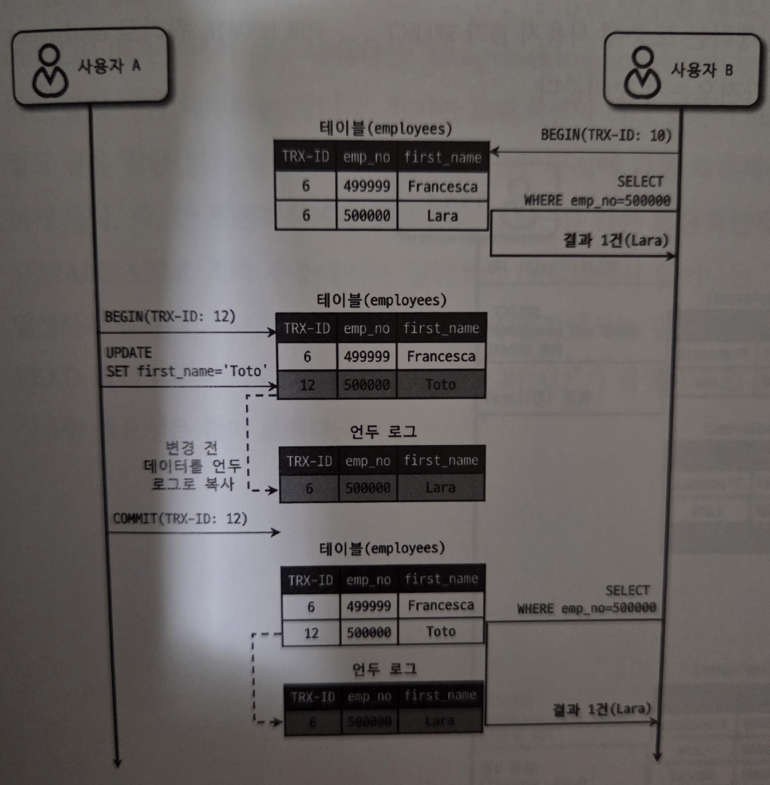
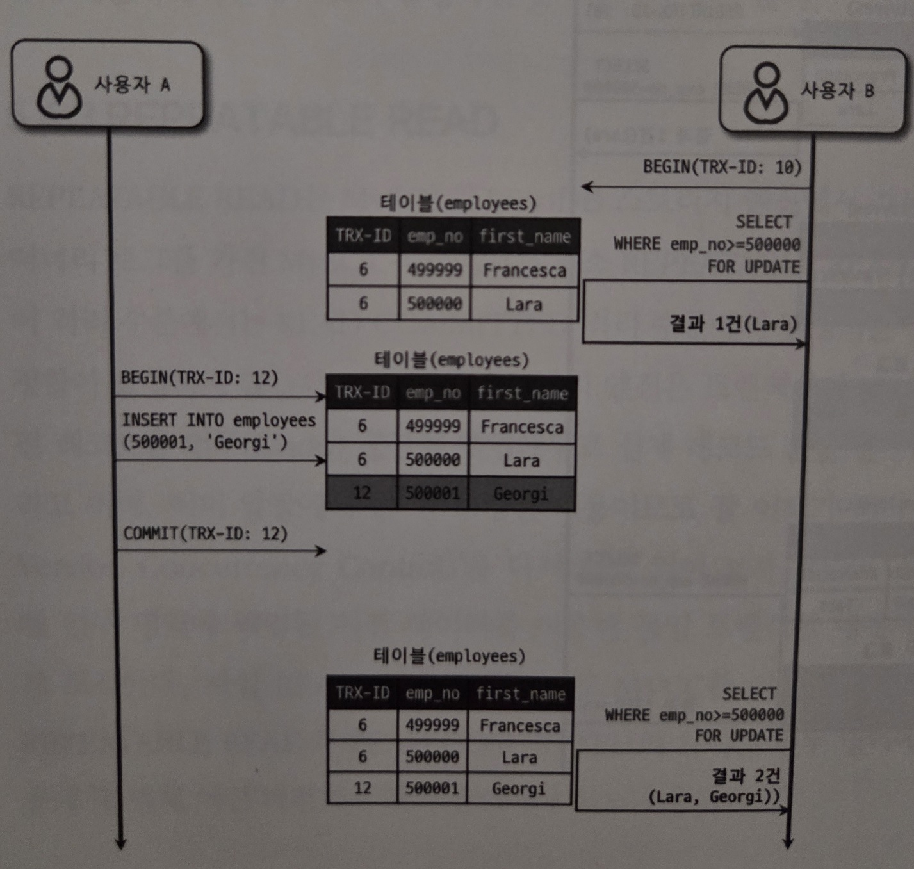

## MySQL의 격리 수준
트랜잭션의 격리 수준(isolation level)
- 여러 트랜잭션이 동시에 처리될 때 특정 트랜잭션이 다른 트랜잭션에서 변경하거나 조회하는 데이터를 볼 수 있게 허용할지 말지를 결정하는 것

격리 수준에 대한 설명
- READ UNCOMMITTED, READ COMMITTED, REPEATABLE READ, SERIALIZABLE이 존재
- READ UNCOMMITTED는 일반적인 데이터베이스에서 거의 사용하지 않음(DIRTY READ)
- SERIALIZABLE은 동시성이 중요한 데이터베이스에서 거의 사용하지 않는다.
- 4개의 격리 수준에서 뒤로 갈수록 각 트랜잭션 간의 격리(고립) 정도가 높아지며, 동시 처리 성능도 떨어지는 것이 일반적이다.
- SERIALIZABLE 격리 수준만 아니라면 크게 성능 개선이나 저하가 발생하지 않는다.

격리 수준에 따른 부정합 발생 여부

|  | DIRTY READ | NON-REPEATABLE READ | PHANTOM READ |
|---|------------|---------------------|--------------|
|READ UNCOMMITTED | 발생 | 발생 | 발생 |  
|READ COMMITTED | 없음 | 발생 | 발생 |
|REPEATABLE READ | 없음 | 없음 | 발생 (InnoDB는 없음) |
|SERIALIZABLE | 없음 | 없음 | 없음 |

일반적인 온라인 서비스 용도의 데이터베이스는 READ COMMITTED, REPEATABLE READ 중 하나 사용
- 오라클은 주로 READ COMITTED 수준을 사용
- MySQL은 REPEATABLE READ를 주로 사용

### RAED UNCOMMITTED
각 트랜잭션에서의 변경 내용이 COMMIT이나 ROLLBACK 여부에 상관없이 다른 트랜잭션에서 보인다.
- 어떤 트랜잭션에서 처리한 작업이 완료되지 않았는데도 다른 트랜잭션에서 볼 수 있는 현상을 더티 리드(Dirty read)라고 한다.
    - 데이터가 나타났다 사라졌다 하는 현상을 초래하므로 애플리케이션 개발자와 사용자를 상당히 혼란스럽게 만든다.
    - INSERT된 값이 롤백 되어도, 다른 트랜잭션에서 롤백된 값을 가지고 작업을 할 가능성이 있음

READ UNCOMMITED는 정합성에 문제가 많은 격리 수준이므로 MySQL을 사용한다면 최소한 READ COMMITTED 이상의 격리 수준을 사용할 것을 권장한다.

### READ COMMITTED
- 오라클 DBMS에서 기본적으로 사용하는 격리 수준
- 온라인 서비스에서 가장 많이 선택되는 격리 수준
- 더티 리드(Dirty read) 현상이 발생하지 않음
    - 트랜잭션이 데이터를 변경하더라도 COMMIT이 완료된 데이터만 다른 트랜젝션에서 조회할 수 있기 때문이다.

READ COMMITTED의 변경 내역 조회 예시
- 사용자 A가 emp_no=5인 사원의 first_name을 "Lara"에서 "Toto"로 변경
    - "Toto"는 employees 테이블에 즉시 기록되고, 이전 값 "Lara"는 언두 영역으로 백업
- 사용자 A가 커밋 수행 전에 사용자 B가 emp_no=5인 사원을 SELECT 하면 first_name은 "Lara"가 조회된다.
    - 언두 영역에 백업된 레코드를 가져온다.
- 사용자 A가 커밋을 하면 그때부터 다른 트랜잭션에서 백업된 언두 레코드("Lara")가 아니라 새롭게 변경된 "Toto"라는 값을 참조할 수 있게 된다.

NON-REPEATABLE READ(REPEATABLE READ 불가능) 예시
- 사용자 B가 BEGIN 명령으로 트랜잭션을 시작하고 first_name="Toto" 조회시 결과 미존재
- 사용자 A가 사원 번호가 5인 사원이 이름을 "Lara" -> "Toto"로 변경후 커밋
- 사용자 B가 똑같은 SELECT 퀴리로 조회하면 결과가 조회됨
    - REPEATABLE READ 정합성에 어긋난다.

NON-REPEATABLE READ 발생시 문제가 되는 예시
- 하나의 트랜잭션에서 동일 데이터를 여러 번 읽고 변경하는 작업이 금전적인 처리와 연결되면 문제가 발생할 수 있음
- 한 트랜잭션에서 입금과 출금을 반복하고, 다른 트랜잭션에서 입금된 총합을 조회한다고 가정했을 때, "REPEATABLE READ"가 보장되지 않으므로 총합 조회시 매번 다른 값을 가져올 수 있다.

주의점
- READ COMMITTED 격리 수준에서는 트랜잭션 내에서 실행되는 SELECT 문장과 트랜잭션 외부에서 실행되는 SELECT 문장의 차이가 별로 없음
- REPEATABLE READ 격리 수준에서는 기본적으로 SELECT 쿼리 문장도 트랜잭션 범위 내에서만 작동한다.
    - START TRANSACTION(또는 BEGIN) 명령으로 트랜잭션을 시작한 상태에서 동일한 쿼리를 반복해서 실행해도 동일한 결과만 보게 된다.(다른 트랜잭션에서 COMMIT을 했더라도)

### REPEATABLE READ
- MySQL의 InnoDB 스토리지 엔진에서 기본으로 사용되는 격리 수준
- 바이너리 로그를 가진 MySQL 서버에서는 최소 REPEATABLE READ 이상의 격리 수준 이상을 사용해야 한다.
- NON-REPETABLE READ가 발생하지 않는다.
- REPEATABLE READ는 MVCC를 위해 언두 영역에 백업된 이전 데이터를 이용해 동일 트랜잭션 내에서 동일한 결과를 보여줄 수 있게 보장한다.
- REPEATABLE READ와 READ COMMITTED와의 차이는 언두 영역에 백업된 레코드의 여러 버전 가운데 몇 번째 이전 버전까지 찾아들어가야 하느냐에 있다.

트랜잭션 번호
- 모든 InnoDB의 트랜잭션은 고유한 트랜잭션 번호를 가진다.(순차적으로 증가)
- 언두 영역에 백업된 모든 레코드는 변경을 발생시킨 트랜잭션 번호가 포함되어 있다.
- 언두 영역에 백업된 데이터는 불필요한 시점에 주기적으로 삭제된다.
- REPEATABLE READ에서는 MVCC를 보장하기 위해 실행 중인 트랜잭션 가운데 가장 오래된 트랜잭션 번호보다 트랜잭션 번호가 앞선 언두 영역의 데이터는 삭제할 수 없다.
    - 가장 오래된 트랜잭션 번호 이전의 트랜잭션에 의해 변경된 모든 언두 데이터가 필요하지는 않다.
    - 특정 트랜잭션 번호의 구간 내에서 백업된 언두 데이터가 보존되어야 한다.

위의 그림에서 사용자B는 BEGING 명령으로 트랜잭션을 시작하면서 10번이라는 트랜잭션 번호를 부여 받았는데, 그떄부터 사용자 B의 10번 트랜잭션 안에서 실행되는 모든 SELECT 쿼리는 트랜잭션 번호가 10보다 작은 트랜잭션 번호에서 변경한 것만 보게 된다.

사용자가 BEGING으로 트랜잭션을 시작하고 장시간 트랜잭션을 종료하지 않으면 언두 영역이, 백업된 데이터로 무한정 커질 수도 있다. 이 경우 MySQL의 처리 성능이 떨어질 수 있다.

REPEATABLE READ에서도 부정합이 발생할 수 있다.

다른 트랜잭션에서 수행한 변경 작업에 의해 레코드가 보였다 안 보였다 하는 현상을 PHANTOM READ(또는 PHANTOM ROW)라고 한다.
- 그림에서는 SELECT가 아닌 SELECT ... FOR UPDATE 수행
- SELECT ... FOR UPDATE 쿼리는 SELECT하는 레코드에 쓰기 잠금을 걸어야 하는데, 언두 레코드에는 잠금을 걸 수 없다.
    - 그래서 SELECT ... FOR UPDATE나 SELECT ... LOCK IN SHARE MODE로 조회되는 레코드는 언두 영역의 변경 전 데이터를 가져오는 것이 아니라 현재 레코드의 값을 가져온다.

### SERIALIZABLE
가장 단순한 격리 수준이면서 동시에 가장 엄격한 격리 수준이다.
- 그만큼 동시 처리 성능도 다른 트랜잭션 격리 수준보다 떨어진다.
- InnoDB 테이블에서 기본적으로 순수한 SELECT 작업은 아무런 레코드 잠금도 설정하지 않고 실행된다.
    - 격리수준이 SERIALIZABLE이면 읽기 작업도 공유 잠금(읽기 잠금)을 획득해야만 하며, 동시에 다른 트랜잭션은 그러한 레코드를 변경하지 못하게 된다.
    - 한 트랜잭션에서 읽고 쓰는 레코드를 다른 트랜잭션에서는 절대 접근할 수 없다.
- PHANTOM READ가 발생하지 않음
    - InnoDB는 갭 락과 넥스트 키 락 덕분에 REPEATABLE READ에서도 이미 PHANTOM READ가 발생하지 않기 때문에 굳이 SERIALIZABLE을 사용할 필요는 없다.
    - 트랜잭션 B에서 SELECT ... FOR UPDATE(커밋은 안됨), 트랜잭션 A에서 INSERT 수행시 넥스트 키 락 때문에 대기 상태가 되어 PHANTOME READ가 발생하지 않음, 트랜잭션 B에서 커밋이 되어야 트랜잭션 A에서 INSERT 수행
