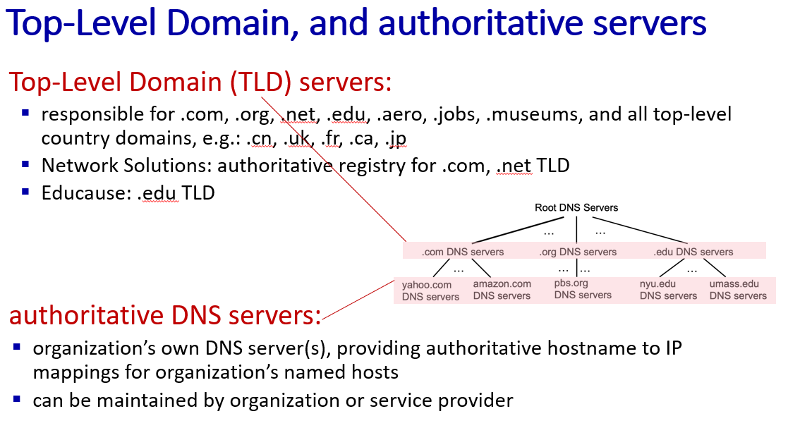

## 어플리케이션 계층

Web caches(proxy server)
- 브라우저와 서버 사이에 존재
- 캐시에 데이터가 있으면 클라이언트에 바로 리턴
- 캐시에 데이터가 없으면 origin server에 요청한 후 데이터를 받아서 클라이언트에 리턴
- 속도가 빠르다.
- 중간에 캐시서버가 요청에 대한 작업을 일부 해준다.
    - 인터넷 트래픽도 줄어든다.
- 원본과 캐시가 다를 수 있는 문제가 있다.(일관성 문제)

인터넷으로 나가는 대역폭에 비해 트래픽이 몰릴 경우
- 대역폭에 트래픽이 걸려서 버벅거리면 대역폭을 늘리면 된다.
    - 공사를 다시 해야한다.
- 웹 프록시를 앞에 둔다.
    - 인터넷으로 나가기 전 앞 장소에 캐시서버를 두면 된다.

Conditional GET
- 원본과 캐시가 다른 문제의 해결책
- HTTP 요청 헤더에 
    - if-modified-since : <<z>date</z>>
    - date 이후로 수정 되었는지 물어본다.
    - 수정되지 않았으면 서버는 304 Not Modified를 보냄.
        - 실제 파일은 보내지 않는다.
    - 수정이 되었으면 200OK와 함께 파일을 보낸다.

DNS
- 영문 주소에 대한 IP 주소 매핑 해서 찾아줌
- ex) 전화번호부 : 친구 이름으로 번호를 매핑해줌
- Host Name을 IP로 매핑해준다.
- DNS 서버는 한 대만 있지 않음
    - 서버 하나의 세상 모든 주소를 넣으면 검색 시간이 엄청 오래 걸린다.
    - 지구 반대편에서 접근하려면 오래 걸림
    - 서버가 다운되면 웹 브라우저 기능이 정지됨
- DNS는 분산, 계층화 되어있다.
    - Root DNS Servers 계층 아래에는
        - com DNS servers, org DNS servers, edu DNS servers.. 등등의 계층이 있다.
    - 사용자가 www.abc.com을 요청하면
        - 클라이언트는 root에 물어보고, root는 com DNS servers 주소를 알려주고, com DNS servers는 abc.com 주소를 알려줌
        - 이런 방식을 recursive query라고 한다.
- root name servers는 전세계에 13곳에 위치함
- top level domain(TLD) servers
    - 
    - com, org, net, edu, aero, jobs, kr, uk 등
- authoritative DNS servers
    - 각 기관이 보유하고 있는 DNS 서버, 조직의 명명된 호스트에 대한 권한 있는 호스트 이름과 IP 매핑 제공
    - 기관 또는 서비스 제공자에 의해 유지된다.
    - 실제 도메인(Domain)과 IP 주소의 정보를 가지고 있음
- Local DNS name server
    - 호스트와 그에 대한 IP주소를 캐싱하고 있음
    - 로컬 캐시에 DNS 매핑이 없으면 Root부터 탐색

캐시 -> 캐시에 없으면 -> root DNS server -> TLD DNS server -> authoritative DNS server

캐시 문제로 인해 DNS 서버도 TTL을 가지고 있다. TTL 시간이 지나면 값을 새로 가져와야 함

DNS는 name, value, type, ttl 4개의 필드를 가지고 있다.
- type
    - A : name = hostanme, value = IP
        - name = dns.edu, value = 1.1.1.1
    - NS : name = domain, value : 도메인이 관리하고 있는 권한있는 네임서버의 호스트 이름
        - name = edu, value = dns.edu
    - CNAME
    - MX : 메일서버 관련

DNS, HTTP는 애플리케이션 계층에서 움직인다.

DNS는 UDP를 사용한다.
- UDP는 준비동작이 없어서 빠르다.
- 메시지 크기가 작다. 유실될 확률도 작고, 유실되도 피해가 적음
- HTTP 통신 이전에 준비 동작임