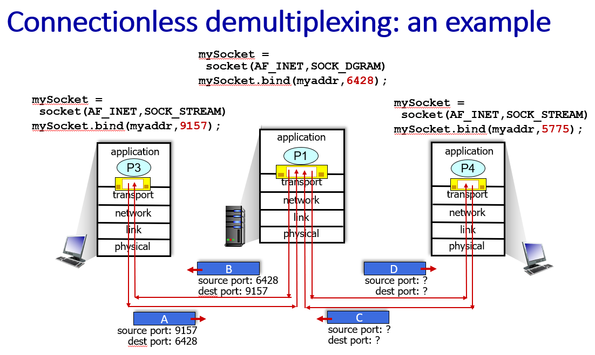
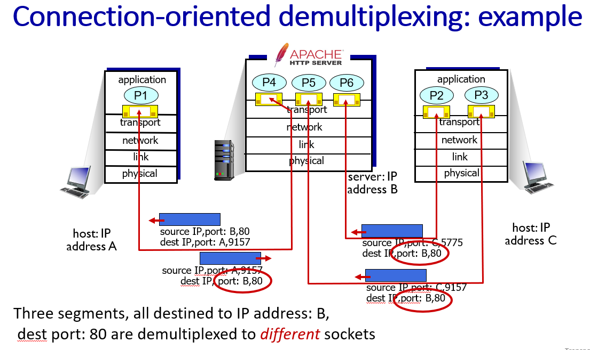

## 전송 계층

애플리케이션 계층 바로 밑에 존재함

TCP / UDP 관점

전송 계층 아래도 블랙박스(어플리케이션 계층 바로밑도 블랙박스였던 것처럼)
- 전송 계층 아래 네트워크 계층에는 IP가 있다.
- 인터넷 : IP 프로토콜을 사용하는 디바이스들의 연결
- 어플리케이션 계층 전송 단위 : 메시지
    - 메시지가 소켓을 통해 내려오면 전송 계층의 전송 단위인 세그먼트 안의 데이터부분에 들어감(ex, 편지와 편지봉투)
- 전송 계층 전송 단위 : 세그먼트 
    - TCP 세그먼트, UDP 세그먼트
- 네트워크 계층 전송 단위 : 패킷
- 링크 계층 전송 단위 : 프레임

메시지가 세그먼트에 담기고 세그먼트는 패킷에담기고 패킷은 프레임안에 담긴다.

UDP는 TCP에 비해 제공하는 기능이 적다.

TCP와 UDP가 공통적으로 제공하는 기능
- multiplexing, demultiplexing
    - 프로세스에서 메시지를 보냈을 때 알맞는 목적지 프로세스 목적지에 전달하는것
- multiplexing
    - 송신자의 복수의 애플리케이션으로부터 데이터를 수집하고, 그 데이터를 헤더로 감싸서 수신자에게 보내는것
    - 장치에서 나가는 인터페이스 통로는 하나인데 같이 합쳐져서 나감
        - ex) wifi, lte, ethernet
- demultiplexing
    - 수신측에서 수신된 세그먼트를 올바른 애플리케이션 계층 프로세스로 전달하는 것
    - 목적지 프로세스에 맞게 전달

UDP

- connectionless demultiplexing
- 소켓과 소켓 사이에 1:1 매핑이 없음
- 세그먼트 헤더부분에 source port, dest port가 있음
- UDP 멀티플렉싱 디멀티플렉싱은 포트 번호를 보고 매핑

TCP

- connection-oriented demultiplexing
- 소켓과 소켓이 1:1 관계
- TCP 소켓들은 고유의 idx를 가지고 있음
    - TCP idx는 4가지로 구성됨
    - soruce ip, source port, destination ip, destination port
    - destination port가 80이여도 다른 소켓임(포트번호만 같을뿐)
        - 인터넷 브라우저 3개를 띄우고 같은 사이트에 접속하면 source port만 다르고 다 같음
    - source ip, source port가 다르기 때문에 TCP가 디멀티플렉싱을 함

하나의 프로세스가 여러 소켓을 가질 수 있다.

UDP
- 헤더 필드가 4개임
- source port(16bit), dest port(16bit), length(세그먼트 길이, 16bit), checksum(16bit)
- checksum
    - 전송중에 에러가 발생했는지 판단하는 코드
- UDP를 받는 측에서 세그멘트를 받았을 때 checksum으로 에러를 검출함
    - 중간에 유실될지언정 이상한 데이터를 보내지 않는다.

