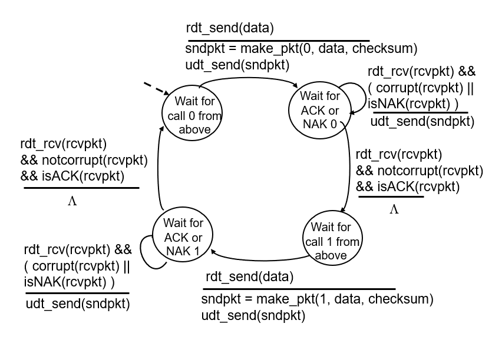
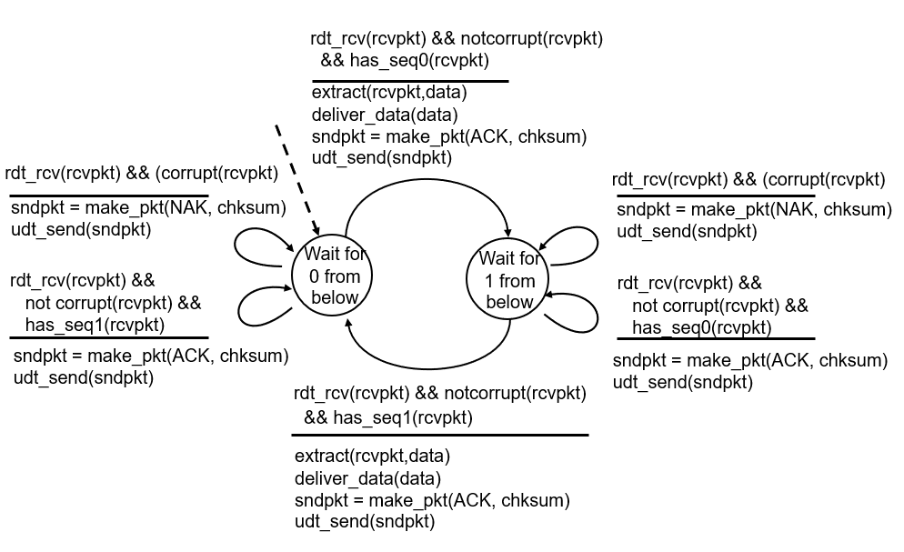

## 전송 계층

TCP와 UDP
- 멀티플렉싱, 디멀티플렉싱을 기본적으로 제공
- 애플리케이션에서 보낸 메시지를 소켓을 통해서 소비 프로세스에서 디멀티플렉싱
- UDP : Connectionless
- TCP : Connection-oriented

각 계층은 데이터 부분과 헤더 부분으로 나뉘어져 있다.

### RDT(Reliable data transfer)
TCP 대표적인 기능 중 하나

전송 계층 아래는 Unreliable Channel(신뢰할수 없는 채널)이다. TCP는 Reliable(신뢰할수 있는) 하기 위해서 어떻게 작동하는지 알아보자.

RDT 설계
- 메시지를 보내고 상대측에서 메시지를 받았다는 것을 확신해야 다음 메시지를 보냄
- 나타날 수 있는 안좋은 예
    - 패킷이 가는 도중 에러 발생
    - 패킷이 가는 도중에 큐가 가득차서 유실됨
- RDT 1.0
    - Underlying channel 채널이 완전히 신뢰할 수 있다.
        - 비트 에러가 발생하지 않음
        - 패킷의 유실이 발생하지 않는다.
    - 송신자가 그냥 패킷을 보내면 된다. 보내면 무조건 수신자가 받음
- RDT 2.0
    - Underlying channel이 에러를 발생시키는 경우
        - 패킷 에러가 발생
        - 패킷 유실은 발생하지 않음
    - 수신자가 받은 패킷이 정상일 경우 
        - 수신자는 송신자에게 acknowledgements(ACKs) 응답을 보냄
    - 수신자가 받은 패킷이 비정상일 경우
        - 패킷 에러가 판별되면 negative aknowledegements를 보낸다(NAKs)
    - 송신자는 ACKs를 받으면 다음 패킷을 보내고, NAKs를 받으면 패킷을 재전송한다.
- RDT 2.1
    - 만약에 피드백(ACKs 인지 NAKs인지)이 판단이 안되는 경우?
        - 송신자는 같은 패킷을 재전송함
        - 송신자가 수신자가 보낸 피드백을 잘 판단하지 못하고 같은 패킷을 보냈지만
        수신자는 다음 패킷이 온걸로 착각할 수 있다. 수신자는 재전송인지 다음 패킷인지 판단 불가
            - sequence number가 필요하다.
        - 수신자가 sequence number와 패킷을 중복해서 받으면 sequence number를 확인후 패킷을 버린다.
        - 중복된 패킷은 버리더라도 수신자는 송신자에게 피드백(ACKs)를 보낸다.
    - 패킷 헤더에는 checksum과 sequence number가 들어있다.
    - 
        - 송신측에서 sequence number 필드에 0을 넣고 수신측에 데이터 전송시 corrupt 패킷이나 NAKs 패킷을 받으면 패킷을 재전송함
        - 패킷 전송이 성공해서 ACKs를 받으면 sequnce number 필드에 1을넣고 수신측에 데이터 전송
        - 이와 같은 과정을 반복 한다.
    - 
        - sequnece number 0인 패킷을 기다릴 경우
            - 수신측에서 패킷이 corrupt이면 NAKs를 전송하고, sequnece number가 1인 패킷이 오면 중복된 패킷이 도착했으므로 이에대한 ACKs를 보낸다. 
            - 제대로 된 패킷이 왔을 경우 ACKs를 보내고, sequnece number가 1인 패킷을 기다린다.
- RDT 2.2
    - NAKs없이 ACKs만 사용해서 똑같이 작동하게 하기
        - 무조건 피드백으로 마지막으로 받은 sequence number와 함께 ACKs를 보냄
        - 송신측이 sequnece number 1인 패킷을 보냈는데, 수신측에서 응답으로 sequence number가 0인 패킷을 보내면, 송신측은 sequnece number가 1인 패킷을 재전송한다.
- RDT 3.0
    - 패킷이 에러가 발생할수도 있고 유실도 발생할 수 있음
    - 패킷을 보내놓고 일정시간 동안 패킷이 오지 않으면 유실로 판단해서 패킷을 재전송한다.
        - 타이머로 일정 시간을 판단한다.
        - 타이머 시간이 짧다
            - 유실이 일어나면 빨리 재전송이 일어난다.
            - 응답 패킷이 유실이 아니라 지연인데 패킷을 재전송하면 손해다.
        - 타이머 시간이 길다
            - 응답 패킷이 지연이라도 패킷을 재전송하지 않음
            - 유실이 일어나면 재전송이 늦다.