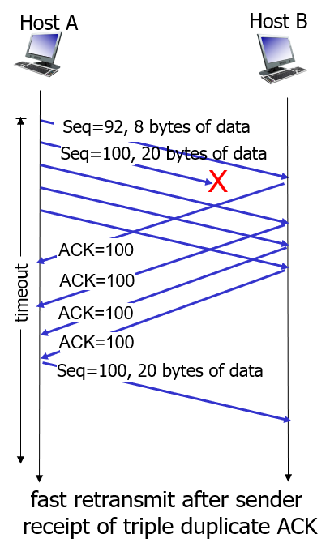

## 전송 계층

Pipelined protocols
- 패킷을 한번에 여러게 보냄

- point-to-point
    - 소켓과 소켓 사이에 TCP 커넥션이 맺어진 한쌍을 위해 동작
    - 하나의 송신자, 하나의 수신자
- reliable, in-order byte stream
    - 유실이 없고
    - 데이터가 보내진 순서대로 도착
- pipelined
    - 한꺼번에 데이터가 많이 갈 수 있다.
    - window size를 통한 TCP 혼잡 제어와 흐름제어
- full duplex data
    - 양 쪽 모두 sender이자 receiver
    - 같은 커넥션으로 두 방향으로 데이터가 흐른다.
    - MSS : maximum segment size
- connection-oriented
    - 연결지향
    - 데이터를 교환하기전에 handsahking 과정을 거친다.
- flow controlled
    - 데이터 세그먼트를 보내는 속도를 상대방 머신의 사정에 맞게 보냄

### TCP 세그먼트 구조
- sequence number
    - 메시지에 대한 추적을 가능하도록 함
    - 새 메시지인지, 중복 메시지인지 판단할 수 있음
    - TCP는 바이트 단위로 sequence number를 붙인다.
    - 바이트의 맨 앞이 세그먼트 sequence number가 된다.
- acknowledgements
    - ack#100
        - 99번까지 잘 받았고 100번 시퀀스를 기다린다.
- 세그먼트를 보낼 때 타이머를 설정한다.
    - 그 시간안에 안오면 유실
    - RTT를 측정
        - 세그먼트를 전송하고 ACK가 올 때 까지의 값을 측정한다.
        - RTT + margin을 더한 값으로 timer 값을 설정한다.
        - 세그먼트를 보낼때 마다 sample rtt 측정
        - 재전송에 대해서는 sample rtt에 포함되지 않는다.
            - 샘플 RTT 분포를 보면 변화무쌍하다.
            - 네트워크, 라우터 큐 사정이 다양하기 때문에 변화 무쌍함
            - RTT 그래프(매번 갱신됨) -> 최근 값(sample RTT)이 가중치가 높다.

### 버퍼 
TCP 연결이 되면 각 소켓(송신, 수신)마다 두 개의 버퍼가 생성된다.(타이머는 각 소켓마다 하나)
- send buffer
    - 애플리케이션이 데이터를 전송하는 속도와 TCP가 전송하는 속도가 다르다.
    - 그 차이를 줄이기 위해 send buffer가 존재한다.
    - TCP는 데이터를 모았다 보낸다.
        - window size만큼 보낼 수 있다.
            - ex) window size가 1000바이트
            - 200바이트 세그먼트 다섯개가 나갈 수 있다.
            - 상대 TCP의 receive buffer로 데이터가 들어간다.
            - 첫번째 세그먼트(#0)가 전송될 때 timer가 설정된다.
                - 첫번째 세그먼트에 대한 ack(ACK#200)가 오면 그 timer를 제거한다.
                - send_base가 200바이트로 이동함
                - 버퍼가 200 바이트 비어서 #1000 세그먼트(#0, #200, #400, #600, #800 다음)가 전송된다.
- receive buffer
    - 데이터를 잘 받으면 위의 계층으로 올린다.
    - 데이터가 전송되다가 #400이 유실됐다고 가정 해보자
        - #600, #800, #1000, #1200은 제대로 전달됨
        - ACK#400을 보냈는데 송신측에서는 send_base를 #400으로 옮긴상태
        - receive buffer는 #600 세그먼트 부터 위의 계층으로 올리지않음
            - 데이터 순서를 보장하기 위해 올리지 않는다.
            - #400이 오기전 까지 올리지 않는다.
            - #600, #800, #1000, #1200 모두 응답으로 ACK#400을 보낸다.
            - send buffer는 재전송을 위한 버퍼
                - 확인이 되면 버퍼를 비운다.
            - #400을 receive buffer가 받으면
                - ACK#1400값을 설정한 세그먼트롤 보낸다.
            - send buffer는 ACK#1400을 받은만큼 송신 버퍼를 늘린다.
        - receive buffer는 순서를 위한 버퍼

보낼 데이터에 대한 sequence number + 상대방이 보낸 데이터에 대한 acknowledgement number(ACK)를 세그먼트 헤더에 넣는다.(즉 보낼 데이터에 대한 sequence number + 받은 데이터에 대한 ACK를 동시에 해줌(상대방 데이터 트래킹)

TCP는 세그먼트 유실을 timer로 처리한다.

TCP 재전송 시나리오

아쉬운 점 
- 타이머가 expired 됐을 때 세그먼트가 전송된다.
   - rtt + margin
- 타이머의 시간은 여유있게 잡음
    - 유실을 빠르게 판단하지 못한다.
    - 여러 세그먼트에서 중복된 ACK를 보내면 패킷 유실이라고 판단할 수 있다.
        - TCP fast retransmit
            - 
            - 4번 동일한 ACK를 받았을 때 유실이라고 판단한다.