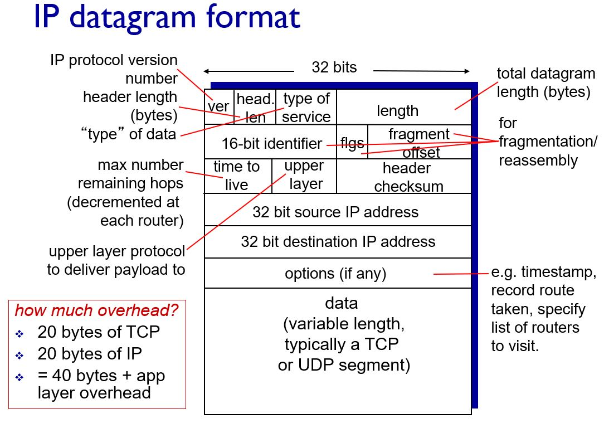

## 네트워크 계층 서비스

어플리케이션 계층에서 내려온 메시지를 TCP(전송 계층) 세그먼트에 넣어서 보낸다.

네트워크 계층에는 많은 라우터들이 있음

출발지에서 목적지까지 어떻게 패킷이 전달되는가가 관심사이다.

애플리케이션 메시지는 세그먼트에 담기고, 세그먼트는 패킷에 담기게 된다.
- ex) 편지지 -> 봉투 -> 봉투
- IP 패킷의 데이터 부분에 세그먼트가 담기게 된다.

라우터들은 IP 패킷들로 쌓여진 정보만 이해할 수 있다.

애플리케이션 메시지는 세그먼트에 담기고 세그먼트는 패킷에 담긴다.

라우터들은 IP 패킷만 인식할 수 있음, TCP 세그먼트가 오면 버린다.(이해하지 못해서)

라우터 기능
- forwarding
    - 들어온 패킷을 목적에 맞는곳으로 보내준다.
    - 단순하다. 들어온 패킷의 목적지를 이용해서 forwarding table 엔트리에서 목적지에 맞는 곳을 찾아서 포워딩
        - forwarding table을 채우는 일은 routing이 함
    - forwarding table
        - 엔트리들은 상세주소를 가지고 있지 않다.(그럼 엔트리가 무지하게 많아진다.)
        - range를 가지고 있음(Destination Address Range)
        - longest prefix matching
            - 여러개의 엔트리에 매칭되는 경우, 가장길게 Prefix에 매칭되는 곳을 선택한다.
        - 각 input port에 forwarding table이 독립적으로 저장된다.(라우팅에 input port는 여러개다.)
            - forwarding 되는 속도보다 input 속도가 빠르면 버퍼링이 생기기때문에 큐가 존재한다.
            - output port에도 큐가 존재한다.
- routing
    - routing processor가 forwarding table을 만들어준다.

IP 라우터들은 best-effort 특징을 갖고 있다.
- 보장해주는 것은 아무것도 없다. (Bandwidth, Loss, Order, Timing 모두 발생한다.)
- 신뢰할 수 없기 때문에 TCP에서 이 작업들을 보완해줌

네트워크 계층에서 중요한 프로토콜은 IP다.
- IP 패킷으로 쌓여있어야만 목적지로 패킷이 전달된다.

IP 패킷 형태
- IP 헤더와 데이터부분이 있음
    - 데이터 부분에는 TCP 세그먼트가 있다.
        - TCP 세그먼트 맨 앞에는 TCP 헤더가 있다.
        - 따라서 IP 패킷 데이터 부분 맨 앞에는 TCP 헤더가 있다.
        - IP헤더 = 20바이트, TCP 헤더 = 20바이트
        - 애플리케이션 메시지 앞에 40바이트의 오버헤드가 붙는셈이다.
- IP 헤더
    - 
    - ver : IP 버전
    - time to live(TTL) : 라우터를 포워딩 할 때마다 TTL의 값을 1씩 감소시킨다.
        - 도착하기 전까지 0이 되면 패킷은 버려진다.
        - 패킷이 영원히 살아남는것을 방지하기 위해서(무한 루프가 생길 수 있다.)
    - upper layer : 패킷이 도착했을 때 상위 Layer에 올려줘야 하는데, 어디에 올려야 하는지 명시해주기 위해
        - TCP 세그먼트인지, UDP 세그먼트인지 알려준다. 아니면 어떤 프로토콜의 메시지인지(다양한 프로토콜이 존재함)
    - 32 bit source IP address
    - 32 bit destination IP address

IP 패킷의 최소 크기는 40바이트
- IP 헤더의 20바이트와 TCP 헤더의 20바이트를 합치면 40바이트이다.
- 데이터 부분이 많이 담길수록 헤더의 오버헤드가 줄어들기 때문에 좋다.
- 40바이트 크기의 패킷도 다수 존재한다.
    - TCP 피드백(ACK)만 담긴 IP 패킷
    - 40바이트 패킷을 보내지 않으면 TCP가 동작하지 않음(응답을 보내야 하기 때문에)

IP 주소
- 32비트의 주소공간을 가진 이진수의 숫자
- 8비트씩 끊어서 10진수를 만든다.
- 하나의 8비트당 255가지 숫자를 가질 수 있다.
- IP 주소는 특정 호스트를 지칭하고 있다.
    - 이는 정확하지 않은 표현이다.
    - IP주소는 인터페이스를 지칭하는 것이다.
    - 보통의 머신(호스트)마다 IP주소가 하나라서 호스트를 IP로 지칭하는 것임
    - 인터페이스가 여러개 있는 장치도 있을 수 있다.
        - 라우터는 인터페이스가 여러개임

IP 주소 배정
- IP가 필요할 때 마다 2^32개의 주소중에 하나를 배정하면
- forwarding table의 엔트리 개수가 무지막지하게 커짐
    - 라우팅 테이블에 모든 값을 넣어야 함
- 매칭이 오래걸린다.
- 오래걸리기 때문에 IP주소를 계층화 시켜서 해결
    - 계층화의 장점
        - 같은 네트워크에 속하면 네트워크 ID가 같다.
        - 포워딩 테이블이 단순해진다. ex) 1.2.3.0/24, 5.6.7.0/24 이런식으로 포워딩 테이블이 채워진다.
        - 네트워크에 장치가 추가되면 호스트 ID만 배정해주면 된다.
    - 앞 부분은 네트워크 뒷 부분은 호스트 부분으로 나눔
        - ex) 12.34.158.0/24
        - 24비트는 네트워크 부분, 뒤에 8비트는 호스트 부분
    - fowarding table 이 간단해진다.
        - 1.2.3.0/24 는 왼쪽 네트워크
        - 5.6.7.0/24 는 오른쪽 네트워크
    - /24 는 사람들이 이해하기 쉽지만 머신은 이해하기 어렵다.
        - subnet mask를 이용해 머신들이 이해하기 쉽게 만든다.
        - ex) 255.255.255.0(어디까지가 네트워크 부분, 호스트 부분인지 알려줌)
        - 255.255.255.0 (11111111 11111111 11111111 00000000)
            - IP주소와 AND연산을 통해 값을 구할 수 있다.

네트워크 IP의 Prefix를 어느정도로 잡아야 하는지
- Network 부분이 24비트일 경우 제약점
    - 2^8의 호스트 밖에 쓸 수 없다.(수가 부족함)
- Network 부분이 8비트인 경우 호스트를 많이 사용할 수 있다.
    - 전 세계에서 네트워크 주소를 적게 쓸 수 밖에 없다.

현대에서는 네트워크 주소 부분의 Prefix를 가변적으로 설정해서 준다.
- 각 기관의 규모에 맞게 유연하게 해서 전달해줌

IP 주소 표현
- Network ID = Prefix = Subnet ID (서브넷 부분)
- host ID(호스트 부분)
- 서브넷 : 같은 네트워크 ID를 가진 인터페이스의 집합
    - 또 다른 정의 : 라우터를 거치지 않고 접근할 수 있는 인터페이스의 집합

라우터는 여러개의 인터페이스를 가지기 때문에 여러개의 IP주소를 가짐
- 라우터의 각각의 인터페이스는 서브넷이 다 다르다.
- 다른 서브넷에 접근하기 위해서는 라우터를 이용해야 하기때문에, 라우터는 각각의 인터페이스가 다른 서브넷을 가지고 있음