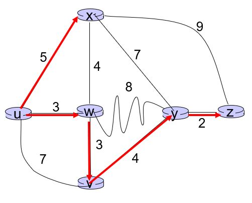
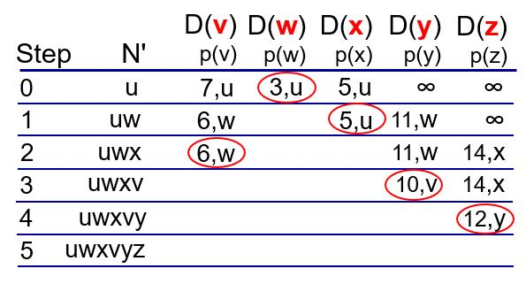

## 라우팅 알고리즘

Dijsktra's Algorithm
- N'에 속한 영역은 최단 거리를 알고 있음
- 이웃한 노드들의 거리값과 직전 노드를 설정하고, 이웃하지 않은 노드들은 무한으로 설정
- N'에 속하지 않으면서 가장 작은 노드를 N'에 추가(강의에서는 W)
- W와 이웃한 노드들(N' 제외)의 모든 노드들의 D값을 업데이트 한다.
    - D(v)와 D(w) + c(w,v)의 값중에 더 작은 값으로 업데이트 한다.
        - 기존의 값 VS 새로운 값(W를 경유)
- N'에 속하지 않으면서 가장 작은 노드를 찾아서 N'에 추가하고 이웃 노드의 값을 설정하는 것을 반복한다.

N' | D(v) | D(w) | D(x) | D(y) | D(z) | 
---|------|-------|------|-----|------|
u | 7u | 3u(min) | 5u | 무한 | 무한 | 
wu | 6w | | 5w(min) | 11w | 무한 |
xwu | 6w(min) | | | 11w |  14x |
vxwu | | | | 10v(min) | 14x | 
vwxyz |  |  |  | |  12y(min) |

이런 형식으로 테이블을 완성

forwarding table을 다익스트라 알고리즘 결과 기반으로 만든다.

Control Message traffice
- ICMP(Internet Control Message Protocol)
- 네트워크 내부의 일들은 ICMP 메시지에 담겨서 전달된다.
- ICMP는 IP 패킷에 담겨서 전달된다.
    - Destination은 브로드캐스트 IP주소가 담긴다. 255.255.255.255

link state가 아닌 distance vector는 전체 브로드캐스팅이 없이 독립적으로 수행된다.(재귀적으로 동작)
