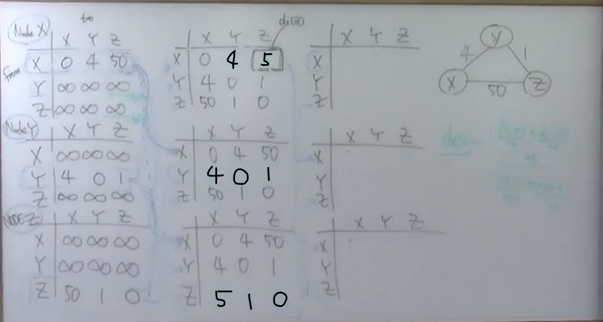
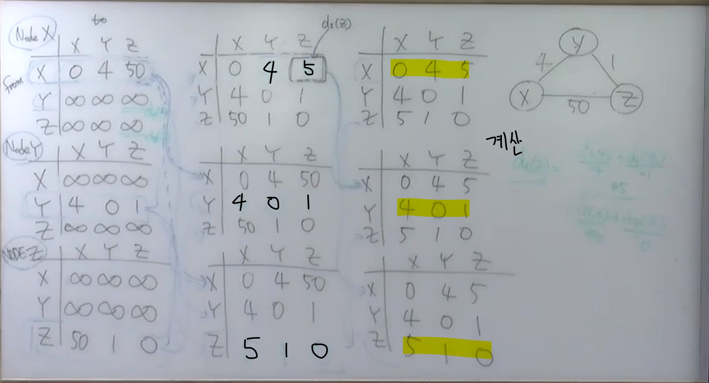
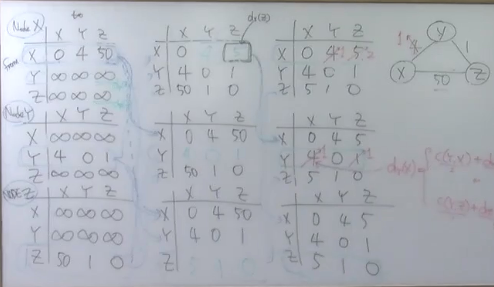

## 거리 벡터 알고리즘

link state 알고리즘(다익스트라 알고리즘)
- least cost를 계산하기 전에 전체 그래프를 알고 시작한다.(모든 노드를 알고 시작함)
    - 브로드 캐스팅을 통해서
    - 라우터가 자기 상태를 전체에 브로드캐스팅 함

distance vector는 전체를 모른다.

distnace vector
- distance array
- dx(y)의 least-cost
    - y로 가는 경로중에 v1, v2, v3 노드가 있음
    - v1, v2, v3 노드가 있으면 x노드는 v1, v2, v3의 노드중 하나를 거쳐야함
        - dx(y) = c(x, v1) + dv1(y)
        - dx(y) = c(x, v2) + dv2(y)
        - dx(y) = c(x, v3) + dv3(y)
    - 위 셋중에 가장 min값이 최단 거리임
    - c(x,v1), c(x,v2), c(x,v3)은 알지만 dv1(y), dv2(y), dv3(y)는 모름
    - dv1(y), dv2(y), dv3(y)값을 x에 전달해주면 계산할 수 있다.
    - v1에서 y의 거리는 어떻게 구할까
        - x노드와 똑같이 구해야 함
- link state는 전체에 브로드캐스트 함
- distance vector는 이웃과 통신
    - distance vector(array)값을 교환함
    - x노드는 dx(y), dx(z) 등을 가지고 있음
    - v1노드는 dv1(y), ... dv1(z) 등을 가지고 있다
- Bellman-Ford example
    - dy(z)를 모른다. 
- Distance vector algorithm
    - link cost가 변했거나
    - 이웃으로부터 distance vector 메시지를 받았을 경우 자신의 distance vector 값을 다시 계산
    - 자기의 distance vector 값이 변했을 경우 이웃에 전달한다.

Node X
|  |x  |y  |z  |
---|---|---|---|
x |0 dx(x)|4 dx(y)|50 dx(z)|
y |무한 |무한 |무한 |
z |무한|무한 |무한 |  

- y에서 x까지는 모른다.(x는 y와 정보교환을 하지않음 그래서 무한, x는 x관련된것만 알고있음)
- 위 표는 x의 distance vector임
- 무한으로 설정된 y의 distance vector는 모른다. (정보 교환이 되지 않음)

x의 정보를 이웃에 넘긴다.(x는 y,z, y는 x,z, z는 x,y)

------------------------------------

다 안정화 되었음

안정화 된 상태에서 링크의 값이 변화되었을 때(cost가 더 좋아졌을 경우)
- x -> y 값이 1로 변하면
- x는 자신의 distance vector를 다시 계산
- y는 x가 변함에 따라 distance vector를 다시 계산

Node x
|  |x  |y  |z  |
---|---|---|---|
x |0|1(변경)|2(변경)|
y |4|0|1|
z |5|1|0|

Node y
|  |x  |y  |z  |
---|---|---|---|
x |0|4|5|
y |1(변경)|0|1|
z |5|1|0|

link cost가 좋아지면 안정화가 금방됨

안정화 된 상태에서 링크의 값이 변화되었을 때(cost가 더 안좋아졌을 경우)
- x -> y 60으로 변경
- 안정화가 금방되지 않는다.

Node x
|  |x  |y  |z  |
---|---|---|---|
x |0|51(변경)|50(변경)|
y |4|0|1|
z |5|1|0|

Node y
|  |x  |y  |z  |
---|---|---|---|
x |0|4|5|
y |6(변경)|0|1|
z |5|1|0|  

yx -> 6으로 변경됨, 전지적인 관점에서는 51로 업데이트 되어야 함

Node z
|  |x  |y  |z  |
---|---|---|---|
x |0|4|5|
y |51(변경)|0|1|
z |50|1|0|  

- 강의를 보면 값이 stable 하게 변경되지 않고 이상하게 변경된다.
    - count infinite
- 계속해서 무한으로 변경됨(zx가 stable까지 변경될 때 까지)
- y에게 dz(x) 값을 50이 아닌 5로 알려줌 
    - y에서 z로 갔다가 x로 돌아오는 길(역류)
    - poisoned reverse 사용
        - dz(x)가 5라는 것은 맞는 정보임
        - z에서 y에 5 정보가 들어가면 나중에 역류하게 된다.
            - z에서 다른곳에 다 가도 되지만 y에 넘어가면 역류하게 된다. 
            - y에서 x값이 변경될 때 z에서 y로 갈때 값을 무한으로 변경한다.
