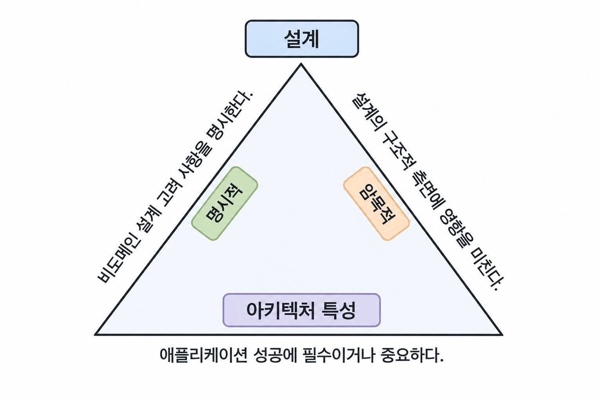

## 아키텍처 특성의 정의

구조적 설계의 두 가지 활동
- 아키텍처 특성 분석
- 논리적 컴포넌트 설계

문제 도메인
- 문제를 해결하기 위한 요구사항들의 집합

아키텍처적 특성
- 문제 도메인과는 독립적이면서 시스템의 성공에 중요한 시스템의 핵심적 측면
- 감사성, 성능, 보안, 요구사항, 데이터, 적법성, 확장성 등

### 4.1 아키텍처 특성과 시스템 설계

어떤 요구사항이 하나의 아키텍처 특성으로 간주되려면 세 가지 기준 혹은 조건을 충족해야 한다.

- **아키텍처 특성은 도메인과 무관한 설계 고려사항을 명시한다.**
    - 소프트웨어의 아키텍처의 구조적 설계는 아키텍트가 수행하는 두 가지 활동으로 구성된다.
    - 도메인에 대한 이해
        - 도메인 설계 고려 사항은 시스템의 행동방식에 관한 것
        - 설계 요구사항은 애플리케이션이 무엇을 해야 하는지 명시
    - 시스템이 성공하려면 꼭 지원해야 하는 역량의 종류 파악 
        - 아키텍처 특성은 역량을 정의한다.
        - 아키텍처 특성은 요구사항을 어떻게 구현할지, 그 사항을 왜 선택했는지를 명시한다.
        - 아키텍처 특성은 프로젝트가 성공하기 위한 운영 및 설계의 기준(criteria)
    - 도메인에 대한 이해와 역량의 종류 파악 두 조합에 의해 구조적 설계가 정의된다.
- **아키텍처 특성은 설계의 구조적 측면에 영향을 미친다.**
    - 모든 품질 속성이 아키텍처 특성이 되는 것은 아니다.
    - 해당 특성을 만족시키기 위해 특별한 구조적 설계가 필요할 때 아키텍처 특성이 된다.
        - 단순히 코딩이나 일반적인 설계 기법으로 해결 가능하면 일반 설계 고려사항
        - 시스템의 구조를 변경하거나 특정 아키텍처 스타일을 요구하면 아키텍처 특성
    - 예시
        - 보안
            - 암호화, 해싱 등의 일반적인 기법만 필요 -> 일반 설계 고려사항
            - 별도의 서비스 분리, 강한 접근 프로토콜 등이 필요 -> 아키텍처 특성
        - 확장성
            - 현재 구조에서 충분히 확장 가능 -> 일반 설계 고려사항
            - 일정 규모 이상에서 분산 아키텍처로 변경해야 함 -> 아키텍처 특성
    - 해당 요구사항이 시스템의 구조적 결정을 유발하는지가 판단 기준
- **아키텍처 특성은 애플리케이션 성공에 필수이거나 중요해야 한다.**
    - 모든 품질 속성을 아키텍처 특성으로 선택할 필요는 없다.
    - 특성이 많을수록 설계가 복잡해지므로 성공에 필요한 핵심 특성만 선택한다.
    - 아키텍처 특성은 가능한 한 적게, 필요한 만큼만 선택한다.

아키텍처 특성의 두 가지
- 암묵적 특성
    - 요구사항 문서에 거의 등장하지 않지만 프로젝트가 성공하는데 꼭 필요한 특성
    - 가용성, 신뢰성, 보안 등
- 명시적 특성
    - 요구사항 문서나 기타 가이드라인 문서 등에 명시되어 있는 특성

### 4.2 중요한 아키텍처 특성들
아키텍처 특성들
- 낮은 수준의 코드 특성부터 정교한 운영상 관심사 까지 광범위한 스펙트럼에 걸쳐 존재한다.

#### 4.2.1 운영 아키텍처 특성
성능, 확장성, 탄력성, 가용성, 신뢰성 같은 역량등이 포함된다.

- 가용성(availability): 장애가 있어도 서비스를 얼마나 계속 사용할 수 있는가?
- 연속성(continuity): 재해 같은 큰 문제가 발생해도 서비스/비즈니스를 계속 이어갈 수 있는가?
- 성능(performance): 요청을 얼마나 빠르고 효율적으로 처리할 수 있는가?
  - 응답 시간, 처리량, 부하 처리 능력 등
- 복구성(recoverability): 장애 발생 후 얼마나 빠르게 정상 상태로 복구할 수 있는가?
  - 백업, 이중화, 복구 전략 등
- 신뢰성(reliability) / 안전성(safety): 시스템이 안정적으로 동작하며, 실패했을 때 얼마나 치명적인 문제가 발생하는가?
- 견고성(robustness): 예상치 못한 오류나 외부 장애가 발생해도 얼마나 잘 버틸 수 있는가?
  - 네트워크 단절, 전원 장애 등의 예외 상황
- 확장성(scalability): 사용자나 요청이 증가해도 처리 능력을 확장해서 대응할 수 있는가?

#### 4.2.2 구조적 아키텍처 특성
시스템의 실행 성능보다는 코드 구조를 얼마나 쉽게 변경,확장,유지할 수 있는가에 관한 특성

- 설정성(configurability): 코드 변경 없이 설정을 얼마나 쉽게 바꿀 수 있는가?
- 확장 능력(extensibility): 기존 구조를 크게 망가뜨리지 않고 새로운 기능을 추가할 수 있는가?
- 설치성(installability): 다양한 환경에 시스템을 얼마나 쉽게 설치할 수 있는가?
- 활용성 / 재사용성(leverageability / reuse): 만들어진 컴포넌트를 다른 시스템에서도 재사용할 수 있는가?
- 현지화(localization): 언어,국가,지역 차이를 얼마나 쉽게 지원할 수 있는가?
- 유지보수성(maintainability): 기존 코드를 얼마나 쉽게 수정하고 개선할 수 있는가?
- 이식성(portability): 다른 OS, DB, 플랫폼 등으로 얼마나 쉽게 옮길 수 있는가?
- 업그레이드성(upgradeability): 새로운 버전으로 얼마나 쉽고 안전하게 전환할 수 있는가?

#### 4.2.3 클라우드 특성
클라우드와 관련된 몇 가지 고려사항

- 온디맨드 확장성(on-demand scalability): 필요하면 처리 자원을 더 늘릴 수 있는가?
  - 예시) 서버 3대 -> 10대
- 온디맨드 탄력성(elasticity): 부하 변화에 따라 자원을 동적으로 늘리거나 줄일 수 있는가?
  - 예시) 트래픽 증가 -> 서버 증가 / 감소 -> 서버 축소
- Zone 기반 가용성: 여러 Zone에 시스템을 분산하여 하나의 Zone에 장애가 발생해도 서비스를 지속할 수 있는가?
- Region 기반 개인정보보호 및 보안: 데이터 저장 위치가 국가·지역의 개인정보 및 보안 규제를 만족하는가?

#### 4.2.4 횡단적 아키텍처 특성
여러 범주에 걸쳐 있거나 특정한 하나의 범주로 분류하기 어려운 특성들 보안, 법적 요구사항, 사용성처럼 여러 계층과 컴포넌트에 공통으로 적용되는 경우가 많다

- 접근성(accessibility): 장애 여부와 관계없이 사용자가 시스템을 얼마나 쉽게 이용할 수 있는가?
- 보관성(archivability): 데이터를 얼마나 오래 보관하고, 언제 삭제할 것인가?
- 인증(authentication): 사용자가 실제로 누구인지 확인할 수 있는가?
- 권한 부여(authorization): 인증된 사용자가 어떤 기능이나 데이터에 접근할 수 있는가?
- 법적 요구사항: 시스템이 관련 법률과 규제를 준수하는가?
- 개인정보보호(privacy): 민감한 정보가 불필요한 사용자나 내부 인력에게 노출되지 않도록 보호할 수 있는가?
- 보안(security): 시스템과 데이터를 외부/내부 공격으로부터 얼마나 안전하게 보호할 수 있는가?
- 지원성(supportability): 장애가 발생했을 때 원인을 얼마나 쉽게 파악하고 대응할 수 있는가?
  - 예시) 로깅, 모니터링, 진단 기능
- 사용성(usability) / 성취성(achievability): 사용자가 시스템을 얼마나 쉽게 배우고 목적을 달성할 수 있는가?

아키텍처 특성의 종류와 분류는 명확하게 고정되어 있지 않고 서로 겹치는 경우도 많다. 같은 용어도 조직이나 상황에 따라 의미가 조금씩 다를 수 있다.

### 4.3 트레이드오프와 '가장 덜 나쁜' 아키텍처
아키텍트는 시스템의 성공에 필수이거나 중요한 아키텍처 특성만 지원해야 한다.
- 시스템이 위에서 나열한 아키텍처 특성을 반드시 모두 지원할 필요가 없다.

모두 지원할 필요가 없는 이유
- 아키텍처 특성에 대한 지원이 '공짜'인 경우는 거의 없다.
    - 아키텍트의 설계 노력과 개발자의 구현 및 유지보수 노력이 필요하다. 구조적 지원이 필요할 수도 있다.
- 아키텍처 특성들은 서로 시너지를 일으키며, 문제 도메인과도 시너지를 일으킨다.
    - 예시) 보안을 개선하면 성능에 부정적인 영향을 미칠 수 있음
    - 아키텍처 특성의 하나를 변경하면 종종 다른 특성도 변경해야 할 수 있다.
- 아키텍처 특성에 대한 표준 정의가 없다.
    - 모호성과 싸워야 한다.
    - 각 조직이 객관적인 정의를 가진 목록을 자체적으로 만드는 것은 가능하다.
- 아키텍처 특성 수 뿐만 아니라 범주 자체도 많아졌다.

많은 아키텍처 특성을 지원하려고 하면 모든 비즈니스 문제를 해결하려는 범용 솔루션이 만들어진다.
- 설계가 다루기 어려워지며, 제대로 작동하는 경우가 거의 없다.

아키텍트는 가능한 반복이 용이한 아키텍처를 설계하도록 노력해야 한다.
- 변경하기 쉬우면 첫 시도에서 정답을 찾아야 한다는 부담이 줄어든다.