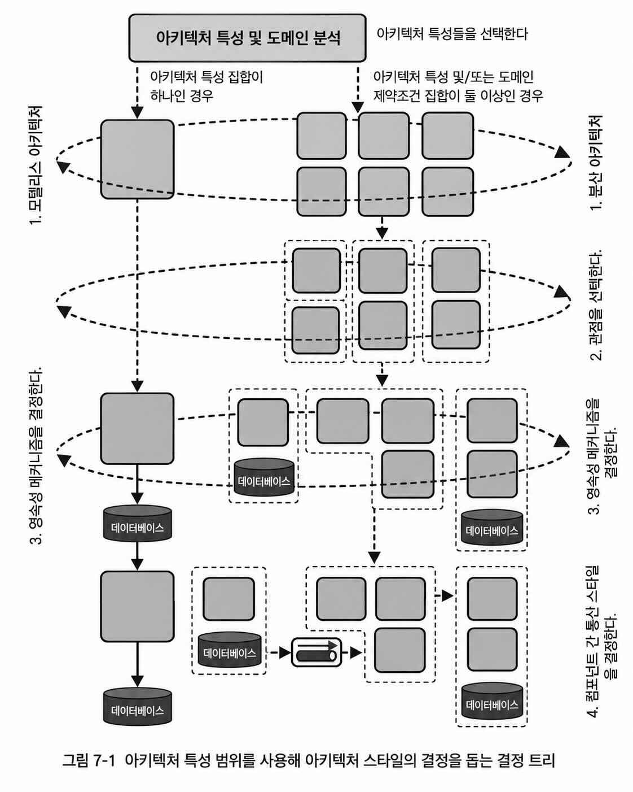
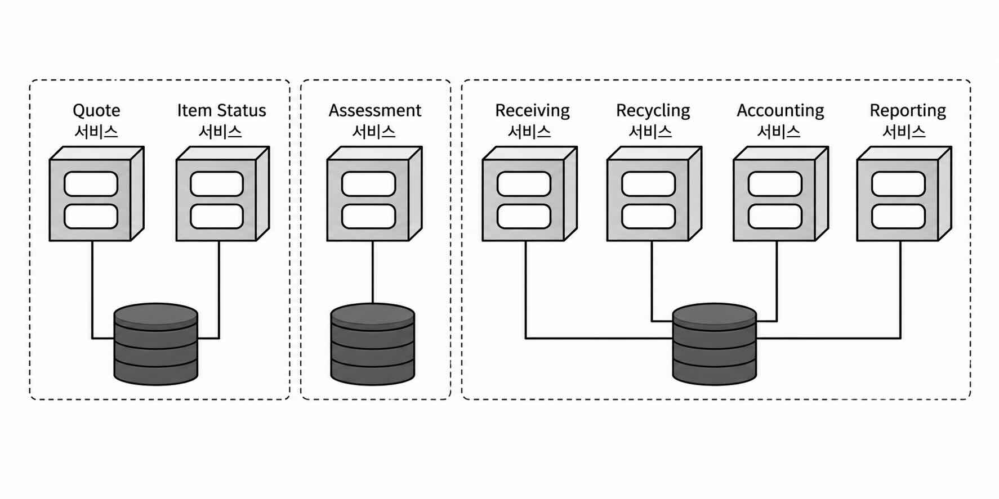

## 아키텍처 특성의 범위

- 하나의 시스템 전체에 동일한 아키텍처 특성 집합이 적용된다고 가정하면 안 된다.
    - 특히 MSA에서는 서비스 수준의 특성과 시스템 전체 수준의 특성이 다를 수 있다.
- 기존의 코드 수준 지표만으로는 아키텍처 특성의 전체 범위를 측정하기 어렵다.
    - 코드 내부의 복잡도나 의존성은 측정할 수 있다.
    - 하지만 DB 등 코드 외부의 의존 요소가 성능, 확장성 같은 특성에 미치는 영향까지는 반영하기 어렵다.
- 따라서 아키텍처 특성을 어느 범위까지 함께 평가할 것인지 정할 기준이 필요하다.
    - 이를 위해 아키텍처 퀀텀(architecture quantum)이라는 개념을 사용한다.

### 7.1 아키텍처 퀀텀과 세분도
- 컴포넌트 수준의 결합만이 시스템을 묶는 요소는 아니다.
    - 도메인/기능의 의미에 따라 묶이는 기능적 응집도 존재한다.
    - 소프트웨어를 성공적으로 설계, 분석하고 진화시키려면 아키텍처의 깨질 수 있는 모든 결합 지점을 고려해야 한다.
- 아키텍처 퀀텀
    - 시스템에서 독립적으로 실행되는 가장 작은 부분
    - 아키텍처 특성 집합이 적용되는 범위를 나타낸다.
    - 예시) 하나의 마이크로서비스가 하나의 아키텍처 퀀텀이 될 수 있음

아키텍처 퀀텀의 네 가지 특성
- 아키텍처의 다른 부분과는 독립적으로 배포된다.
- 기능적 응집도가 높다.
- 외부 구현과의 정적 결합도가 낮다.
- 다른 퀀텀들과 동기적으로 통신한다.

아키텍처 퀀텀 정의에 대한 상세한 설명

아키텍처 퀀텀
- 아키텍처 특성 집합이 적용되는 범위를 구분하는 경계 역할을 한다.

독립적 배포 가능
- 하나의 퀀텀은 다른 부분과 독립적으로 배포될 수 있어야 한다.
- 퀀텀이 동작하는 데 필수적인 요소도 퀀텀에 포함된다.
    - 예시) 애플리케이션이 특정 DB 없이는 동작할 수 없다면 DB도 같은 퀀텀에 포함
- 전통적인 모놀리스/레거시 시스템
    - 하나의 DB와 시스템 전체가 강하게 묶여 있어 전체가 하나의 큰 퀀텀이 되는 경우가 많다.
- 마이크로서비스
    - 서비스가 자체 데이터와 함께 독립적으로 배포될 수 있다면 서비스별로 별도의 퀀텀이 형성될 수 있다.

높은 기능적 응집도
- 하나의 퀀텀은 특정 기능이나 목적에 관련된 요소들이 함께 모여 있어야 한다.
- 모놀리스에서는 시스템 전체가 하나의 퀀텀인 경우가 많아 퀀텀별 기능적 응집을 구분하는 의미가 상대적으로 작다.
- MSA나 이벤트 주도 아키텍처에서는 서비스/경계를 특정 업무나 도메인에 맞춰 나누기 때문에 기능적 응집도가 높은 퀀텀을 만들기 쉽다.

결합의 세부적인 유형들
- 의미적 결합(semantic coupling)
    - 문제 도메인 자체에 원래 존재하는 자연스러운 결합
    - 예시) 주문, 재고, 고객, 장바구니 등이 업무적으로 서로 연관됨
    - 구현 방법과 관계없이 도메인 자체가 바뀌면 영향을 받는 결합
- 구현 결합(implementation coupling)
    - 도메인을 실제 시스템으로 구현하면서 선택한 방식 때문에 생기는 결합
    - 예시) 하나의 DB를 공유할지, DB를 분리할지
    - 모놀리스로 만들지, 분산 아키텍처로 만들지 등
    - 같은 도메인이라도 구현 선택에 따라 결합 정도가 달라질 수 있음
- 정적 결합(static coupling)
    - 코드/구조상 동일한 의존 대상에 묶이는 결합
    - 예시) 여러 서비스가 같은 DB나 공유 컴포넌트에 의존
    - 하나를 변경했을 때 다른 부분까지 깨질 수 있다면 정적 결합이 존재한다고 볼 수 있음
    - 이런 공유 의존성이 있으면 서로 독립적인 퀀텀으로 보기 어려움
- 동적 결합(dynamic coupling)
    - 실행 중 퀀텀들이 서로 통신하면서 생기는 결합
    - 예시) 서비스 간 호출이나 메시지 교환을 통해 하나의 작업 흐름을 수행

외부 구현의 정적 결합도 낮음
- 다른 퀀텀의 내부 구현이나 공유 자원에 직접 의존하지 않아야 한다.
- 서로 느슨하게 결합되어야 독립적인 변경과 배포가 가능하다.

```
범위가 좁을 때는 결합도가 더 높아도 된다. 범위가 넓을수록 결합은 더 느슨해야 한다.
```

### 7.2 동기적 통신
- 퀀텀 간 통신은 실행 시점에 발생하는 동적 결합이다.
- 동기 통신에서는 호출자가 상대방의 응답을 기다리므로,
  한 퀀텀의 운영 특성이 다른 퀀텀에 직접 영향을 줄 수 있다.
    - 예시) 확장성이 높은 Auction이 확장성이 낮은 Payment를 동기 호출하면 Payment가 병목이 되어 Auction 요청도 실패할 수 있다.
- 비동기 통신은 큐 등을 통해 순간적인 처리량 차이를 버퍼링하여 이러한 결합을 완화할 수 있다.
    - 단, 생산량이 지속적으로 소비량보다 많으면 결국 큐도 한계에 도달한다.

동기적으로 연결된 퀀텀은 서로의 성능, 확장성, 가용성 같은 운영 특성에 영향을 받으므로 함께 고려해야 한다.

### 7.3 범위 지정의 영향
아키텍처 특성의 범위를 정하면 서비스/퀀텀 경계를 결정하는 데 도움이 된다.



#### 7.3.1 범위 지정과 아키텍처 스타일

문제 도메인의 퀀텀 경계를 결정하면 아키텍처 스타일을 선택하기가 좀 더 쉬워진다.

1. 아키텍처 특성 집합의 수를 판단한다.
    - 시스템 전체에 동일한 아키텍처 특성 집합 하나만 필요하면 모놀리스 아키텍처를 고려할 수 있다.
    - 도메인이나 서비스별로 서로 다른 아키텍처 특성 집합이 필요하면 분산 아키텍처를 고려한다.
2. 분산 아키텍처라면 퀀텀의 경계를 결정한다.
   - 어떤 기능과 도메인을 하나의 독립적인 퀀텀으로 묶을지 결정한다.
   - 퀀텀은 독립 배포 가능성, 기능적 응집도, 낮은 외부 정적 결합 등을 고려해 나눈다.
3. 영속성 메커니즘을 결정한다.
    - 모놀리스라면 일반적으로 하나의 데이터베이스를 사용한다.
    - 분산 아키텍처라면 선택지가 나뉜다.
        - 하나의 데이터베이스를 여러 서비스가 공유
        - 서비스/퀀텀의 세분도에 따라 데이터를 분리하여 각자 영속성 저장소를 사용
4. 퀀텀 간 통신 방식을 결정한다.
   - 동기 통신 또는 비동기 통신을 선택한다.
   - 통신 방식에 따라 퀀텀 간 결합도와 운영 특성이 달라질 수 있다.
   - 경우에 따라 통신 방식을 선택한 뒤 기존 퀀텀 경계를 다시 조정해야 할 수도 있다.

#### 7.3.2 카타: 고잉 그린 예제

Going Green
- 중고 전자제품을 매입하여 평가한 뒤 재활용하거나 재판매하는 시스템

주요 업무
- 고객에게 견적 및 제품 상태 제공
- 전자제품 평가
- 제품 수령, 재활용, 회계, 보고

업무 영역마다 중요하게 요구되는 아키텍처 특성의 조합이 다를 수 있다.
- 고객 대면(견적, 상태)
    - 확장성, 가용성, 민첩성
- 전자제품 평가
    - 유지보수성, 배포성, 테스트성, 민첩성
- 재활용, 보고, 회계
    - 보안, 데이터 무결성, 감사성

전자제품 평가는 새로운 제품이 계속 출시되므로 평가 로직을 빠르게 변경하고 배포할 수 있어야 한다.
- 따라서 민첩성이 중요한 아키텍처 특성이 된다.

이처럼 각 업무의 성격에 따라 중요하게 요구되는 아키텍처 특성의 조합이 달라질 수 있다.

모든 특성을 시스템 전체에서 동일하게 만족시키려고 하면 설계가 복잡해지고 특성 간 충돌이 발생할 수 있다.
- 예시) 높은 감사성과 빠른 배포성은 서로 트레이드오프가 생길 수 있음

모든 아키텍처 특성을 시스템 전체에서 충족하려 하기보다, 아키텍처 특성 그룹을 기준으로 퀀텀의 경계를 나누는 것이 바람직하다.

아키텍처 특성의 범위를 서비스 세분도 결정의 지침으로 사용하면, 각 영역에 적절한 트레이드오프를 선택하는 데 도움이 된다.



### 7.4 범위와 클라우드
- 클라우드 기반 자원은 시스템의 여러 운영 아키텍처 특성을 캡슐화한다.
- 애플리케이션에서 클라우드를 사용할 경우 배포 모델에 따라 고려해야 할 사항이 달라진다.

클라우드를 컨테이너 호스팅에 사용
- 서버용 컨테이너를 클라우드에서 실행하고 오케스트레이션한다.
- 컨테이너의 아키텍처 특성과 Kubernetes 같은 오케스트레이션 도구의 제약조건을 고려해야 한다.

클라우드 제공업체의 자원을 시스템 구성요소로 활용
- 트리거 함수, 데이터베이스 등 클라우드 제공업체의 구성요소를 조합해 시스템을 만든다.
- 제공업체가 제공하는 기능을 이해하고, 해당 기능을 적절히 활용할 방법을 판단해야 한다.

클라우드 제공업체는 탄력성 등 과거에는 구현하기 어려웠던 여러 기능을 기본적으로 제공한다.
- 반면 현재의 아키텍트에게도 가용성, 보안 등 새로운 트레이드오프가 존재한다.
- 기술의 세부사항은 계속 변하지만 트레이드오프를 분석하는 일은 변하지 않는다.