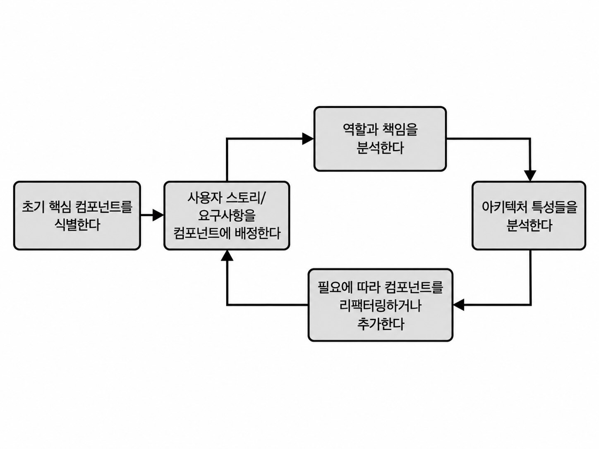

## 컴포넌트 기반 사고

컴포넌트 기반 사고(component-based thinking)
- 시스템의 구조를 서로 상호작용하며 각자 특정 비즈니스 기능을 수행하는 논리적 컴포넌트들의 집합

### 8.1 논리적 컴포넌트의 정의

주문 접수, 주문 검사, 주문 내역, 주문 이행, 고객 추적, 재고 관리, 주문 배송, 알림, 반품 및 환불, 결제 처리 등등

시스템 컴포넌트들은 재고 관리, 주문 배송, 결제 처리 같은 특정 기능을 수행한다.
- 이들이 모여서 시스템을 구성한다.
- 각 컴포넌트는 해당 비즈니스 기능을 구현하는 소스코드를 포함한다.

```
order_entry
├── ordering
│   ├── returns
│   ├── placement
│   ├── payment        -> 결제 처리
│   ├── validation
│   └── order_history
└── processing
    ├── fulfillment    -> 주문 이행
    └── shipment
```

- 시스템의 주요 기능들은 논리적 컴포넌트로 나눌 수 있다.
- 논리적 컴포넌트는 보통 소스 코드의 디렉터리나 namespace/package 구조로 표현된다.
- 일반적으로 말단 디렉터리(leaf node)가 하나의 논리적 컴포넌트를 나타내고,
  상위 디렉터리는 도메인/서브도메인을 나타낸다.

### 8.2 논리적 아키텍처 대 물리적 아키텍처
논리적 아키텍처
- 시스템을 구성하는 논리적 컴포넌트와 그 상호작용을 나타낸다.
- 시스템과 행위자의 상호작용도 나타낼 수 있다.
- 서비스, UI, 데이터베이스 같은 물리적 요소보다 시스템의 기능과 컴포넌트 간 상호작용에 초점을 둔다.
- 물리적 아키텍처나 아키텍처 스타일을 결정하지 않은 상태에서도 작성할 수 있다.

물리적 아키텍처
- 서비스, 사용자 인터페이스, 데이터베이스 등의 물리적 요소를 나타낸다.
- 하나 이상의 아키텍처 스타일을 구체적으로 나타낸다.
- 물리적 구조만으로는 기능이 어디에 존재하고 다른 기능과 어떻게 결합되는지 파악하기 어려울 수 있다.
    - 개발 팀에게 모놀리스 또눈 분산 시스템을 구축하거나 코드를 구성하는 방법에 대한 지침을 제공하지 않는다
- 물리적 아키텍처만으로 개발하면 유지보수, 테스트, 배포가 어려운 비구조적인 아키텍처가 만들어질 수 있다.

논리적 아키텍처의 장점
- 물리적 구조나 아키텍처 스타일을 먼저 결정하지 않고도 작성할 수 있다.
- 시스템이 무엇을 하는지, 기능을 어떻게 나누고 서로 어떻게 상호작용하는지에 집중할 수 있다.
- 따라서 모놀리스인지 분산 아키텍처인지 결정하기 전에 시스템의 기능적 구조부터 설계할 수 있다.

### 8.3 논리적 아키텍처의 작성

논리적 아키텍처를 작성하는 과정은 논리적 컴포넌트들을 식별하고 재구성하는 작업의 반복으로 이루어진다.



- 초기 핵심 컴포넌트를 식별한다.
- 사용자 스토리/요구사항을 각 컴포넌트에 배정한다.
- 컴포넌트의 역할과 책임을 분석한다.
    - 배정된 요구사항이 해당 컴포넌트에 적절한지 확인한다.
- 필요한 아키텍처 특성을 분석한다.
    - 아키텍처 특성을 기준으로 컴포넌트를 분리하거나 결합할 필요가 있는지 판단한다.
- 필요하면 컴포넌트를 리팩터링하거나 새로 추가한다.
- 변경된 컴포넌트에 다시 사용자 스토리/요구사항을 배정하면서 반복한다.

이 과정은 한 번에 끝나는 것이 아니라 지속적으로 개선하는 피드백 루프이다.

새로운 시스템을 설계할 때뿐 아니라 기존 시스템에 기능을 추가하거나 변경할 때도 사용할 수 있다.

#### 8.3.1 핵심 컴포넌트의 식별
- 초기부터 모든 요구사항을 완벽하게 알고 컴포넌트를 설계하려 하지 않는다.
- 시스템의 주요 기능을 기준으로 초기 핵심 컴포넌트를 대략적으로 식별한다.
    - 초기 컴포넌트는 완성된 설계가 아니라 '빈 양동이' 같은 자리표시자에 가깝다.
- 이후 요구사항과 사용자 스토리를 분석하면서 컴포넌트를 채우고, 추가·분리·재구성한다.

초기 핵심 컴포넌트를 찾는 방법

작업흐름 접근법
- 사용자가 시스템을 이용하는 주요 작업흐름을 따라가며 필요한 기능을 찾는다.
    - 예시) 주문 -> 결제 -> 주문 이행 -> 배송
- 각 단계에서 필요  한 기능을 기준으로 컴포넌트를 식별한다.
- 동일한 기능이 여러 단계에서 사용되면 하나의 컴포넌트를 재사용할 수 있다.

행위자/행동 접근법
- 시스템과 상호작용하는 행위자를 찾는다.
    - 예시) 고객이 주문한다 → Order Placement
    - 사용자뿐 아니라 시스템 자체도 행위자가 될 수 있다.
- 각 행위자가 수행하는 주요 행동을 식별하고, 그 행동을 담당할 컴포넌트를 도출한다.

엔티티 함정(Entity Trap) - 피해야 할 접근
- Customer, Item, Order 같은 엔티티를 그대로 컴포넌트로 만드는 방식
- Manager, Controller, Handler 같은 모호한 이름을 사용하면 컴포넌트의 역할과 책임이 불분명해질 수 있다.
- 관련된 기능들이 하나의 컴포넌트에 계속 쌓여 '쓰레기 하치장'이 될 수 있다.
- 결국 너무 크고 많은 책임을 가진 컴포넌트가 되어 유지보수, 테스트, 배포가 어려워질 수 있다.
- CRUD만 하는 단순 시스템이면 엔티티 중심으로 만들어도 큰 문제가 없을 수 있다.

#### 8.3.2 사용자 스토리를 컴포넌트에 배정
- 사용자 스토리나 요구사항이 들어오면 어떤 컴포넌트가 그 책임을 맡아야 하는지 판단한다.
- 기존 컴포넌트가 적절하면 해당 컴포넌트에 배정한다.
- 여러 컴포넌트에 중복 구현해야 하거나 기존 컴포넌트의 책임과 맞지 않으면 새로운 컴포넌트를 추가할 수 있다.
- 요구사항이 추가되면서 논리적 컴포넌트 구조도 계속 진화한다.

#### 8.3.3 역할과 책임의 분석
- 컴포넌트에 배정된 요구사항과 사용자 스토리가 서로 얼마나 관련되어 있는지 확인한다.
    - 컴포넌트의 응집도(cohesion)를 분석한다.
- 하나의 컴포넌트가 너무 많은 역할과 책임을 담당하지 않는지 확인한다.
- 서로 관련성이 낮거나 독립적인 책임이 한 컴포넌트에 섞여 있다면 별도의 컴포넌트로 분리한다.
    - 예시) Order Placement 안의 결제, 재고 조정, 고객 알림 등을 각각 별도 컴포넌트로 분리
- 컴포넌트를 분리하면 각 컴포넌트의 역할과 책임이 더 명확해지고 유지보수, 테스트, 배포가 쉬워진다.

#### 8.3.4 아키텍처 특성들의 분석
- 기능적으로는 하나의 컴포넌트로 묶을 수 있어도, 필요한 아키텍처 특성이 다르면 컴포넌트를 분리할 수 있다.
    - 예시) 처리해야 하는 사용자 규모가 다른 기능(사용자 입력이 한 곳은 소수 한 곳은 동시에 수백명) -> 서로 다른 확장성 요구
- 큰 컴포넌트를 적절히 분리하면 유지보수성, 테스트성, 확장성, 탄력성, 내결함성 등을 개선할 수 있다.
- 따라서 컴포넌트의 크기와 경계를 결정할 때 기능뿐 아니라 아키텍처 특성도 고려해야 한다.

#### 8.3.5 컴포넌트 재구성
- 컴포넌트 설계는 한 번에 끝나는 작업이 아니다.
- 개발하면서 새로운 사실이나 예외 상황을 발견하면 컴포넌트의 역할과 경계를 다시 조정해야 할 수 있다.
- 시스템의 전체 수명 주기 동안 컴포넌트가 계속 재구성될 수 있음을 예상해야 한다.