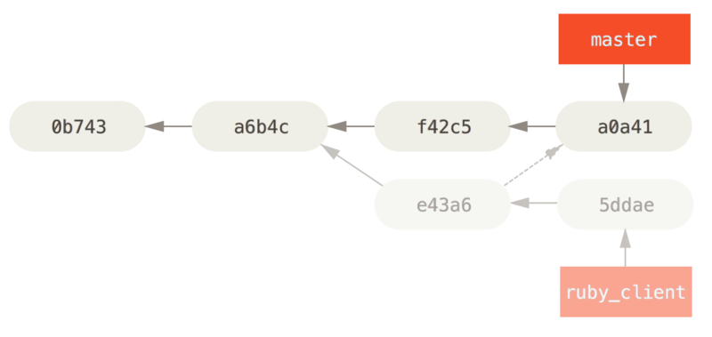

> https://git-scm.com/book/ko/v2/%EB%B6%84%EC%82%B0-%ED%99%98%EA%B2%BD%EC%97%90%EC%84%9C%EC%9D%98-Git-%ED%94%84%EB%A1%9C%EC%A0%9D%ED%8A%B8-%EA%B4%80%EB%A6%AC%ED%95%98%EA%B8%B0

## 프로젝트 관리하기
#### 대규모 Merge 워크플로
Git을 개발하는 프로젝트는 Long-Running의 브랜치를 4개 운영한다. 각 브랜치 이름은 master, next, pu(Proposed Updates),  maint이다. 기여자가 새로운 기능을 제안하면 관리자는 자신의 저장소에 토픽 브랜치를 만들어 관리하고 토픽을 테스트 한후  안정화되면 next로 Merge하고 저장소에 Push한다. 
 
토픽 브랜치가 좀 더 개선되어야 하면 next가 아닌 pu에 Merge한다. 충분히 검증되었을 때만 master 브랜치에 Merge한다.  Merge하고 나면 pu와 next 브랜치는 master 브랜치를 기반으로 다시 만든다. 
 
토픽 브랜치가 master 브랜치로 Merge되면 저장소에서 삭제한다. 그리고 이전 릴리즈 버전에 Patch가 필요하면 maint 브랜치를  이용해 대응한다. 

#### Rebase와 Cherry-Pick 워크플로
한 브랜치에서 다른 브랜치로 작업한 내용을 옮기는 또 다른 방식으로 Cherry-Pick이란 것도 있다. Git의 Cherry-Pick은 커밋  하나만 Rebase하는 것이다. 커밋 하나로 Patch 내용을 만들어 현재 브랜치에 적용하는 것이다. 토픽 브랜치에 있는 커밋 중에서  하나만 고르거나 토픽 브랜치에 커밋이 하나밖에 없을 때 Rebase보다 유용하다. 
 
> $ git cherry-pick e43a6

위 명령을 실행하면 e43a6 커밋에서 변경된 내용을 현재 브랜치에 똑같이 적용한다.
 

합치고 나면 필요없는 토픽 브랜치나 커밋은 삭제한다.

#### Rerere
Rerere는 "reuse recorded resolution"의 약자로 수작업으로 충돌을 해결하던것을 쉽게 해준다. 이 기능이 활성화 되어 있으면  Merge가 성공할 때 마다 그 이전과 이후 상태를 저장해둔다. 나중에 충돌이 발생하면 비슷한 상황에서 Merge가 성공한 적이  있었는지 찾아보고 해결이 가능하다면 자동으로 해결한다.
Rerere 기능의 동작은 두 부분으로 나뉘어져 있다. 기능을 설정하는  부분과 기능을 명령으로 사용하는 부분이다. 
> $ git config --global rerere.enabled true

이제부터 Merge가 성공할 때마다 상황을 기록해두고 나중에 충돌이나면 사용할 수 있다.
