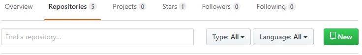
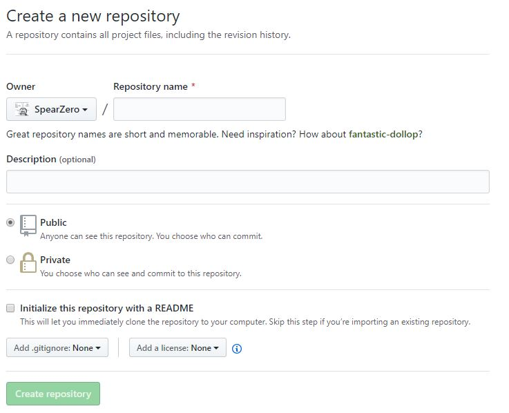
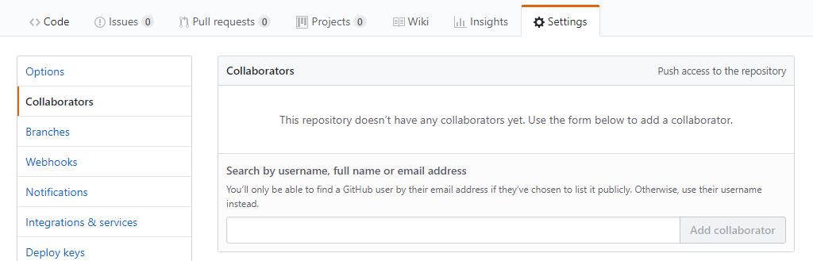

> https://git-scm.com/book/ko/v2/GitHub-GitHub-%ED%94%84%EB%A1%9C%EC%A0%9D%ED%8A%B8-%EA%B4%80%EB%A6%AC%ED%95%98%EA%B8%B0

## GitHub 프로젝트 관리하기
### 새 저장소 만들기
 
New라고 써 있는 초록버튼을 누르면 새 저장소가 만들어진다.
 
빈 칸을 입력하고 Create repository 버튼을 누르면 <<z>user>/<<z>project_name>의 저장소가 생긴다.

### 동료 추가하기
 
Add collborator로 동료를 추가할 수 있다.

### Pull Request 관리하기
#### 이메일 알림
어떤 사람이 Pull Request를 보내면 이 정보를 알려주는 이메일이 프로젝트 관리자에게 보내진다. 
 

Pull Request에서 어떤 파일이 얼마나 변경되었는지 보여주며, Pull Request의 페이지 링크도 있고 CLI로 Merge하는 방법과  URL도 간략히 보여준다.

'git pull <<z>url> patch-1' 명령은 리모트 브랜치를 간단히 Merge할 수 있게 해 준다. 저장소를 리모트로 추가하지 않아도 된다.

.diff와 .patch URL은 Pull Request의 'Unified Diff'와 Patch 버전의 URL이다. 이 URL로 아래와 같이 Pull Request를 Merge 할 수  있다.
> $curl <.patch의 url> | git am

#### Pull Request로 함께 일하기
Pull Request를 만든 사람과 토론할 수 있다. 대화에 참여하면 누군가 코멘트할 때마다 이메일 알람이 계속 온다. 그 이메일에는  Pull Request의 페이지링크가 포함되어 있기 때문에 어떤 일이 일어나고 있는지 쉽게 알 수 있다. 그리고 답 메일을 보내면 Pull  Request의 코멘트로 달린다.

GitHub 사이트에서 "Merge" 버튼을 누르는 것으로 간편하게 Merge 할 수 있다. command line 힌트 링크를 클릭하면 명령어로  Merge하는 방법을 알려준다. 
 

#### Pull Request의 Ref
일일이 리모트를 등록하고 Pull하는 것은 Pull Request를 많이 처리하는 사람에게 고통스럽다. GitHub는 이럴때 사용하는 방법을  제공해준다. GitHub는 Pull Request의 브랜치를 서버에 있는 가상 브랜치로 노출해준다.

이 방법을 사용하려면 저수준 명령어인 ls-remote가 필요하다. 이 명령은 서버에 어떤 Ref가 있는지 보여준다.
<pre>
    <code>
        $ git ls-remote <프로젝트 github 주소>
        10d539600d86723087810ec636870a504f4fee4d	HEAD
        10d539600d86723087810ec636870a504f4fee4d	refs/heads/master
        6a83107c62950be9453aac297bb0193fd743cd6e	refs/pull/1/head
        afe83c2d1a70674c9505cc1d8b7d380d5e076ed3	refs/pull/1/merge
        3c8d735ee16296c242be7a9742ebfbc2665adec1	refs/pull/2/head
        15c9f4f80973a2758462ab2066b6ad9fe8dcf03d	refs/pull/2/merge
        a5a7751a33b7e86c5e9bb07b26001bb17d775d1a	refs/pull/4/head
        31a45fc257e8433c8d8804e3e848cf61c9d3166c	refs/pull/4/merge
    </code>
</pre>
저장소 안이라면 git ls-remote origin이라고 실행시켜도 된다.

GitHub 저장소에 어떤 Pull Request라도 열려있다면 refs/pull/로 시작하는 이름의 Ref가 생성된다. 이 Ref들은 Clone과 Fetch  할 때 받아지지 않는다.

/head로 끝나는 ref는 Pull Reqest 브랜치가 가르키는 마지막 커밋이다. 누군가 bug-fix라는 브랜치를 Pull Request했다고 하면  이 브랜치가 a5a775 커밋을 가리킨다. bug-fix 브랜치는 Fork한 저장소에 있어서 관리자의 저장소에는 없다. 하지만 a5a775를  가리키는 'pull/<pr#>/head 형식의 브랜치가 생긴다. 그래서 매번 다른 저장소를 리모트로 등록하지 않고서 Pull Request를 쉽게  Pull 할 수 있다.

이 브랜치를 가져오려면 다음과 같은 명령어를 사용한다.
<pre>
    <code>
        $ git fetch origin refs/pull/958/head
        From https://github.com/libgit2/libgit2
        * branch            refs/pull/958/head -> FETCH_HEAD
    </code>
</pre>
"리모트의 브랜치 origin을 refs/pull/958/head로 Fetch 한다"는 뜻이다. Git은 다 내려받고 마지막 커밋을 .git/FETCH_HEAD에  저장한다. git merge FETCH_HEAD로 Merge해서 테스트 할 수 있다. 이렇게 Merge하면 커밋 메시지가 약간 이상해질 수 있다.  또한 많은 Pull Request를 처리해야 하는 경우 쓸데없는 Merge 커밋도 많아진다.

항상 Pull Request를 전부 가져오게 할 수 있다. .git/config 파일을 열어 origin 리모트를 찾는다.
<pre>
    <code>
        [remote "origin"]
        url = https://github.com/libgit2/libgit2
        fetch = +refs/heads/*:refs/remotes/origin/*
    </code>
</pre>
fetch= 로 시작하는 라인이 "refspec"이다.([refspec 알아보기](https://git-scm.com/book/ko/v2/Git%EC%9D%98-%EB%82%B4%EB%B6%80-Refspec)) 여기서는 refs/heads에 해당하는 이름이 refs/remote/origin 디렉 토리에 매핑된다는 뜻이다.
<pre>
    <code>
        [remote "origin"]
        url = https://github.com/libgit2/libgit2.git
        fetch = +refs/heads/*:refs/remotes/origin/*
        fetch = +refs/pull/*/head:refs/remotes/origin/pr/*
    </code>
</pre>
추가한 마지막 라인은 refs/pull/123/head와 같은 Ref를 refs/remotes/origin/pr/123에 저장 한다는 의미다. git fetch 라고 실행 하면 새 Refspec의 브랜치도 가져온다.
<pre>
    <code>
        $ git fetch
        # …
        * [new ref]         refs/pull/1/head -> origin/pr/1
        * [new ref]         refs/pull/2/head -> origin/pr/2
        * [new ref]         refs/pull/4/head -> origin/pr/4
        # …
    </code>
</pre>
서버에 있는 모든 Pull Request를 추적하는 트래킹 브랜치가 생겼다. 쓰기는 불가능하지만 계속 Fetch 해올 수 있다. 이렇게하면  Pull Request를 로컬에 가져와서 작업하는게 편해진다.

refs/pull/#/merge처럼 생긴 Refspec은 GitHub에서 Merge 버튼으로 Merge했을 때 적용되는 결과이다.
