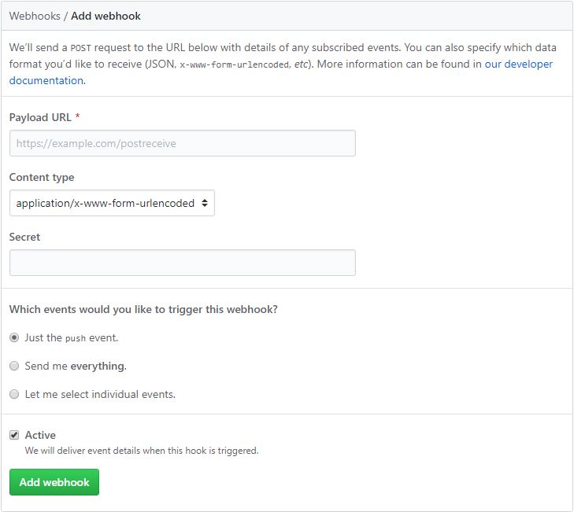

> https://git-scm.com/book/ko/v2/GitHub-GitHub-%EC%8A%A4%ED%81%AC%EB%A6%BD%ED%8C%85

## GitHub 스크립팅
### 훅
GitHub에 좀더 세세한 설정을 하고 싶거나 외부 사이트와 연동하고 싶으면 훅을 이용한다. GitHub의 훅은 URL을 하나 주면 그  URL로 HTTP 페이로드를 보내준다.

프로젝트에서 "Settings"를 클릭한 뒤 탭 메뉴에 "Webhooks"를 클릭후 "Add webhook"버튼을 누르면 다음과 같은 화면이 나타 난다. 
 

URL과 보안키를 입력하고 "Add webhook" 버튼을 클릭하면 된다. 다른 이벤트의 페이로드를 선택할 수 있지만 push 이벤트의  페이로드만 보내는 것이 기본이다. 

훅에대해 더 알아보기
> https://developer.github.com/webhooks/

### GitHub API
이벤트 정보를 자세히 알고 싶거나, 자동으로 동료를 추가하거나 이슈에 레이블을 달도록 하고 싶을때 사용하기 위해 GitHub  API가 준비되어 있다. GitHub가 제공하는 API Endpoint는 많아서 웹사이트에서 하는 웬만한 일은 자동화 할 수 있다.

#### 기본 사용법
사용자에 대한 정보를 얻어오는 명령어
> $ curl https://api.github.com/users/<사용자이름>

Organization, 프로젝트 이슈, 커밋 정보를 가져오는 Endpoint가 많이 있다.

사용가능한 Endpoint들 보기
> https://developer.github.com/v3/apps/available-endpoints/

#### 이슈에 코멘트하기
이슈나 Pull Request에 코멘트를 달거나 공개하지 않은 정보를 얻으려고 할 때는 인증이 필요하다. 몇 가지 방법으로 인증할 수  있다. 사용자이름과 암호가 필요한 Basic인증도 가능하지만, 개인 액세스 토큰을 사용하는게 낫다.

개발자 "Personal settings" 탭에서 "Developer settings"를 선택후 "Personal access token"을 선택하면 개인 액세스 토큰을 생성  할 수 있다.

토큰을 어디에 쓸지 범위를 선택하고 설명을 입력한다. 나중에 스크립트나 애플리케이션을 더이상 사용하지 않게 되었을 때,  삭제를 편히 할 수 있도록 설명을 이해하기 쉽게 다는 게 좋다.

토큰이 생성되면 복사해서 사용한다. 토큰은 허용하는 범위가 제한돼 있고 언제든지 폐기할 수 있어서 좋다.

Authorization 헤더에 생성한 토큰을 넣어서 함께 보낸다.
<pre>
    <code>
        $ curl -H "Content-Type: application/json" \
       -H "Authorization: token TOKEN" \
       --data '{"body":"A new comment, :+1:"}' \
       https://api.github.com/<<z>repos>/<<z>user>/<<z>repo>/issues/<<z>num>/comments
    </code>
</pre>
웹 사이트(GitHub)에서 할 수 있는 일은 전부 API로도 할 수 있다.

#### Pull Request의 상태 변경하기
커밋은 하나 이상의 상태를 가질 수 있는데 API를 통해서 상태를 추가하거나 조회할 수 있다. 웹 훅과 API를 통해 조건에 따른  테스트결과를 Pull Request의 커밋 리포트 할 수 있다.
