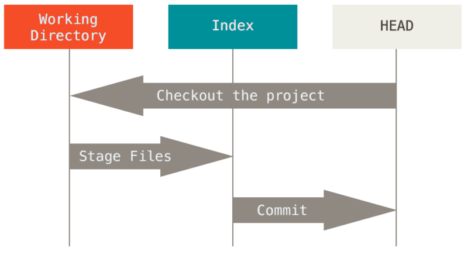

> https://git-scm.com/book/ko/v2/Git-%EB%8F%84%EA%B5%AC-Reset-%EB%AA%85%ED%99%95%ED%9E%88-%EC%95%8C%EA%B3%A0-%EA%B0%80%EA%B8%B0

## Reset 명확히 알고가기
### 세 개의 트리

트리 | 역할
-----|-----
HEAD | 마지막 커밋의 스냅샷, 다음 커밋의 부모 커밋
Index | 다음에 커밋할 스냅샷
워킹 디렉토리 | 샌드박스

#### HEAD
HEAD는 현재 브랜치를 가리키는 포인터이며, 브랜치는 브랜치에 담긴 커밋 중 가장 마지막 커밋을 가리킨다.

#### Index (Staging Area)
Index는 바로 다음에 커밋할 것들이다. 먼저 Index는 워킹 디렉토리에서 마지막으로 Checkout한 브랜치의 파일 목록과 파일  내용으로 채워진다. 이후 파일 변경 작업을 하고 변경한 내용으로 Index를 업데이트 할 수 있다. 이렇게 업데이트하고  git commit 명령을 실행하면 Index는 새 커밋으로 변환된다.

#### 워킹 디렉토리
HEAD와 Index는 .git 디렉토리에 저장되지만 사람이 알아보기 어렵다. 워킹 디렉토리는 실제 파일로 존재한다. 바로 눈에 보이기  때문에 사용자가 편집하기 수월하다. 커밋하기 전에는 Index(Staging Area)에 올려놓고 얼마든지 변경할 수 있다.

### 워크플로
 
이 과정을 시각화 해보면 다음과 같다. 파일 하나(v1)을 생성하고 git init 명령을 실행해 Git 저장소를 만들면 다음과 같다. 
 
이 시점에는 워킹 디렉토리에만 데이터가 있다. git add 명령을 실행하면 이 내용을 Index에 복사한다. 
 
그리고 git commit 명령을 실행하면, Index의 내용을 스냅샷으로 영구히 저장하고 그 스냅샷을 가리키는 커밋 객체를 만든다.  그리고는 master가 그 커밋 객체를 가리키도록 한다. 
 
git status 명령을 실행하면 세 트리가 모두 같기 때문에  아무런 변경 사항이 없다고 나온다. 다시 파일의 내용을 바꾸고 커밋하면 다음과 같다. 
 
git status 명령을 입력하면 워킹 디렉토리와 Index가 서로 다른 내용을 담고 있기 때문에 "Changes not staged commit"이라는  문장과 빨간색으로 된 파일의 제목이 나타나게 된다. git add 명령을 실행해 변경 사항을 Index에 올린다. 
 
git status 명령을 입력하면 "Changes to be committed" 아래에 파일 이름이 녹색으로 변한다. Index와 HEAD의 다른 파일들이  표시된다. 이는 다음에 커밋할 것과 지금 마지막 커밋이 다르다는 뜻이다. 마지막으로 git commit 명령을 실행한다. 
 
이제 세 트리의 내용이 같기 때문에 git status 명령을 실행해도 아무것도 출력하지 않는다.  브랜치를 바꾸거나 Clone 명령도  비슷한 절차를 밟는다. 브랜치를 Checkout하면, HEAD가 새로운 브랜치를 가리키도록 바뀌고, 새로운 커밋의 스냅샷을 Index에  놓는다. 그리고 Index의 내용을 워킹 디렉토리로 복사한다.