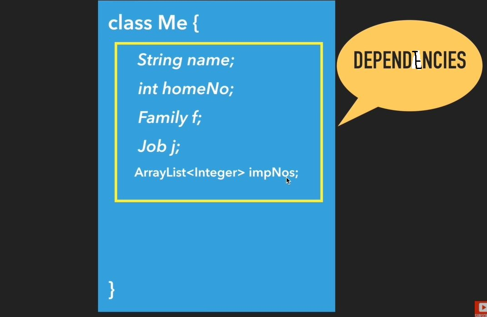
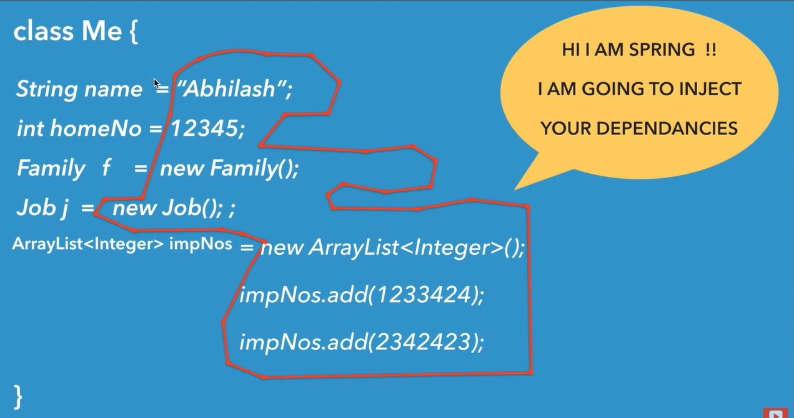

### What is dependency injection in Spring

> https://www.youtube.com/watch?v=vLMaFRgZjM0

위의 강의를 요약

 

현실 세계에서 "나"는 이름, 집 번호, 가족, 직업, 여권번호, 주민등록번호 등등 많은 것에 의존한다. 이를 코드로 표현하면 위의 그림과 같다.

위의 코드에서 Me 객체 내부에는 다양한 변수나 객체가 선언되어있는데, Me 객체 내부에서 참조되는 변수, 객체, 컬렉션 들을 Me 객체가 의존한다고 한다. 

 

스프링은 이러한 의존성을 객체에서 직접 생성하지 않고 주입시켜주는 기능을 제공하는데 이를 Dependency Inejction 이라고 한다. 

Depndency Injection에는 setter injection, constructor injection, field injection 등 다양한 방법이 있다.

